# MutBench 학위논문 쉬운 설명서

**한줄 요약**: 바이러스 변이 핫스팟을 찾는 방법이 여러 개 있는데, 어떤 방법이 좋은지 비교할 기준이 없었다. 이 논문이 그 기준(MutBench)을 만들고, "모든 바이러스에 통하는 만능 방법은 없다"는 것을 통계적으로 증명했다.

---

## 1. 배경: 바이러스 변이란?

### 1.1 바이러스와 변이

바이러스는 세포 안에서 자신의 유전자를 복사하여 증식한다. 이 유전자는 A, C, G, U(또는 T) 네 글자로 이루어진 서열이다. SARS-CoV-2(코로나바이러스)는 약 30,000개의 염기로 구성되어 있다.

복제 과정에서 간혹 복사 오류가 발생하는데, 이것이 **변이(mutation)**다. RNA 바이러스(코로나, 인플루엔자, HIV 등)는 특히 변이가 빠르다. 연간 유전자 위치당 약 10만분의 1 ~ 1천분의 1 비율로 변이가 축적되어, 수개월 내에 새로운 변이주가 출현한다.

### 1.2 핫스팟이란?

**핫스팟(hotspot)**이란 변이가 유독 많이 생기는 유전체 위치 또는 영역을 말한다.

중요한 점: 단순히 변이가 "많은" 곳이 아니다. 핫스팟에는 두 가지 종류가 섞여 있다.

- **진짜 핫스팟**: 바이러스가 인간 면역을 회피하거나 감염력을 높이기 위해 "선택적으로" 변이하는 곳. 예: SARS-CoV-2 Spike 단백질의 E484K, N501Y 위치는 여러 변이주(Alpha, Beta, Gamma, Omicron)에서 독립적으로 반복 출현했다.
- **가짜 핫스팟 (founder effect)**: 특정 변이가 많은 이유가 "유리해서"가 아니라 "그 변이를 가진 계통이 우연히 크게 번성해서"인 경우. D614G 변이가 대표적이다.

### 1.3 왜 중요한가?

- **백신 설계**: 핫스팟(계속 변하는 곳)을 피하고, 보존된 부위를 타겟으로 삼아야 오래 쓸 수 있는 백신을 만들 수 있다.
- **항바이러스제 개발**: 약물이 표적하는 부위가 핫스팟이면 내성 변이가 빠르게 나타난다.
- **실시간 감시**: 새로운 변이주가 핫스팟 위치에서 변이를 축적하면 위험 신호다.

---

## 2. 문제: 비교 기준이 없다

### 2.1 세 가지 구체적 문제

**문제 1: 정답이 없다.** "여기가 진짜 핫스팟이다"라는 공인된 정답표(ground truth)가 없다. 각 논문이 자기 기준으로 "잘 찾았다"고 주장하지만, 기준이 다르니 비교할 수 없다.

**문제 2: 각자 다른 데이터로 평가한다.** 방법 A는 코로나 데이터로 테스트하고, 방법 B는 인플루엔자로 테스트한다. 같은 시험을 보지 않았으니 비교가 불가능하다.

**문제 3: 하나의 바이러스만 테스트한다.** 코로나에서 좋은 방법이 HIV에서도 좋을지 아무도 검증하지 않았다.

### 2.2 암 분야와의 대조

암 유전체학에서는 이 문제가 이미 해결되어 있다. Bailey et al.(2018)은 26개 암 드라이버 유전자 탐지 방법을 체계적으로 비교했다. 바이러스 유전체학에는 이런 벤치마크가 없었다.

인접 분야의 유사 연구들:

- **ProteinGym**(2023): 변이 효과 예측 모델 벤치마크 (핫스팟 "영역" 탐지가 아님)
- **ConDor**(2024): 수렴 변이 탐지 도구 (벤치마크 프레임워크가 아님)
- **Pons et al.**(2020): 암 핫스팟 탐지 40+ 방법 리뷰 (서술적 서베이, 암 한정)

---

## 3. 해결: MutBench

### 3.1 정답표: 3층 Ground Truth

"진짜 핫스팟"을 정의하기 위해 3가지 독립적인 생물학적 근거를 결합했다.

**Layer A (정답/양성)** — 수렴 진화 위치: **같은 바이러스 종 안에서** 서로 다른 계통(lineage)이 독립적으로 같은 위치에서 변이한 곳. 예: SARS-CoV-2의 E484K는 Alpha(영국), Beta(남아공), Gamma(브라질), Omicron(남아공) 계통에서 각각 독립적으로 출현했다. 이렇게 반복적으로 같은 위치가 변이한다는 것은 그 위치가 바이러스에게 진화적으로 유리하다는 강력한 증거다. 병원체당 9~54개 위치.

Layer A는 변이의 "기능"이 무엇인지(면역 회피인지, 감염력 증가인지)는 묻지 않는다. 오직 "독립적으로 반복 출현했는가"만 본다. 구체적인 기능적 영향은 Layer C(DMS 실험)에서 확인한다.

**Layer B (오답/음성)** — 보존 구조 영역: 변이가 생기면 단백질 접힘이 파괴되거나, 막 융합이 불가능해지거나, 수용체 결합이 사라지는 위치로, 해당 변이를 가진 바이러스는 도태된다(예: 막 융합에 필수적인 heptad repeat 영역, 구조적 이황화결합 시스테인 잔기). 진화적으로 이 위치의 변이는 "정화 선택"에 의해 제거되므로 핫스팟이 될 수 없다. 탐지 방법이 이곳을 핫스팟이라고 하면 오답이다. 병원체당 0~229개 위치.

**Layer C (검증)** — DMS 실험 데이터: 실험실에서 모든 가능한 단일 아미노산 치환을 물리적으로 만들어, 정량적 표현형(예: SARS-CoV-2의 세포 진입 효율, H3N2의 복제 적합도)에 미치는 영향을 측정한 데이터. 이 층은 진화 데이터에서 아직 관찰되지 않은 기능적 중요성을 포착할 수 있다. 9개 중 4개 바이러스에 존재.

**세 층의 역할 비교:**

- **Layer A**: "이 위치가 반복적으로 변이하는가?" → 진화적 패턴 (메커니즘 무관)
- **Layer B**: "이 위치가 변이하면 바이러스가 죽는가?" → 구조적 제약
- **Layer C**: "이 위치의 변이가 실제로 기능에 얼마나 영향을 주는가?" → 실험적 기능 측정

세 질문은 서로 독립적이다. Layer A에서 핫스팟인 위치가 Layer C에서 반드시 높은 적합도 효과를 보이지는 않으며(Jaccard 0.006), 그 반대도 마찬가지다. 이것이 단일 기준이 아닌 3층 체계를 사용하는 이유다.

세 근거의 Jaccard 유사도는 0.006으로, 거의 겹치지 않는다 — 독립적 정보를 제공한다.

**"Layer B/C가 없는 바이러스는 왜 포함했는가?"**

9개 바이러스 중 완전한 3층 GT(A+B+C)를 가진 것은 4개뿐(SARS-CoV-2, H3N2, HIV-1, RSV)이다. Norovirus, MERS, HCV는 Layer A만 있고, Flu-B와 Dengue는 Layer C가 없다. 그럼에도 포함한 이유:

1. **핵심 평가 지표(MCC)는 Layer A만으로 계산된다.** Layer A = 정답(양성), 나머지 전체 = 오답(음성)으로 MCC를 계산하므로, Layer B/C가 없어도 핵심 평가는 가능하다. Layer B는 "특히 나쁜 오답"을 추가로 측정하는 보조 지표(Constrained FPR)에 사용되고, Layer C는 독립적 검증(DMS F1)에 사용된다.

2. **4개만으로는 통계 검정이 어렵다.** "만능 방법이 없다"를 증명하려면 ANOVA, Friedman, LOPO 같은 통계 검정이 필요한데, 4개 바이러스로는 검정력이 부족하다. 9개로 늘려야 통계적으로 유의한 결론을 낼 수 있다.

3. **다양성이 완전성보다 중요하다.** DMS 데이터가 있는 바이러스만 쓰면 잘 연구된 병원체에 편향된다. Norovirus(epoch 진화), HCV(초변이), MERS(데이터 부족) 같은 도전적 사례를 포함해야 벤치마크의 현실적 가치가 있다.

이 점은 논문에서 한계(Limitation)로 명시적으로 논의되고 있다.

**Oracle MCC란?**

각 바이러스에 대해 369가지 조합(9 점수화 x 41 탐지) 중 **가장 높은 MCC를 달성한 조합의 MCC 값**을 Oracle MCC라고 한다. "만약 신이 최적 방법을 알려준다면 달성할 수 있는 최고 성능"이라는 뜻이다. Oracle은 현실에서는 알 수 없는 상한선이며, 각 바이러스의 "난이도"를 나타낸다.

- H3N2: Oracle MCC = 0.549 (가장 쉬움 — GT가 잘 정의되어 있고 항원 변이 위치가 명확)
- MERS: Oracle MCC = 0.088 (가장 어려움 — 서열 수 530개, Layer B/C 없음)

PAHD의 목표는 이 Oracle에 최대한 가까운 성능을 달성하는 것이다 (현재 proof-of-concept 수준에서 48~58% 회복).

### 3.2 채점 기준: Hotspot-score

```
hotspot-score = (recall + precision + stability) / 3
```

각 성분은 3층 Ground Truth를 기준으로 계산된다:

- **Recall (재현율)**: Layer A(수렴 진화 위치) 중에서 탐지 방법이 실제로 찾아낸 비율. 예를 들어 SARS-CoV-2에 Layer A 위치가 25개 있는데 탐지 방법이 그중 15개를 찾았다면 recall = 15/25 = 0.60. 높을수록 놓치는 핫스팟이 적다.

- **Precision (정밀도)**: 탐지 방법이 핫스팟이라고 보고한 위치 중에서 실제로 Layer A에 속하는 비율. 예를 들어 100개 위치를 핫스팟으로 보고했는데 그중 15개만 Layer A에 포함된다면 precision = 15/100 = 0.15. 높을수록 헛것(false positive)을 적게 찾는다.

- **Stability (안정성)**: 입력 데이터를 80%만 랜덤으로 추출하여 같은 탐지를 100번 반복했을 때, 원래 결과와 얼마나 일치하는지를 Jaccard 유사도로 측정. 높을수록 데이터가 조금 바뀌어도 결과가 안정적이다. 실제 감시 현장에서는 새로운 서열이 계속 추가되므로, 결과가 불안정한 방법은 실용성이 떨어진다.

**왜 합산이 필요한가?** 개별 지표만으로는 "종합적으로 어떤 방법이 좋은가?"에 답할 수 없다:

- recall만 높이려면 → 게놈 전체를 핫스팟이라고 선언 (recall=1.0, precision≈0)
- precision만 높이려면 → 가장 확실한 1개만 보고 (precision≈1.0, recall≈0)
- 둘 다 현실적으로 의미 없다

hotspot-score는 **순위 결정**을 위한 종합 점수다. 개별 성분(recall, precision, stability)은 결과 테이블에 **모두 따로 보고**되므로, 독자가 원하면 각 지표를 개별적으로 분석할 수 있다. 즉 합산 점수는 "어떤 방법이 1위인가"를 결정하고, 개별 지표는 "왜 1위인가"를 설명한다.

**왜 F1+stability가 아닌가?** F1은 recall과 precision을 하나로 합쳐버려서, stability와의 상호작용이 보이지 않는다. 예를 들어 HDBSCAN-Auto는 F1이 0.146(낮음)이지만 recall 0.944(높음), stability 0.788(높음)이다. F1+stability 구조에서는 이 방법이 과소평가되지만, (recall+precision+stability)/3 구조에서는 높은 recall과 stability가 적절히 반영된다.

### 3.3 왜 이 방법들을 선택했는가?

핫스팟을 찾는 문제는 결국 **"게놈 위의 숫자 배열에서 비정상적으로 높은 영역을 찾아라"**라는 신호 탐지 문제다. 이런 문제는 생물학뿐 아니라 의학, 공학, 금융 등 다양한 분야에서 이미 풀어왔다. 본 논문은 각 분야에서 검증된 방법들을 바이러스 핫스팟 탐지에 체계적으로 적용한 것이다.

15개 탐지 패밀리를 5개 카테고리로 나누어 설명한다. 각 방법에 대해 **(1) 무엇을 하는지, (2) 왜 선택했는지, (3) 어디서 성공했는지**를 함께 소개한다.

---

아래에서 핵심 4개 방법의 동작 과정을 단계별 그림으로 보여준다.

---

#### 카테고리 1: 임계값 기반 — "상위 몇 %를 자르자"

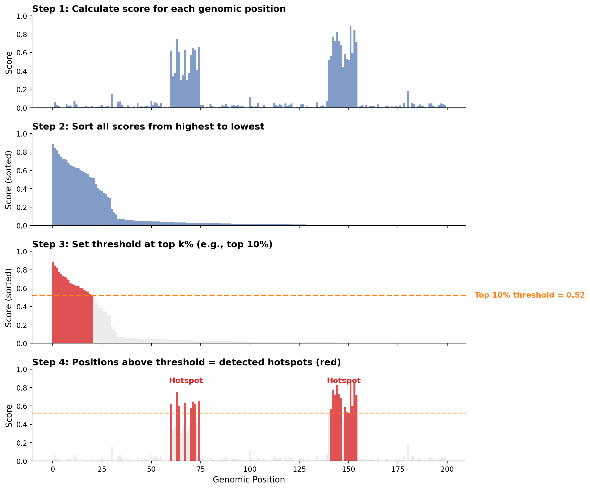

**▲ 빈도 임계값(FreqThresh) 4단계 동작.** Step 1: 각 위치에 점수를 매긴다. Step 2: 점수를 높은 순으로 정렬. Step 3: 상위 10% 지점에 임계값 선을 긋는다 (주황색 점선). Step 4: 원래 위치에서 임계값 이상인 곳(빨간색) = 핫스팟.

**빈도 임계값 (FreqThresh)**

- **무엇**: 각 위치에 점수를 매긴 뒤, 상위 k%(예: 상위 5%)를 핫스팟으로 선택. 가장 단순한 방법이다.
- **왜 선택**: 다른 복잡한 방법들의 **기준선(baseline)** 역할. 이것보다 못하면 복잡한 방법을 쓸 이유가 없다.
- **어디서 성공**: Mercatelli & Giorgi(2020)가 48,635개 SARS-CoV-2 게놈에서 지역별 반복 변이를 이 방법으로 매핑했다.
- **동작 원리**: 점수 목록을 정렬 → 상위 k% 지점에 선 긋기 → 선 위의 위치 = 핫스팟

**적응형 임계값 (AdaptiveKnee)**

- **무엇**: 정렬된 점수 곡선에서 "꺾이는 점(knee)"을 자동으로 찾아 그 지점을 임계값으로 사용.
- **왜 선택**: FreqThresh는 k를 사람이 정해야 하는데, AdaptiveKnee는 **데이터가 스스로 임계값을 결정**한다.
- **어디서 성공**: Satopaa et al.(2011)의 Kneedle 알고리즘이 클러스터 수 결정 등에 널리 사용된다.

---

#### 카테고리 2: 신호 처리 — "파형에서 이상을 찾자"

게놈 위의 점수를 **시간 축의 신호**처럼 취급하여, 신호 처리 기법으로 이상 영역을 찾는다.

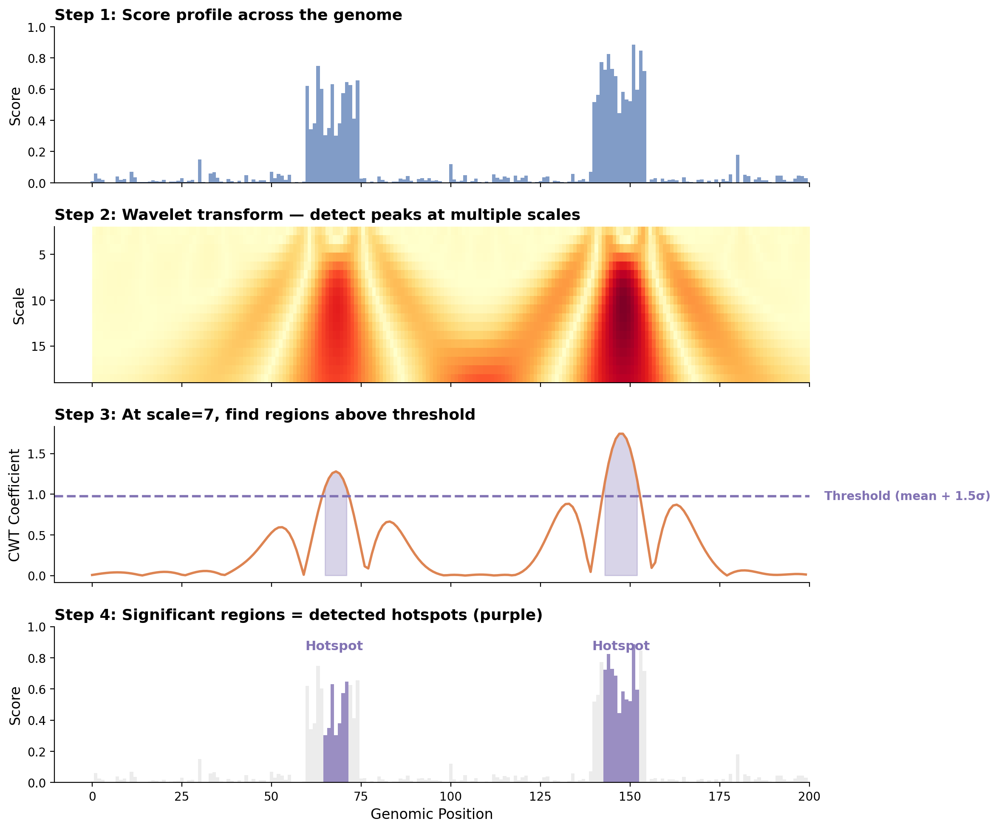

**▲ 웨이블릿 변환(Wavelet) 4단계 동작.** Step 1: 원본 점수 프로파일. Step 2: 히트맵처럼 보이는 이 그림은 **scalogram**(스케일로그램)이라고 하며, 웨이블릿 분석의 표준 시각화 방법이다. x축은 게놈 위치, y축은 분석 크기(scale, 좁은 범위~넓은 범위), 색상은 해당 위치·크기에서의 이상 신호 강도를 나타낸다. 뜨거운 색(빨강/노랑)이 나타나는 곳이 핫스팟 후보다. Step 3: 특정 scale에서 변환 계수가 임계값(보라색 점선)을 초과하는 영역. Step 4: 초과 영역(보라색) = 핫스팟.

**웨이블릿 변환 (Wavelet)**

- **무엇**: 점수 프로파일을 여러 크기(scale)의 "파동"으로 분해하여, 국소적으로 점수가 높은 영역을 탐지. Mexican hat 커널을 사용한다.
- **왜 선택**: 핫스팟의 크기가 다양하므로(좁은 것도, 넓은 것도 있음), **여러 크기에서 동시에 탐지**할 수 있는 웨이블릿이 적합하다.
- **어디서 성공**: Anastassiou(2001)가 DNA 서열에서 엑손(단백질을 만드는 부분)의 3bp 주기성을 발견하는 데 성공적으로 사용했다.
- **동작 원리**: 점수 프로파일 → 여러 크기의 웨이블릿으로 변환 → 변환 계수가 임계값 초과하는 영역 = 핫스팟

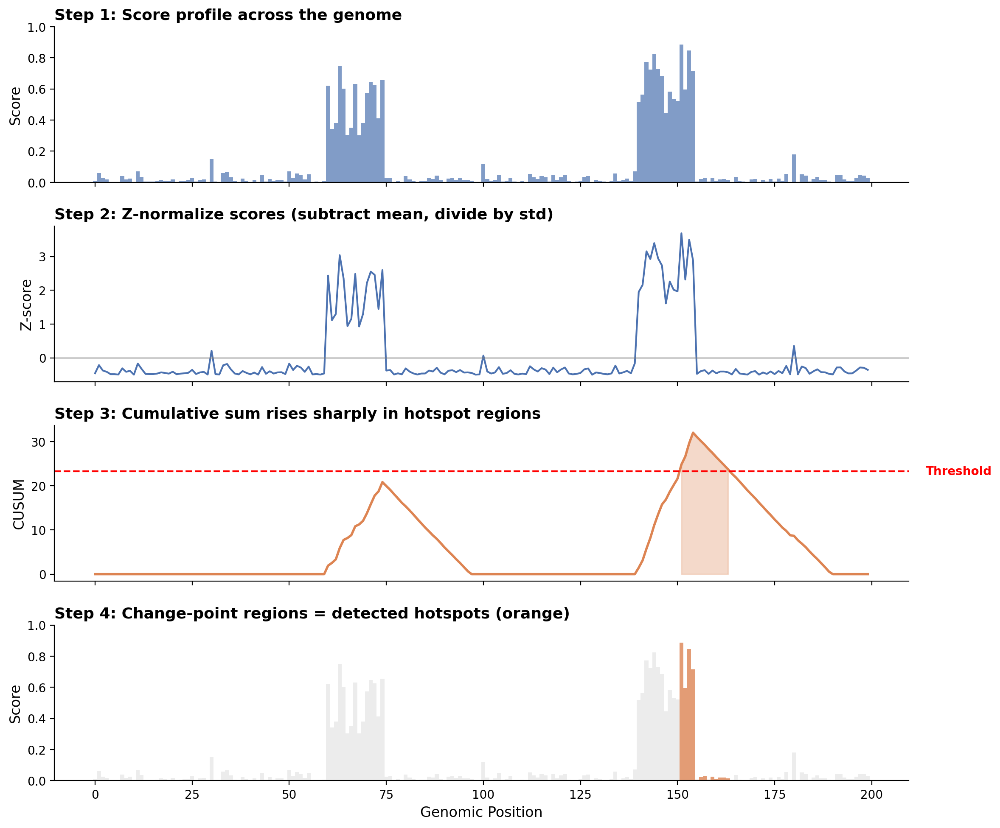

**▲ CUSUM 4단계 동작.** Step 1: 원본 점수. Step 2: z-정규화(평균=0, 표준편차=1로 변환). Step 3: 누적합 계산 — 핫스팟 영역에서 급격히 상승. Step 4: 임계값 초과 구간(주황색) = 핫스팟.

**CUSUM (Cumulative Sum)**

- **무엇**: 점수의 누적합을 추적하면서 "변화점"을 탐지. 핫스팟 영역에 들어가면 누적합이 급격히 올라가고, 나오면 평탄해진다.
- **왜 선택**: 핫스팟의 **경계(시작점과 끝점)**를 정확히 잡는 데 강하다. 공장 품질 관리에서 "불량품이 나오기 시작한 시점"을 찾는 기법이다.
- **어디서 성공**: Sonesson & Bock(2003)이 감염병 발생 조기 탐지에 적용하여, biosurveillance(생물학적 감시)의 표준 기법으로 자리잡았다.

**스펙트럴 분석 (Spectral)**

- **무엇**: FFT(고속 푸리에 변환)로 점수 프로파일을 주파수 영역으로 변환 → 고주파(국소적 변동)만 추출 → 이상 영역 탐지.
- **왜 선택**: 전체적인 배경 트렌드(저주파)를 제거하고 **국소적 이상(고주파)만 분리**할 수 있다.

---

#### 카테고리 3: 밀도/클러스터링 — "뭉쳐 있는 곳을 찾자"

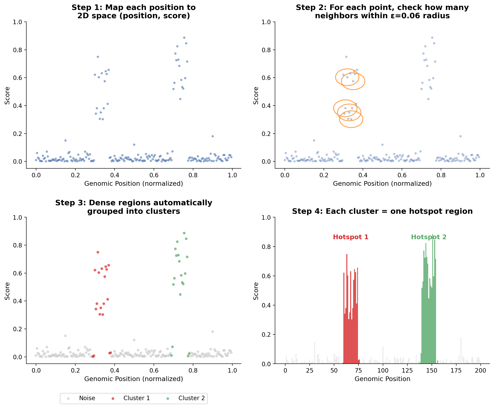

**▲ DBSCAN 4단계 동작.** Step 1: 각 위치를 2D 공간(게놈 좌표, 점수)에 배치. Step 2: 각 점에서 반경 ε 안에 이웃이 몇 개인지 확인. Step 3: 이웃이 충분히 많은 점들을 자동으로 클러스터(빨강, 초록)로 묶고, 나머지는 노이즈(회색). Step 4: 각 클러스터 = 하나의 핫스팟 영역.

**DBSCAN / HDBSCAN**

- **무엇**: 게놈 위에서 높은 점수가 밀집한 영역을 자동으로 찾아 "클러스터"로 묶는다. 사전에 클러스터 수를 지정할 필요 없다.
- **왜 선택**: 핫스팟은 **여러 개가 게놈 곳곳에 흩어져** 있고, 각각의 크기가 다르다. DBSCAN은 이런 불규칙한 형태의 클러스터를 자동으로 찾는 데 최적화되어 있다.
- **어디서 성공**: Tokheim et al.(2016)의 HotMAPS가 26개 암 종에서 3D 단백질 구조 위의 변이 클러스터를 발견했다.
- **동작 원리**: 점수가 높은 위치들을 2차원 공간(게놈 좌표, 점수)에 배치 → 가까이 모여있는 점들을 자동 그룹핑 → 각 그룹 = 핫스팟

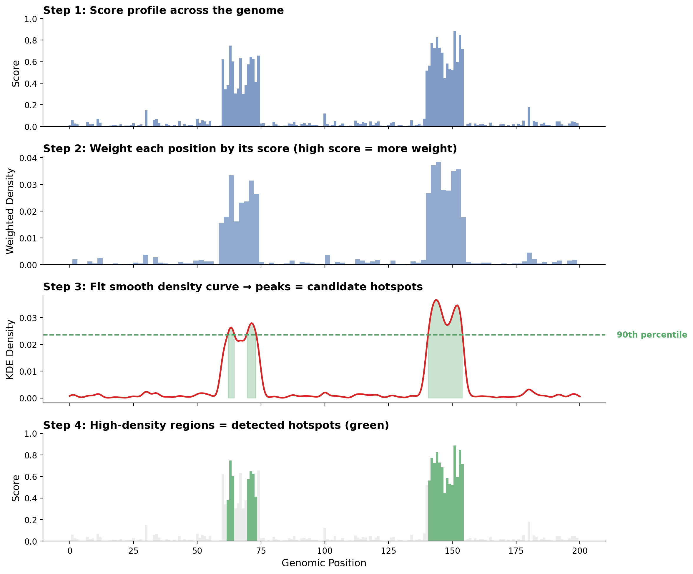

**▲ KDE 4단계 동작.** Step 1: 원본 점수. Step 2: 각 위치를 점수만큼 가중하여 히스토그램 생성. Step 3: 부드러운 밀도 곡선(KDE) 피팅 → 90번째 백분위 이상(초록) = 핫스팟 후보. Step 4: 고밀도 영역(초록) = 핫스팟.

**KDE (Kernel Density Estimation)**

- **무엇**: 각 데이터 포인트에 부드러운 "봉우리"를 놓고 전부 합쳐서 연속적인 밀도 곡선을 만든다. 밀도가 높은 영역이 핫스팟이다.
- **왜 선택**: 이산적인 점수 데이터를 **연속적인 밀도 함수**로 변환하므로, 핫스팟 경계를 부드럽게 결정할 수 있다.
- **어디서 성공**: MACS(Zhang et al. 2008)가 ChIP-Seq(단백질이 DNA에 결합하는 위치를 찾는 실험) 피크 탐지의 표준 도구로 자리잡아 **40,000회 이상 인용**되었다.

---

#### 카테고리 4: 통계/모델 기반 — "통계적으로 유의한 곳을 찾자"

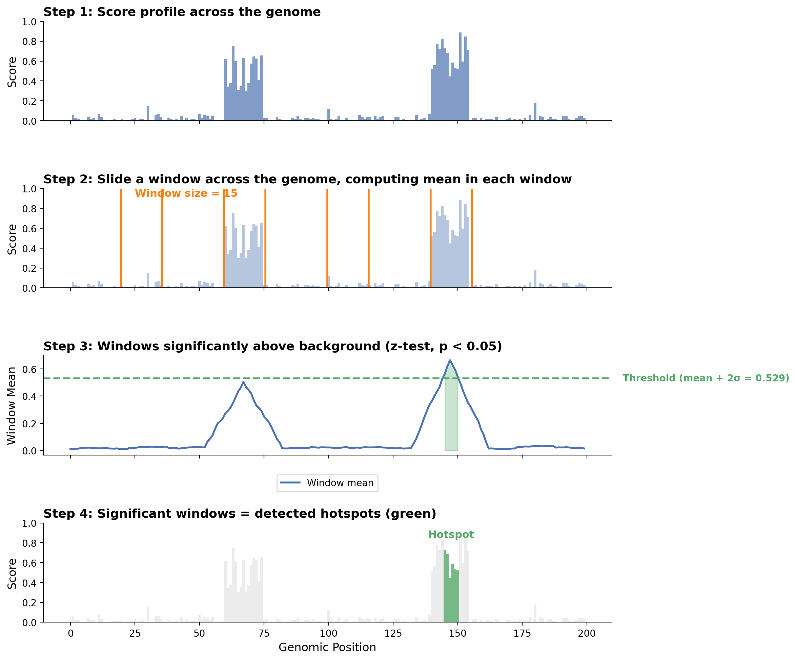

**▲ 슬라이딩 윈도우(SlidingTest) 4단계 동작.** Step 1: 원본 점수 프로파일. Step 2: 15칸 크기의 창을 1칸씩 밀면서 각 창의 평균 계산 (주황색 박스). Step 3: 창 평균이 전체 평균+2σ(초록 점선)를 초과하는 구간. Step 4: 유의한 구간(초록색) = 핫스팟.

**슬라이딩 윈도우 (SlidingTest)**

- **무엇**: 게놈 위에 일정 크기의 "창"을 놓고 한 칸씩 밀면서, 창 안의 평균 점수가 전체 배경보다 통계적으로 유의하게 높은지 z-검정으로 판정.
- **왜 선택**: 가장 직관적인 통계 기반 접근. "이 구간이 나머지보다 유의하게 높은가?"를 직접 검정한다.
- **어디서 성공**: Tajima(1989)의 D 통계량이 집단 내 자연선택을 탐지하는 인구유전학의 기본 도구다.
- **동작 원리**: 20개 위치 크기의 창을 1칸씩 이동 → 각 창의 평균 점수를 계산 → 전체 평균과 z-test 비교 → p < 0.05이면 핫스팟 후보

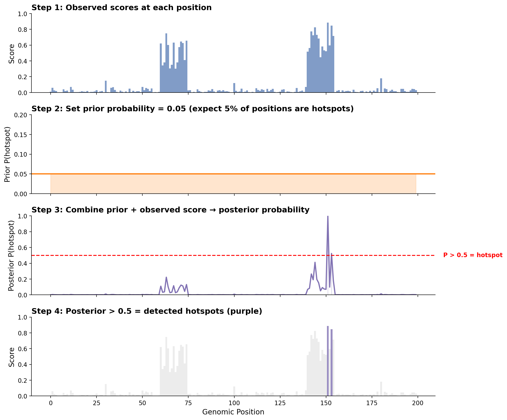

**▲ 베이지안 탐지 4단계 동작.** Step 1: 관측된 점수. Step 2: 사전 확률 설정 (5%가 핫스팟일 것으로 기대). Step 3: 베이즈 정리로 사후 확률 계산 → P > 0.5인 곳(보라색)이 핫스팟. Step 4: 최종 결과.

**베이지안 탐지 (Bayes)**

- **무엇**: "이 위치가 핫스팟일 사전 확률"과 "관측된 점수"를 결합하여 "핫스팟일 사후 확률"을 계산.
- **왜 선택**: **불확실성을 정량적으로 표현**할 수 있다. 단순히 "핫스팟이다/아니다"가 아니라 "80% 확률로 핫스팟이다"라고 말할 수 있다.
- **어디서 성공**: MutSigCV(Lawrence et al. 2013)가 TCGA 데이터에서 33개 유의한 암 드라이버 유전자를 식별했다.

---

#### 카테고리 5: 앙상블/레거시 — "여러 방법을 결합하거나 기존 방법을 사용"

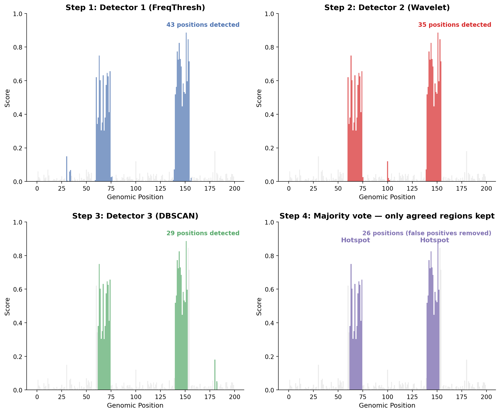

**▲ 앙상블 4단계 동작.** Step 1~3: 3개의 서로 다른 탐지기(FreqThresh, Wavelet, DBSCAN)가 각각 독립적으로 핫스팟을 탐지. 각 방법마다 약간 다른 영역을 찾고, 일부는 고유한 false positive를 만든다. Step 4: 다수결(3/4 이상 동의) → 모든 방법이 동의하는 영역만 남기고 개별 방법의 false positive는 제거된다.

**앙상블 (Ensemble)**

- **무엇**: 4개의 단순 탐지기를 돌려서 다수결로 결정. 3개 이상이 핫스팟이라고 하면 핫스팟.
- **왜 선택**: 개별 방법의 약점을 서로 상쇄할 수 있다. "여러 전문가의 의견을 종합"하는 것과 같다.
- **어디서 성공**: Bailey et al.(2018)이 26개 암 드라이버 유전자 탐지 방법의 앙상블이 개별 방법보다 false positive를 줄인다는 것을 보였다.

**MutClust-Orig**

- **무엇**: 이 논문의 선행 연구(MutClust)의 원래 알고리즘. CCM 시드 탐지 + 적응형 DBSCAN.
- **왜 선택**: 벤치마크의 출발점. "기존 방법이 얼마나 좋은가?"를 측정하는 **비교 기준**.
- **어디서 성공**: Youn et al.(2025)이 SARS-CoV-2 Spike 단백질에서 7개 기능적 핫스팟 클러스터를 식별했다.

**MutClust-Hybrid (본 논문의 개선 방법)**

- **무엇**: MutClust-Orig을 개선한 방법. 두 가지 장점을 결합했다:
  - **CCM 시드 탐지** (MutClust의 강점): 생물학적 사전 지식을 활용하여 핵심 변이 위치(시드)를 먼저 찾는다. 높은 precision(정밀도)을 보장한다.
  - **HDBSCAN 경계 결정** (데이터 기반의 강점): 시드 주변의 클러스터 경계를 데이터에서 자동으로 결정한다. recall(재현율)을 향상시킨다.
- **왜 최고 성능**: MutClust-Orig은 precision이 높지만(0.991) recall이 낮고(0.504), HDBSCAN-Auto는 recall이 높지만(0.944) precision이 매우 낮다(0.079). MutClust-Hybrid는 두 접근의 장점만 취하여 **precision 0.968 + recall 0.659 = F1 0.785**로 최고 균형을 달성했다.
- **핵심 아이디어**: "어디를 볼지"는 도메인 지식(CCM)이, "얼마나 넓게 볼지"는 데이터(HDBSCAN)가 결정한다.

---

#### 통계 용어 해설

**MCC (Matthews Correlation Coefficient)**: 이진 분류 성능 지표. 양성/음성 예측 결과를 하나의 숫자(-1~+1)로 요약한다. 특히 양성이 극소수인 불균형 상황(본 논문에서 핫스팟 비율 1~16%)에서 F1보다 공정하다. 0이면 무작위 수준, 1이면 완벽한 예측이다.

**ANOVA (Analysis of Variance)**: "성능 차이가 방법 때문인지, 바이러스 때문인지, 둘의 조합 때문인지"를 수학적으로 분리하는 통계 기법. omega-squared(ω²)는 각 요인이 전체 성능 분산의 몇 %를 설명하는지를 나타낸다.

**Friedman 검정**: "상위 20개 방법의 순위가 바이러스마다 바뀌는가?"를 검정한다. 정규분포를 가정하지 않는 비모수 검정이므로 ANOVA의 보완 검증으로 사용한다.

### 3.4 시험 범위: 9개 바이러스

다양한 진화 양상을 포괄하기 위해 **9개 RNA 바이러스**를 선택했다:

- **호흡기**: SARS-CoV-2 (Spike, 1,273 AA), MERS (Spike, 1,330 AA), RSV (F 단백질, 574 AA), Influenza A H3N2 (HA, 566 AA), Influenza B (HA, 584 AA)
- **혈액/성매개**: HIV-1 (Env gp120, 480 AA), HCV (E2, 340 AA)
- **위장관**: Norovirus (VP1, 540 AA)
- **절지동물 매개**: Dengue (E 단백질, 495 AA)

**9개 바이러스 비교표:**

| 바이러스 | 단백질 | 길이(AA) | 서열 수 | Layer A | Layer B | Layer C | 전파 경로 | 진화 패턴 | 변이 속도 |
|---------|--------|---------|--------|---------|---------|---------|---------|---------|---------|
| SARS-CoV-2 | Spike | 1,273 | 4,982 | 25 | 154 | 252 | 호흡기 | 수렴 진화 | ~1/10,000 |
| H3N2 | HA | 566 | 2,644 | 25 | 10 | 102 | 호흡기 | 항원 변이 | ~1/5,000 |
| Norovirus | VP1 | 540 | 1,894 | 18 | 0 | 0 | 위장관 | Epoch 진화 | ~1/2,000 |
| HIV-1 | gp120 | 480 | 5,325 | 12 | 18 | 100 | 혈액/성매개 | Quasispecies | ~1/1,000 |
| Dengue | E protein | 495 | 3,156 | 15 | 229 | 0 | 절지동물 | 혈청형 분화 | ~1/1,250 |
| RSV | F protein | 574 | 1,311 | 18 | 18 | 101 | 호흡기 | 중간 속도 | ~1/1,400 |
| Flu-B | HA | 584 | 2,101 | 10 | 10 | 0 | 호흡기 | 2계통 분화 | ~1/6,700 |
| MERS | Spike | 1,330 | 530 | 9 | 0 | 0 | 호흡기 | 제한된 데이터 | ~1/10,000 |
| HCV | E2 | 340 | 1,578 | 54 | 0 | 0 | 혈액/성매개 | 초변이 | ~1/2,000 |

아래 그림은 각 바이러스의 분석 대상 단백질 구조를 보여준다.

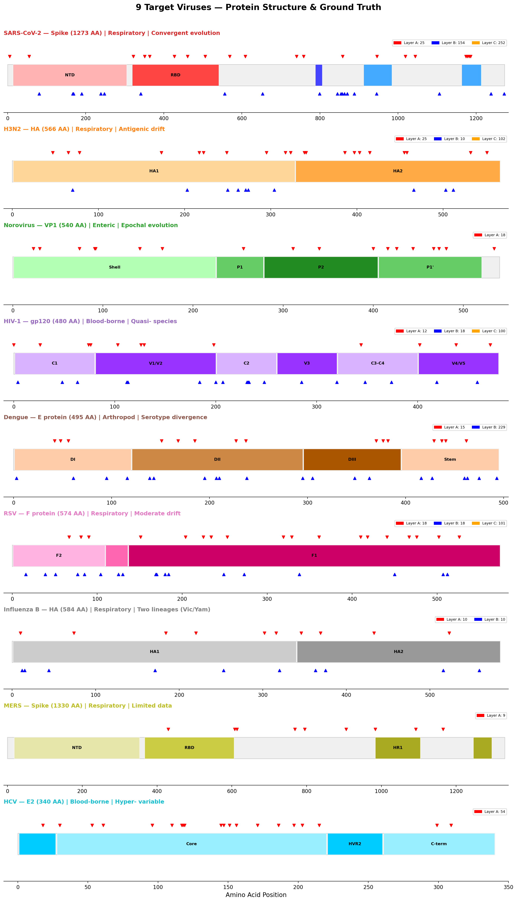

**▲ 9개 바이러스 단백질 구조 모식도.** 각 바이러스의 분석 대상 단백질을 선형으로 펼쳐서 도메인(기능 영역)을 색상으로 표시했다. 빨간 삼각형(▼)은 Layer A(양성 선택) 위치, 파란 삼각형(▲)은 Layer B(보존 영역) 위치를 나타낸다. SARS-CoV-2의 RBD(수용체 결합 도메인)가 진한 빨간색, HIV-1의 V1~V5 가변 영역이 보라색, HCV의 HVR1/HVR2 초변이 영역이 하늘색으로 표시되어 있다.

각 바이러스의 상세 특성은 다음과 같다:

**SARS-CoV-2** — 2019년 출현한 코로나바이러스. Spike 단백질(1,273 AA)이 인간 ACE2 수용체에 결합하여 세포에 진입한다. 변이 속도가 비교적 느리지만(약 1/10,000 치환/위치/년), 전 세계적 대유행으로 인해 엄청난 양의 서열 데이터가 축적되어 있다. Alpha, Beta, Delta, Omicron 등 주요 변이주가 각각 다른 지역에서 독립 출현했으며, 수렴 진화 연구가 가장 활발한 바이러스다.

**Influenza A H3N2** — 계절 인플루엔자의 주요 아형. HA(혈구응집소, 566 AA) 단백질이 분석 대상이다. **항원 변이(antigenic drift)**가 지속적으로 일어나 매년 백신을 갱신해야 한다. 항원 지도(antigenic cartography)를 통해 핵심 변이 위치가 잘 알려져 있어 ground truth 구성에 유리하다.

**Norovirus** — 급성 위장관염의 주요 원인 바이러스. VP1 캡시드 단백질(540 AA)이 분석 대상이다. H3N2와 달리 **epoch 진화** 패턴을 보인다: 수년간 안정적이다가 갑자기 새로운 변이주로 대체된다. 이 독특한 진화 양상이 벤치마크에서 H3N2와 대조적인 결과를 만들어낸다.

**HIV-1** — 후천성 면역결핍 바이러스. Env gp120(480 AA)이 분석 대상이다. RNA 바이러스 중 **가장 빠른 변이 속도**(약 1/1,000 치환/위치/년)를 가지며, 한 환자 내에서도 다양한 변이주가 공존하는 quasispecies를 형성한다. 극도로 높은 다양성이 탐지 방법에 도전적인 환경을 제공한다.

**Dengue** — 모기 매개 열대 감염병. E 단백질(495 AA)이 분석 대상이다. 4개 혈청형(DENV-1~4)이 존재하며, 항체 의존적 증강(ADE)으로 인해 백신 설계가 특히 어렵다.

**RSV** — 영유아 호흡기 감염의 주요 원인. F 융합 단백질(574 AA)이 분석 대상이다. 2023년부터 RSV 백신이 승인되기 시작하여 변이 감시의 중요성이 높아지고 있다.

**MERS-CoV** — 중동호흡기증후군 코로나바이러스. SARS-CoV-2와 같은 코로나바이러스 계열이지만 서열 수가 적어(약 530개) Ground Truth 구성이 가장 어려운 바이러스다. Oracle MCC가 9개 중 가장 낮다(0.088).

**Influenza B** — 인플루엔자 B형. H3N2와 같은 인플루엔자이지만 진화 속도가 느리고 두 개 계통(Victoria, Yamagata)으로 나뉜다. H3N2와의 비교를 통해 같은 바이러스 과(Orthomyxoviridae) 내에서도 최적 방법이 달라지는지 확인할 수 있다.

**HCV** — C형 간염 바이러스. E2 단백질(340 AA)이 분석 대상이다. 초변이 영역(HVR1, HVR2)이 존재하여 Layer A 정의가 다른 바이러스와 다르다(수렴 진화 대신 초변이 영역 사용). **Layer B가 0**이어서(제약 영역 미정의) 3층 GT 중 2층만 사용 가능한 특이 사례다.

이 9종은 변이 속도, 단백질 길이, 진화 패턴이 모두 달라, 단일 바이러스에 치우치지 않는 평가를 보장한다.

각 바이러스에 대해 **9가지 점수화 공식 x 41가지 탐지 알고리즘 x 9개 바이러스 = 3,321회** 평가를 수행했다.

---

## 4. 실험 설계와 결과

### 전체 실험 설계: 왜 2단계인가?

이 연구의 실험은 **"좁고 깊게 → 넓고 체계적으로"** 2단계로 설계되어 있다.

- **Stage 1 (SARS-CoV-2 심층 분석)**: 먼저 가장 데이터가 풍부한 코로나바이러스 하나에 집중한다. 목적은 "MutBench 평가 도구 자체가 제대로 작동하는가?"를 검증하는 것이다. 마치 새로 만든 저울이 정확한지 확인하기 위해, 무게를 이미 아는 물건으로 먼저 테스트하는 것과 같다.

- **Stage 2 (9-pathogen 대규모 비교)**: Stage 1에서 도구가 작동함을 확인한 후, 9개 바이러스로 확장하여 핵심 질문에 답한다: **"모든 바이러스에 통하는 만능 방법이 있는가?"**

Stage 1 없이 바로 Stage 2로 가면, 결과가 나빠도 "방법이 나쁜 건지, 평가 도구가 나쁜 건지" 구분할 수 없다. Stage 1이 평가 도구의 신뢰성을 먼저 보장해주기 때문에, Stage 2의 결과를 믿을 수 있다.

### Stage 1: SARS-CoV-2 심층 분석 — "평가 도구가 작동하는가?"

Stage 1은 5개의 실험으로 구성되며, 각각 평가 프레임워크의 다른 측면을 검증한다.

#### 실험 1: 합성 데이터 테스트 — "정답을 미리 알 때, 방법 차이가 보이는가?"

첫 번째로 해야 할 일은 평가 도구가 "좋은 방법과 나쁜 방법을 구분할 수 있는지" 확인하는 것이다. 이를 위해 **정답을 미리 알고 있는** 통제된 환경을 만든다.

29,903개 위치의 가상 게놈에 7개 알려진 기능 영역(RBD, NTD 등 총 1,251개 위치)에 높은 점수를 인위적으로 심어놓고, 7가지 방법이 이 정답을 얼마나 잘 찾는지 비교했다.

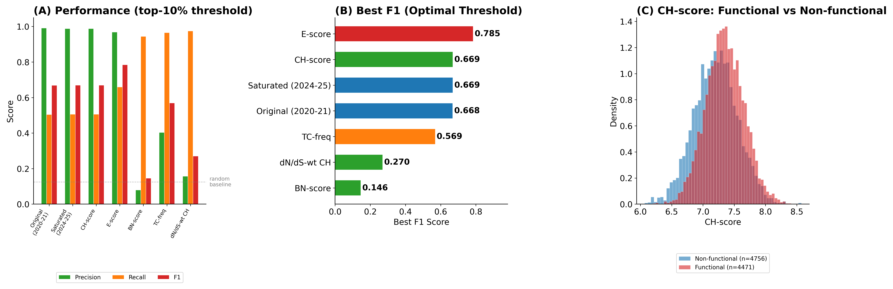

**▲ 합성 데이터 방법 비교.** (A) 7가지 방법의 precision/recall/F1. MutClust-Hybrid가 F1=0.785로 최고 균형. MutClust-Original은 정밀하지만(precision 0.991) 놓치는 게 많고(recall 0.504), HDBSCAN-Auto는 거의 다 찾지만(recall 0.944) 헛것도 많다(precision 0.079). (B) 최적 임계값에서의 최고 F1. (C) CH-score의 기능/비기능 위치 분리도.

**핵심 발견**: MutClust-Hybrid가 **도메인 지식(어디를 볼지)과 데이터 기반 탐지(얼마나 넓게 볼지)**를 결합하여 최고 성능을 달성했다.

**중요한 주의**: 이 합성 데이터 결과(F1 0.785)는 **실제 성능을 과대추정**한다. 뒤의 실제 GISAID 데이터에서는 F1이 0.123으로 급락한다. 합성 실험의 목적은 절대 성능 측정이 아니라, 평가 도구가 방법 간 차이를 구분할 수 있는지 확인하는 것이다.

#### 실험 2: 게놈 핫스팟 지도 — "탐지 결과가 생물학적으로 말이 되는가?"

합성 데이터에서 방법 차이를 확인했다. 이제 **실제 게놈 위에서** 탐지 결과가 어떻게 나타나는지 시각적으로 확인한다.

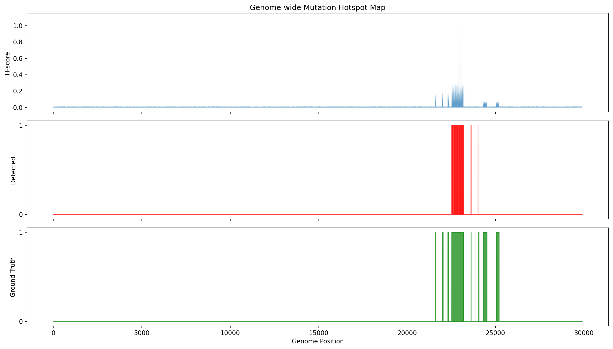

**▲ 게놈 핫스팟 지도.** SARS-CoV-2 Spike 단백질 전체에 걸친 3층 비교. 위: H-score 분포 (변이 활발도). 가운데: 탐지 결과 (빨간색 = 핫스팟). 아래: Ground Truth (초록 = 알려진 기능 영역). 탐지 결과와 Ground Truth가 대체로 겹치므로, 방법이 생물학적으로 의미 있는 영역을 찾고 있음을 확인할 수 있다.

#### 실험 3: 다중 Ground Truth 검증 — "정답 기준이 달라지면 최적 방법도 달라지는가?"

실험 1-2에서 하나의 정답 기준(기능 영역)만 사용했다. 하지만 "핫스팟이 중요한 이유"는 여러 가지다 — 면역 회피(수렴 진화), 실험적 기능(DMS), 구조적 위치(기능 영역). **정답 기준을 바꾸면 최적 방법도 달라지는가?**

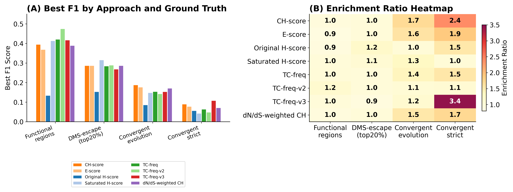

**▲ 다중 GT 평가.** (A) 4가지 정답 기준별 최고 F1. **정답 기준에 따라 최적 방법이 달라진다**: 기능 영역 → TC-freq-v2, DMS → Saturated H-score, 수렴 진화 → CH-score. 이것은 아직 SARS-CoV-2 하나만의 결과인데도, 이미 "만능 방법은 없다"의 첫 번째 힌트가 나타난다. (B) 점수화 방법 × GT별 enrichment 히트맵.

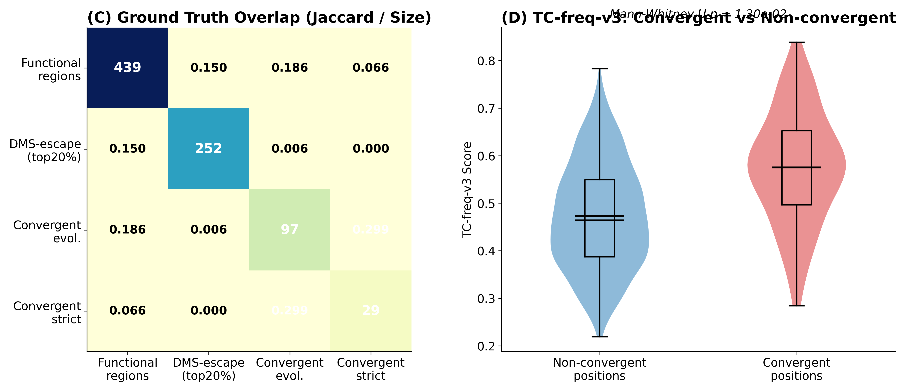

**▲ 다중 GT 평가 (계속).** (C) GT 간 Jaccard 중첩 행렬 — 비대각선 값이 0.006으로, 세 GT가 거의 겹치지 않는다. 이는 3층 GT가 각각 독립적인 정보를 제공한다는 것을 정량적으로 보여준다. (D) 수렴 vs 비수렴 위치의 점수 분포.

#### 실험 4: DMS 실험 데이터 검증 — "실험실에서 직접 측정한 데이터와도 일치하는가?"

지금까지의 정답 기준(기능 영역, 수렴 진화)은 문헌에서 가져온 것이다. 여기서는 **실험실에서 직접 측정한** DMS 데이터로 독립 검증한다. DMS에서 "기능적으로 중요하다"고 측정된 위치를 탐지 방법이 실제로 찾는지 확인한다.

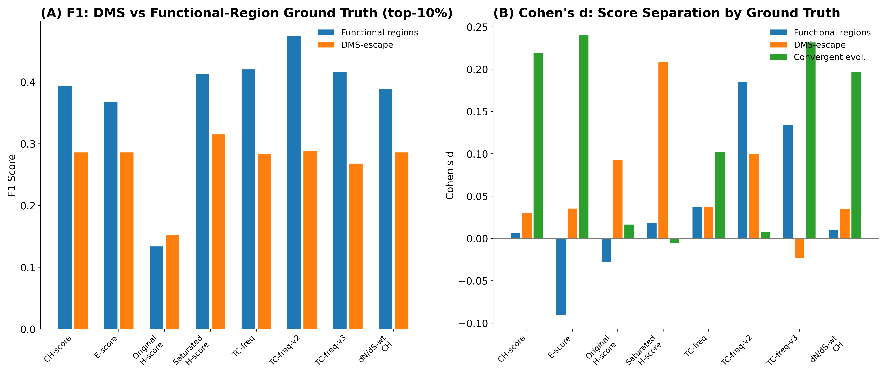

**▲ DMS 검증.** (A) DMS 기반 GT vs 기능 영역 GT에서의 F1 비교 — 같은 방법이 어떤 GT를 기준으로 보느냐에 따라 성능이 크게 달라진다. (B) Cohen's d 효과 크기 — 어떤 점수가 핫스팟과 비핫스팟을 잘 분리하는지.

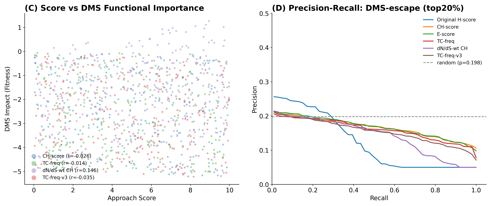

**▲ DMS 검증 (계속).** (C) 점수와 DMS 적합도의 상관 산점도. (D) DMS-escape 위치에 대한 Precision-Recall 곡선.

#### 실험 5: 안정성 검증 — "이 결과를 믿어도 되는가?"

마지막으로, 벤치마크 결과 자체가 안정적인지 확인한다. 입력 서열 수를 50개에서 5,000개까지 바꿔가며, 결과가 얼마나 흔들리는지 관찰한다.


**▲ 표본 크기 수렴.** 약 1,000개 서열부터 성능이 안정화된다(hotspot-score ≈ 0.62). 본 벤치마크에 사용된 서열 수(1,311~5,325개)는 모두 이 수렴점 이상이므로, 결과는 데이터 양의 부족으로 인한 아티팩트가 아니다.

**Stage 1 요약**: 평가 도구(hotspot-score, 3층 GT)가 작동함을 확인했다. 방법 간 차이를 구분할 수 있고, 결과가 안정적이며, 생물학적으로 의미 있는 영역을 탐지한다. 그리고 첫 번째 힌트를 발견했다 — 같은 바이러스 내에서도 정답 기준에 따라 최적 방법이 달라진다. 이것이 Stage 2로 나아가는 동기다.

---

### Stage 2: 9개 바이러스 대규모 비교 — "만능 방법은 정말 없는가?"

Stage 1에서 코로나 하나로 도구를 검증했다. 이제 핵심 질문에 답할 차례다.

**질문**: 코로나에서 가장 좋은 방법(MutClust-Hybrid)이 인플루엔자에서도 좋은가? HIV에서도? 노로바이러스에서도?

이 질문에 답하기 위해 **9개 바이러스 × 9가지 점수화 공식 × 41가지 탐지 알고리즘 = 3,321회** 평가를 수행하고, 4가지 서로 다른 통계 방법으로 같은 질문을 검증했다. 4가지를 사용한 이유는 하나의 통계 검정만으로는 "우연일 수 있다"는 반론을 받을 수 있기 때문이다. 4가지가 모두 같은 결론을 가리키면 반론의 여지가 없다.

#### 증거 1: ANOVA — "성능 차이의 원인이 무엇인가?"

**질문**: 방법마다 성능이 다른데, 이 차이가 "방법이 원래 좋아서"인가 아니면 "특정 바이러스와의 궁합 때문"인가?

**방법**: 3-way ANOVA로 성능 분산을 요인별로 분해했다. 마치 학생 성적의 차이가 "학생 능력 때문"인지 "과목과의 궁합 때문"인지를 분리하는 것과 같다.

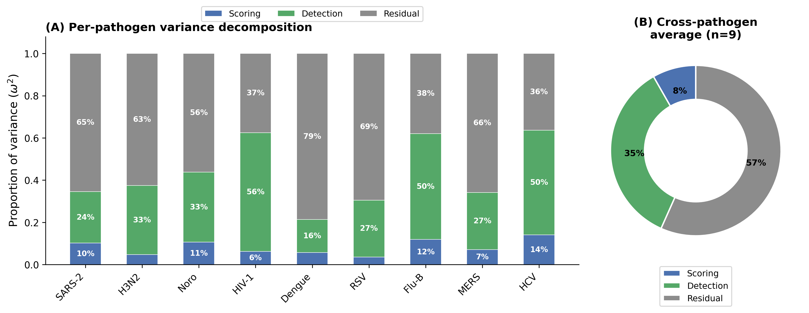

**▲ ANOVA 분산 분해.** 이 논문에서 가장 중요한 그림이다. **녹색(탐지 방법 × 바이러스 상호작용)**이 28.5%로 가장 크다. "탐지 방법 자체"는 2.5%에 불과하다. 즉 "이 방법이 좋다"(2.5%)보다 "이 방법이 **이 바이러스에서** 좋다"(28.5%)가 **11배 더 중요**하다.

**결론**: 방법의 성능은 방법 자체보다 **방법과 바이러스의 조합**에 의해 결정된다.

#### 증거 2: 9/9 고유 최적 조합 — "실제로 모든 바이러스가 다른 방법을 원하는가?"

**질문**: ANOVA에서 "조합이 중요하다"는 것을 알았다. 그렇다면 실제로 각 바이러스의 최적 조합이 서로 다른가?

**방법**: 9개 바이러스 각각에 대해 369가지 조합 중 MCC(정확도 지표)가 가장 높은 조합을 찾았다.

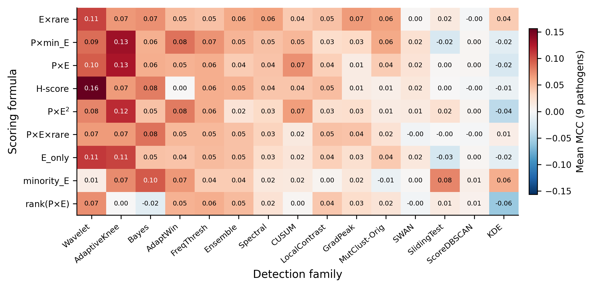

**▲ 성능 히트맵.** 9개 바이러스(행) × 15개 탐지 패밀리(열). 가장 진한 색이 최고 성능인데, **바이러스마다 다른 위치**에 있다. 만능 방법이 있었다면 한 열이 전부 진한 색이어야 한다.

**결과**: 9개 바이러스 모두 서로 다른 최적 조합을 가진다 — SARS-CoV-2는 E×rare + CUSUM, H3N2는 E_only + SlidingTest, Norovirus는 P×E×rare + Wavelet... 단 하나의 조합도 2개 이상의 바이러스에서 동시에 최적이 아니다.

#### 증거 3: Friedman 검정 — "이 차이가 통계적으로 유의한가?"

**질문**: 증거 2에서 최적 조합이 다르다는 것을 봤다. 하지만 이것이 "우연히" 다른 것일 수도 있다. 통계적으로 유의하게 다른가?

**방법**: Friedman 비모수 검정으로, 상위 20개 조합의 성능 "순위"가 바이러스마다 유의하게 바뀌는지 검정했다. 정규분포를 가정하지 않는 검정이라 데이터 분포에 대한 걱정 없이 사용할 수 있다.

**결과**: χ² = 42.44, **p = 0.0015**. 귀무가설("순위가 바이러스에 관계없이 같다")이 기각된다. 순위는 우연이 아니라 유의하게 바뀐다.

#### 증거 4: LOPO 교차 검증 — "그러면 실제로 예측이 불가능한가?"

**질문**: 가장 실용적인 질문이다. 만약 **새로운 바이러스**가 등장하면, 기존 바이러스에서 잘 된 방법을 그대로 적용해도 되는가?

**방법**: Leave-One-Pathogen-Out — 9개 바이러스 중 1개를 "새 바이러스"로 간주하고 빼놓는다. 나머지 8개에서 최적 조합을 찾아 빼놓은 바이러스에 적용한다. 이것을 9번 반복하여, 기존 데이터로 새 바이러스의 최적 방법을 예측할 수 있는지 확인한다.

**결과**: **0/9 일치.** 9번 시도에서 단 한 번도 맞지 않았다. 다른 바이러스에서 좋은 방법이 이 바이러스에서도 좋을 것이라는 기대는 완전히 빗나간다. 평균 일반화 비율은 oracle 성능의 4.9%에 불과하다.

#### Stage 1→2 연결: Cross-Pathogen 비교

Stage 1에서 코로나 최적이었던 MutClust-Hybrid는 다른 바이러스에서 어떤가?


**▲ SARS-CoV-2 vs H3N2 방법 순위 비교.** Stage 1 최적이었던 MutClust-Hybrid가 H3N2에서는 MutClust-Fixed에 밀린다. 같은 인플루엔자 계열인 Flu-B에서도 순위가 또 다르다. 이것이 "만능 방법은 없다"의 가장 직관적인 증거다.

**Stage 2 종합**: 4가지 독립적 검증(ANOVA, 9/9 고유, Friedman, LOPO)이 모두 같은 결론을 가리킨다. **바이러스마다 최적의 핫스팟 탐지 방법이 다르며, 하나의 방법을 모든 바이러스에 적용하는 것은 체계적으로 성능이 떨어진다.**

---

## 5. 추가 검증

### 5.1 ESM-2: 딥러닝도 같은 패턴

ESM-2(6.5억 파라미터 단백질 언어 모델)로 완전히 다른 방식의 점수를 만들어도: SARS-CoV-2와 MERS에서는 **1위**, 노로바이러스와 HIV에서는 **꼴찌(10위)**. 딥러닝조차 바이러스 의존성을 벗어나지 못한다.

### 5.2 계통발생 보정

H-score와 실제 독립적 변이 횟수의 상관: **ρ = -0.876**. H-score가 높은 곳이 오히려 독립적 변이가 적다 — founder effect를 positive selection으로 착각하는 근본적 한계.

### 5.3 Region-Overlap 분석

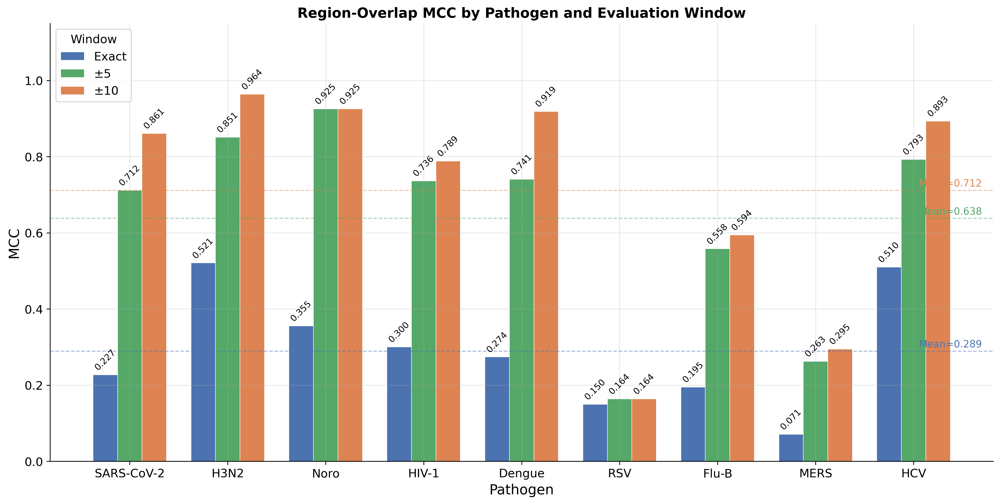

**▲ Figure 5.1: Region-Overlap MCC 비교.** 파란색(Exact, 정확히 일치), 녹색(±5), 주황색(±10) 윈도우에서의 MCC를 9개 바이러스별로 비교한다. Exact(0.289) → ±10(0.712)으로 성능이 크게 향상된다. 이는 탐지 결과가 정답과 "정확히" 일치하지 않더라도, 생물학적으로 의미 있는 근접 거리 안에 위치한다는 뜻이다. H3N2는 ±10에서 MCC 0.964에 도달한다.

### 5.4 민감도 분석


**▲ Figure 4.8: 파라미터 민감도 히트맵.** MutClust의 주요 파라미터(epsilon 스케일링 γ, decay d, 최소 포인트 MinPts)를 64가지 조합으로 바꿔도 성능이 안정적인지를 보여준다. MutClust-Hybrid가 71.9%의 조합에서 1위를 유지했다.

---

## 6. PAHD: 바이러스 맞춤형 방법 선택

"만능 방법이 없다"면 → **바이러스에 맞는 방법을 자동으로 골라야 한다.**

PAHD (Pathogen-Adaptive Hotspot Detection): 바이러스의 게놈 특성을 프로파일로 만들어, 유사한 바이러스에서 잘 작동한 방법을 추천하는 시스템.

현재 **개념 증명** 단계:

- 패밀리 수준: oracle 성능의 **48.3%** 회복
- 점수화 수준: oracle 성능의 **57.7%** 회복
- 정확한 조합: **0/9** (n=9로는 부족, 20+ 필요)

---

## 7. 한계

- **Ground truth 불완전**: DMS 데이터는 4/9 바이러스에만 존재
- **RNA 바이러스만**: DNA 바이러스(HPV, HBV) 미검증
- **계통발생 보정 미완**: founder effect 인지+검증했지만 파이프라인 미통합
- **합성-실제 성능 격차**: 합성 벤치마크가 절대 성능 과대추정
- **PAHD 데이터 부족**: 20+ 바이러스 필요

---

## 8. 기여 요약

**기여 1: MutBench 벤치마크 프레임워크** — 바이러스 핫스팟 탐지 분야 최초의 공정한 비교 기준

**기여 2: 병원체 적응형 방법 선택의 필요성 증명** — 4가지 독립적 통계 증거(ANOVA ω²=0.285, 9/9 고유, Friedman p=0.0015, LOPO 0/9)로 입증

---

## 9. 한줄 결론

> 바이러스마다 최적의 핫스팟 탐지 방법이 다르다. 따라서 하나의 방법을 모든 바이러스에 적용하는 현재 관행은 체계적으로 성능이 떨어진다. MutBench가 이를 증명했고, 앞으로는 바이러스 특성에 맞는 방법을 선택해야 한다.
