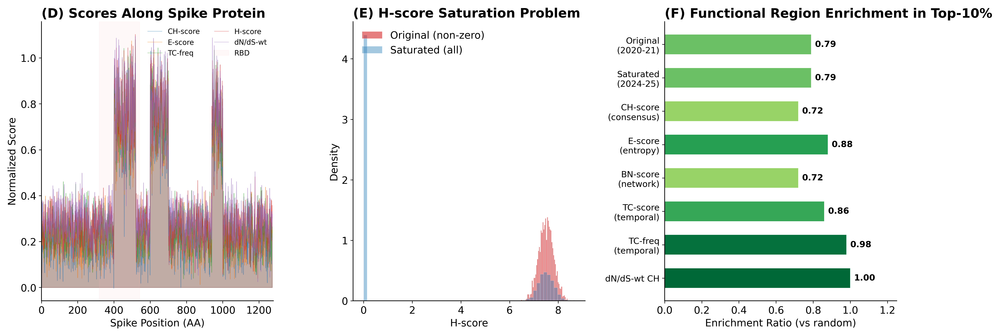

# MutBench 학위논문 쉬운 설명서

**한줄 요약**: 바이러스 변이 핫스팟을 찾는 방법이 여러 개 있는데, 어떤 방법이 좋은지 비교할 기준이 없었다. 이 논문이 그 기준(MutBench)을 만들고, "모든 바이러스에 통하는 만능 방법은 없다"는 것을 통계적으로 증명했다.

---

## 1. 배경: 바이러스 변이란?

### 1.1 바이러스와 변이

바이러스는 세포 안에서 자신의 유전자를 복사하여 증식한다. 이 유전자는 A, C, G, U(또는 T) 네 글자로 이루어진 서열이다. SARS-CoV-2(코로나바이러스)는 약 30,000개의 염기로 구성되어 있다.

복제 과정에서 간혹 복사 오류가 발생하는데, 이것이 **변이(mutation)**다. RNA 바이러스(코로나, 인플루엔자, HIV 등)는 특히 변이가 빠르다. 연간 유전자 위치당 약 10만분의 1 ~ 1천분의 1 비율로 변이가 축적되어, 수개월 내에 새로운 변이주가 출현한다.

### 1.2 핫스팟이란?

**핫스팟(hotspot)**이란 변이가 유독 많이 생기는 유전체 위치 또는 영역을 말한다.

중요한 점: 단순히 변이가 "많은" 곳이 아니다. 핫스팟에는 두 가지 종류가 섞여 있다.

- **진짜 핫스팟**: 바이러스가 인간 면역을 회피하거나 감염력을 높이기 위해 "선택적으로" 변이하는 곳. 예: SARS-CoV-2 Spike 단백질의 E484K, N501Y 위치는 여러 변이주(Alpha, Beta, Gamma, Omicron)에서 독립적으로 반복 출현했다.
- **가짜 핫스팟 (founder effect)**: 특정 변이가 많은 이유가 "유리해서"가 아니라 "그 변이를 가진 계통이 우연히 크게 번성해서"인 경우. D614G 변이가 대표적이다.

### 1.3 왜 중요한가?

- **백신 설계**: 핫스팟(계속 변하는 곳)을 피하고, 보존된 부위를 타겟으로 삼아야 오래 쓸 수 있는 백신을 만들 수 있다.
- **항바이러스제 개발**: 약물이 표적하는 부위가 핫스팟이면 내성 변이가 빠르게 나타난다.
- **실시간 감시**: 새로운 변이주가 핫스팟 위치에서 변이를 축적하면 위험 신호다.

---

## 2. 문제: 비교 기준이 없다

### 2.1 세 가지 구체적 문제

**문제 1: 정답이 없다.** "여기가 진짜 핫스팟이다"라는 공인된 정답표(ground truth)가 없다. 각 논문이 자기 기준으로 "잘 찾았다"고 주장하지만, 기준이 다르니 비교할 수 없다.

**문제 2: 각자 다른 데이터로 평가한다.** 방법 A는 코로나 데이터로 테스트하고, 방법 B는 인플루엔자로 테스트한다. 같은 시험을 보지 않았으니 비교가 불가능하다.

**문제 3: 하나의 바이러스만 테스트한다.** 코로나에서 좋은 방법이 HIV에서도 좋을지 아무도 검증하지 않았다.

### 2.2 암 분야와의 대조

암 유전체학에서는 이 문제가 이미 해결되어 있다. Bailey et al.(2018)은 26개 암 드라이버 유전자 탐지 방법을 체계적으로 비교했다. 바이러스 유전체학에는 이런 벤치마크가 없었다.

인접 분야의 유사 연구들:

- **ProteinGym**(2023): 변이 효과 예측 모델 벤치마크 (핫스팟 "영역" 탐지가 아님)
- **ConDor**(2024): 수렴 변이 탐지 도구 (벤치마크 프레임워크가 아님)
- **Pons et al.**(2020): 암 핫스팟 탐지 40+ 방법 리뷰 (서술적 서베이, 암 한정)

---

## 3. 해결: MutBench

### 3.1 정답표: 3층 Ground Truth

"진짜 핫스팟"을 정의하기 위해 3가지 독립적인 생물학적 근거를 결합했다.

**Layer A (정답/양성)** — 수렴 진화 위치: **같은 바이러스 종 안에서** 서로 다른 계통(lineage)이 독립적으로 같은 위치에서 변이한 곳. 예: SARS-CoV-2의 E484K는 Alpha(영국), Beta(남아공), Gamma(브라질), Omicron(남아공) 계통에서 각각 독립적으로 출현했다. 이렇게 반복적으로 같은 위치가 변이한다는 것은 그 위치가 바이러스에게 진화적으로 유리하다는 강력한 증거다. 병원체당 9~54개 위치.

Layer A는 변이의 "기능"이 무엇인지(면역 회피인지, 감염력 증가인지)는 묻지 않는다. 오직 "독립적으로 반복 출현했는가"만 본다. 구체적인 기능적 영향은 Layer C(DMS 실험)에서 확인한다.

**Layer B (오답/음성)** — 보존 구조 영역: 변이가 생기면 단백질 접힘이 파괴되거나, 막 융합이 불가능해지거나, 수용체 결합이 사라지는 위치로, 해당 변이를 가진 바이러스는 도태된다(예: 막 융합에 필수적인 heptad repeat 영역, 구조적 이황화결합 시스테인 잔기). 진화적으로 이 위치의 변이는 "정화 선택"에 의해 제거되므로 핫스팟이 될 수 없다. 탐지 방법이 이곳을 핫스팟이라고 하면 오답이다. 병원체당 0~229개 위치.

**Layer C (검증)** — DMS 실험 데이터: 실험실에서 모든 가능한 단일 아미노산 치환을 물리적으로 만들어, 정량적 표현형(예: SARS-CoV-2의 세포 진입 효율, H3N2의 복제 적합도)에 미치는 영향을 측정한 데이터. 이 층은 진화 데이터에서 아직 관찰되지 않은 기능적 중요성을 포착할 수 있다. 9개 중 4개 바이러스에 존재.

**세 층의 역할 비교:**

- **Layer A**: "이 위치가 반복적으로 변이하는가?" → 진화적 패턴 (메커니즘 무관)
- **Layer B**: "이 위치가 변이하면 바이러스가 죽는가?" → 구조적 제약
- **Layer C**: "이 위치의 변이가 실제로 기능에 얼마나 영향을 주는가?" → 실험적 기능 측정

세 질문은 서로 독립적이다. Layer A에서 핫스팟인 위치가 Layer C에서 반드시 높은 적합도 효과를 보이지는 않으며(Jaccard 0.006), 그 반대도 마찬가지다. 이것이 단일 기준이 아닌 3층 체계를 사용하는 이유다.

세 근거의 Jaccard 유사도는 0.006으로, 거의 겹치지 않는다 — 독립적 정보를 제공한다.

### 3.2 채점 기준: Hotspot-score

```
hotspot-score = (recall + precision + stability) / 3
```

각 성분은 3층 Ground Truth를 기준으로 계산된다:

- **Recall (재현율)**: Layer A(수렴 진화 위치) 중에서 탐지 방법이 실제로 찾아낸 비율. 예를 들어 SARS-CoV-2에 Layer A 위치가 25개 있는데 탐지 방법이 그중 15개를 찾았다면 recall = 15/25 = 0.60. 높을수록 놓치는 핫스팟이 적다.

- **Precision (정밀도)**: 탐지 방법이 핫스팟이라고 보고한 위치 중에서 실제로 Layer A에 속하는 비율. 예를 들어 100개 위치를 핫스팟으로 보고했는데 그중 15개만 Layer A에 포함된다면 precision = 15/100 = 0.15. 높을수록 헛것(false positive)을 적게 찾는다.

- **Stability (안정성)**: 입력 데이터를 80%만 랜덤으로 추출하여 같은 탐지를 100번 반복했을 때, 원래 결과와 얼마나 일치하는지를 Jaccard 유사도로 측정. 높을수록 데이터가 조금 바뀌어도 결과가 안정적이다. 실제 감시 현장에서는 새로운 서열이 계속 추가되므로, 결과가 불안정한 방법은 실용성이 떨어진다.

세 가지를 동시에 보는 이유: recall만 높이려면 게놈 전체를 핫스팟이라고 선언하면 된다(precision = 0). precision만 높이려면 가장 확실한 1개만 보고하면 된다(recall ≈ 0). 둘 다 현실적으로 의미 없다.

### 3.3 탐지 방법 용어 해설

논문에서 사용하는 전문적 탐지 방법들을 쉽게 설명한다.

**웨이블릿 변환 (Wavelet Transform)**: 게놈 위의 점수 프로파일을 "파동"으로 분석하는 방법이다. 마치 음악에서 높은 음과 낮은 음을 분리하듯, 게놈에서 국소적으로 점수가 높은 영역(핫스팟)과 넓은 범위의 트렌드를 분리한다. Mexican hat 커널을 사용하여 여러 크기(scale)에서 분석한다.

**DBSCAN / HDBSCAN**: 밀도 기반 클러스터링 알고리즘. 지도에서 사람이 밀집한 지역(도시)을 찾는 것과 같다. 게놈 위에서 높은 점수가 밀집한 영역을 자동으로 찾아 "클러스터(핫스팟)"로 묶는다. HDBSCAN은 DBSCAN의 개선 버전으로 밀도가 다양한 클러스터도 찾을 수 있다.

**Shannon 엔트로피**: 정보 이론에서 온 개념. 특정 위치에서 변이 종류의 "다양성"을 측정한다. 모든 서열이 같은 염기면 엔트로피 = 0 (변이 없음). 여러 종류의 변이가 고르게 분포하면 엔트로피가 높다 (다양한 변이 = 진화 압력이 강한 곳일 가능성).

**CUSUM (Cumulative Sum)**: 품질 관리에서 온 기법. 점수 프로파일의 누적합을 추적하면서 "변화점"을 탐지한다. 핫스팟 영역에 들어가면 누적합이 급격히 올라가고, 나오면 평탄해진다. 이 전환점을 핫스팟 경계로 사용한다.

**KDE (Kernel Density Estimation)**: 각 데이터 포인트에 "부드러운 봉우리"를 놓고 전부 합쳐서 연속적인 밀도 곡선을 만드는 방법. 이 밀도가 높은 영역이 핫스팟이다.

**슬라이딩 윈도우 (Sliding Window)**: 게놈 위에 일정 크기의 "창"을 놓고, 한 칸씩 밀면서 창 안의 평균 점수를 계산한다. 평균이 전체 배경보다 유의하게 높으면 핫스팟 후보.

**MCC (Matthews Correlation Coefficient)**: 이진 분류 성능 지표. 양성/음성 예측 결과를 하나의 숫자(-1~+1)로 요약. 특히 양성이 극소수인 불균형 상황에서 F1보다 공정한 평가를 제공한다. 본 논문에서 양성(핫스팟) 비율이 1~16%이므로 MCC가 적합하다.

**ANOVA (Analysis of Variance)**: 여러 그룹 간 평균 차이가 통계적으로 유의한지 검정하는 방법. 본 논문에서는 "성능 차이가 방법 때문인지, 바이러스 때문인지, 둘의 조합 때문인지"를 분리한다. omega-squared(ω²)는 각 요인이 설명하는 분산 비율이다.

**Friedman 검정**: 비모수 통계 검정. 여러 조건에서의 "순위"가 그룹(바이러스)마다 유의하게 바뀌는지 검증한다. 정규분포 가정이 필요 없어 ANOVA의 보완 검증으로 사용한다.

### 3.4 시험 범위: 9개 바이러스

다양한 진화 양상을 포괄하기 위해 **9개 RNA 바이러스**를 선택했다:

- **호흡기**: SARS-CoV-2 (Spike, 1,273 AA), MERS (Spike, 1,330 AA), RSV (F 단백질, 574 AA), Influenza A H3N2 (HA, 566 AA), Influenza B (HA, 584 AA)
- **혈액/성매개**: HIV-1 (Env gp120, 480 AA), HCV (E2, 340 AA)
- **위장관**: Norovirus (VP1, 540 AA)
- **절지동물 매개**: Dengue (E 단백질, 495 AA)

이 9종은 변이 속도(HIV-1의 ~10⁻³ ~ SARS-CoV-2의 ~10⁻⁴ 치환/위치/년), 단백질 길이(340~1,330 AA), 진화 패턴(H3N2의 지속적 항원 변이 vs Norovirus의 간헐적 epoch 변이)이 모두 달라, 단일 바이러스에 치우치지 않는 평가를 보장한다.

각 바이러스에 대해 9가지 점수화 공식 × 41가지 탐지 알고리즘 = **369가지 조합**, 총 **3,321회** 평가.

---

## 4. 실험과 결과

### Stage 1: SARS-CoV-2 심층 분석


**▲ Figure 4.1~4.2: 합성 데이터 방법 비교.** 왼쪽 막대 그래프에서 MutClust-Hybrid(초록)가 precision과 recall의 균형을 가장 잘 맞춘다(F1=0.785). 가운데는 각 접근법의 최적 F1을 보여준다. 오른쪽은 CH-score가 기능적 위치와 비기능적 위치를 얼마나 잘 분리하는지 보여주는 분포이다.

**핵심 발견**: MutClust-Hybrid가 도메인 지식(CCM 시드)과 데이터 기반 탐지(HDBSCAN)를 결합하여 최고 성능을 달성했다.



**▲ Figure 4.2: 합성 데이터 방법 비교 (Part 2).** (D) Spike 단백질 위치별 점수 프로파일 — H-score(파란색)와 CH-score(빨간색)의 분포를 비교한다. RBD 영역(~330-530 AA)에서 높은 피크가 관찰된다. (E) H-score 포화 문제 — 2020년 원본 데이터(빨간색)는 소수 위치만 비제로인 반면, 2024년 포화 데이터(회색)는 모든 위치가 비제로로 변별력을 잃는다. (F) 상위 10% 점수 위치에서의 기능 영역 enrichment — dN/dS-weighted CH가 1.00(완벽)에 가장 가깝다.


**▲ Figure 3.2: 게놈 핫스팟 지도.** SARS-CoV-2 Spike 단백질 전체에 걸친 H-score 분포(위), 탐지 결과(가운데), Ground Truth 영역(아래)을 겹쳐 보여준다. RBD(수용체 결합 도메인) 영역에서 점수가 높게 나타나는 것이 보인다.


**▲ Figure 4.3: 다중 Ground Truth 평가 (Part 1).** (A) 각 GT(기능영역, DMS, 수렴진화, 수렴진화-strict)별 최고 F1을 보여주는 막대 그래프. 핵심: **GT 종류에 따라 최적 방법이 달라진다.** (B) 8가지 점수화 접근법 × 4가지 GT의 enrichment ratio 히트맵. 진한 색일수록 해당 GT에서 enrichment가 높다.


**▲ Figure 4.4: 다중 Ground Truth 평가 (Part 2).** (C) GT 간 Jaccard 중첩 행렬. 대각선의 큰 숫자(439, 252, 97, 25)는 각 GT의 크기이고, 비대각선의 작은 숫자(0.006 등)는 GT 간 독립성을 보여준다. 0에 가까울수록 두 GT가 서로 다른 정보를 담고 있다. (D) 수렴 vs 비수렴 위치의 TC-freq-v3 점수 분포 바이올린 플롯. 수렴 위치의 점수가 유의하게 높다.


**▲ Figure 4.5: DMS 기반 평가 (Part 1).** (A) DMS-escape GT vs 기능영역 GT에서의 F1 비교. 같은 방법이라도 어떤 GT를 기준으로 평가하느냐에 따라 성능이 크게 달라진다. (B) Cohen's d 효과 크기. 어떤 점수가 핫스팟/비핫스팟 위치를 잘 분리하는지를 정량화한다.


**▲ Figure 4.6: DMS 기반 평가 (Part 2).** (C) 각 점수와 DMS 적합도 간 산점도. 상관관계가 높을수록 해당 점수가 실험적 기능 중요도를 잘 반영한다. (D) DMS-escape(상위 20%) 위치에 대한 Precision-Recall 곡선. 곡선 아래 면적(AUC)이 클수록 해당 점수가 DMS 기반 핫스팟을 잘 탐지한다.


**▲ Figure 4.7: 표본 크기 수렴.** MSA에 포함되는 서열 수(50~5,000)에 따른 hotspot-score 변화를 보여준다. 약 1,000개 서열부터 성능이 안정화된다(hotspot-score ≈ 0.62). 이는 MutBench 벤치마크에 사용된 서열 수가 충분함을 확인하는 검증이다.

### Stage 2: 9개 바이러스 — "만능 방법은 없다"

#### 증거 1: ANOVA


**▲ Figure 4.9: ANOVA 분산 분해.** 이 논문에서 가장 중요한 그림 중 하나다. 각 바이러스에서 성능 분산이 어디서 오는지를 색상별로 보여준다. **빨간색(탐지 방법 × 바이러스 상호작용)**이 모든 바이러스에서 가장 큰 비율을 차지한다. 이것은 "어떤 방법이 좋은가"가 바이러스에 따라 달라진다는 핵심 증거다.

- 상호작용: **28.5%** (가장 큼) — "이 방법이 **이 바이러스에서** 좋다/나쁘다"
- 탐지 방법 자체: 2.5% — "이 방법이 좋다/나쁘다"
- → 상호작용이 방법 자체보다 **11배 더 중요**

#### 증거 2: 9/9 고유 최적 조합


**▲ Figure 4.10: 성능 히트맵.** 9개 바이러스(행) × 15개 탐지 패밀리(열)의 평균 MCC를 색상으로 표현했다. 핵심: **가장 진한 색(최고 성능)이 바이러스마다 다른 위치에 있다.** 만약 만능 방법이 있었다면 한 열이 전부 진한 색이어야 한다. 하지만 실제로는 가로 줄마다 최적 위치가 다르다.

9개 바이러스의 최적 조합:

- SARS-CoV-2 → E×rare + CUSUM (MCC 0.118)
- H3N2 → E_only + SlidingTest (MCC 0.549)
- Norovirus → P×E×rare + Wavelet (MCC 0.438)
- HIV-1 → E×rare + FreqThresh (MCC 0.182)
- 나머지 5개도 모두 다름

#### 증거 3: Friedman 검정

상위 20개 조합의 성능 순위가 바이러스마다 바뀌는가? → **예** (p = 0.0015). "보편적 상위권 방법"은 존재하지 않는다.

#### 증거 4: LOPO 교차 검증

9개 바이러스 중 1개를 빼놓고 나머지 8개에서 최적 조합을 찾아 적용. 9번 반복.

결과: **0/9 일치.** 단 한 번도 맞지 않았다.

#### Cross-Pathogen 비교


**▲ Figure 4.11: SARS-CoV-2 vs H3N2 방법 순위 비교.** Stage 1에서 최적이었던 MutClust-Hybrid가 H3N2에서는 MutClust-Fixed에 밀린다. 두 바이러스에서의 방법 순위가 완전히 다르다는 것을 보여준다.

---

## 5. 추가 검증

### 5.1 ESM-2: 딥러닝도 같은 패턴

ESM-2(6.5억 파라미터 단백질 언어 모델)로 완전히 다른 방식의 점수를 만들어도: SARS-CoV-2와 MERS에서는 **1위**, 노로바이러스와 HIV에서는 **꼴찌(10위)**. 딥러닝조차 바이러스 의존성을 벗어나지 못한다.

### 5.2 계통발생 보정

H-score와 실제 독립적 변이 횟수의 상관: **ρ = -0.876**. H-score가 높은 곳이 오히려 독립적 변이가 적다 — founder effect를 positive selection으로 착각하는 근본적 한계.

### 5.3 Region-Overlap 분석


**▲ Figure 5.1: Region-Overlap MCC 비교.** 파란색(Exact, 정확히 일치), 녹색(±5), 주황색(±10) 윈도우에서의 MCC를 9개 바이러스별로 비교한다. Exact(0.289) → ±10(0.712)으로 성능이 크게 향상된다. 이는 탐지 결과가 정답과 "정확히" 일치하지 않더라도, 생물학적으로 의미 있는 근접 거리 안에 위치한다는 뜻이다. H3N2는 ±10에서 MCC 0.964에 도달한다.

### 5.4 민감도 분석


**▲ Figure 4.8: 파라미터 민감도 히트맵.** MutClust의 주요 파라미터(epsilon 스케일링 γ, decay d, 최소 포인트 MinPts)를 64가지 조합으로 바꿔도 성능이 안정적인지를 보여준다. MutClust-Hybrid가 71.9%의 조합에서 1위를 유지했다.

---

## 6. PAHD: 바이러스 맞춤형 방법 선택

"만능 방법이 없다"면 → **바이러스에 맞는 방법을 자동으로 골라야 한다.**

PAHD (Pathogen-Adaptive Hotspot Detection): 바이러스의 게놈 특성을 프로파일로 만들어, 유사한 바이러스에서 잘 작동한 방법을 추천하는 시스템.

현재 **개념 증명** 단계:

- 패밀리 수준: oracle 성능의 **48.3%** 회복
- 점수화 수준: oracle 성능의 **57.7%** 회복
- 정확한 조합: **0/9** (n=9로는 부족, 20+ 필요)

---

## 7. 한계

- **Ground truth 불완전**: DMS 데이터는 4/9 바이러스에만 존재
- **RNA 바이러스만**: DNA 바이러스(HPV, HBV) 미검증
- **계통발생 보정 미완**: founder effect 인지+검증했지만 파이프라인 미통합
- **합성-실제 성능 격차**: 합성 벤치마크가 절대 성능 과대추정
- **PAHD 데이터 부족**: 20+ 바이러스 필요

---

## 8. 기여 요약

**기여 1: MutBench 벤치마크 프레임워크** — 바이러스 핫스팟 탐지 분야 최초의 공정한 비교 기준

**기여 2: 병원체 적응형 방법 선택의 필요성 증명** — 4가지 독립적 통계 증거(ANOVA ω²=0.285, 9/9 고유, Friedman p=0.0015, LOPO 0/9)로 입증

---

## 9. 한줄 결론

> 바이러스마다 최적의 핫스팟 탐지 방법이 다르다. 따라서 하나의 방법을 모든 바이러스에 적용하는 현재 관행은 체계적으로 성능이 떨어진다. MutBench가 이를 증명했고, 앞으로는 바이러스 특성에 맞는 방법을 선택해야 한다.
