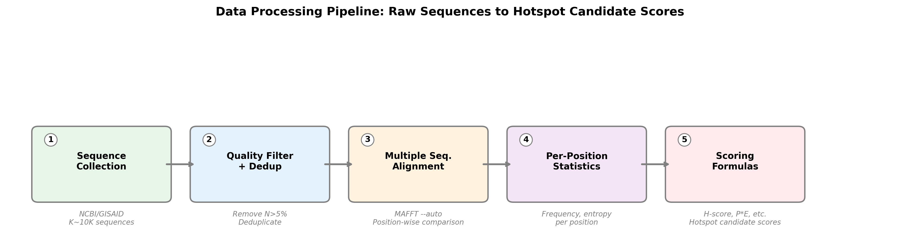
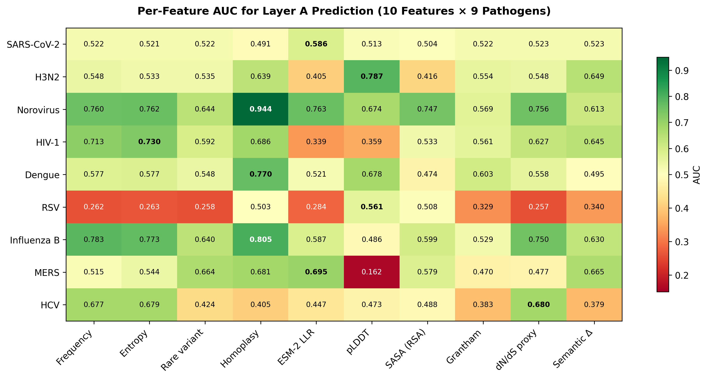
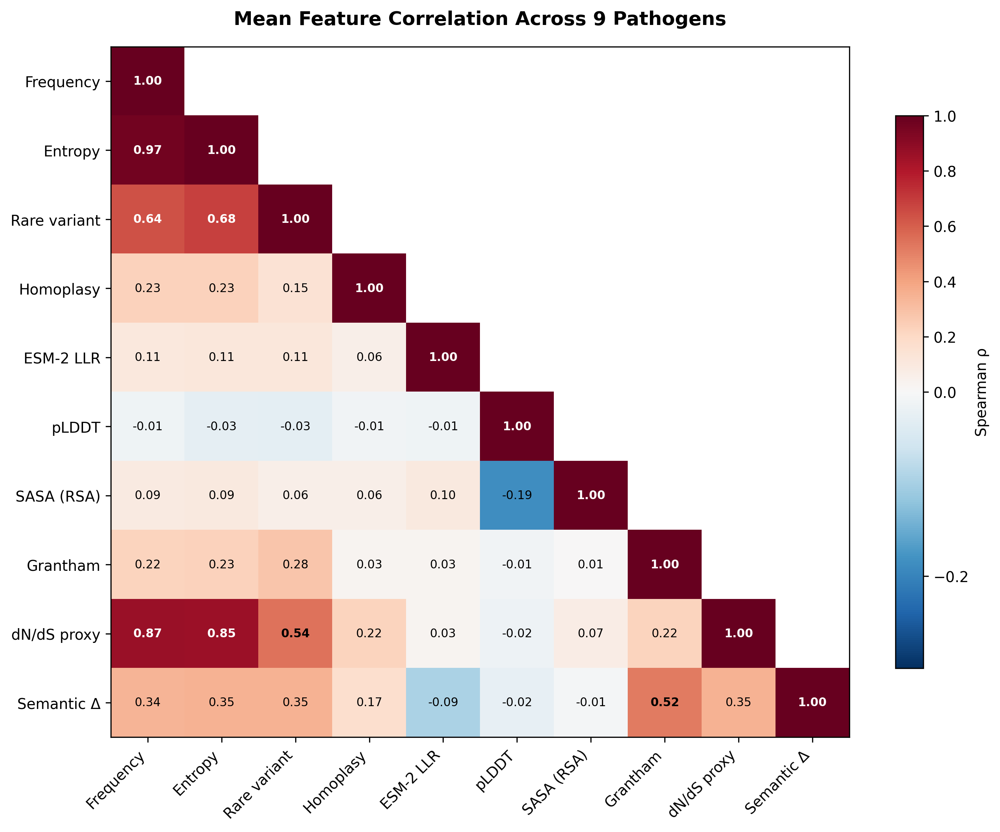
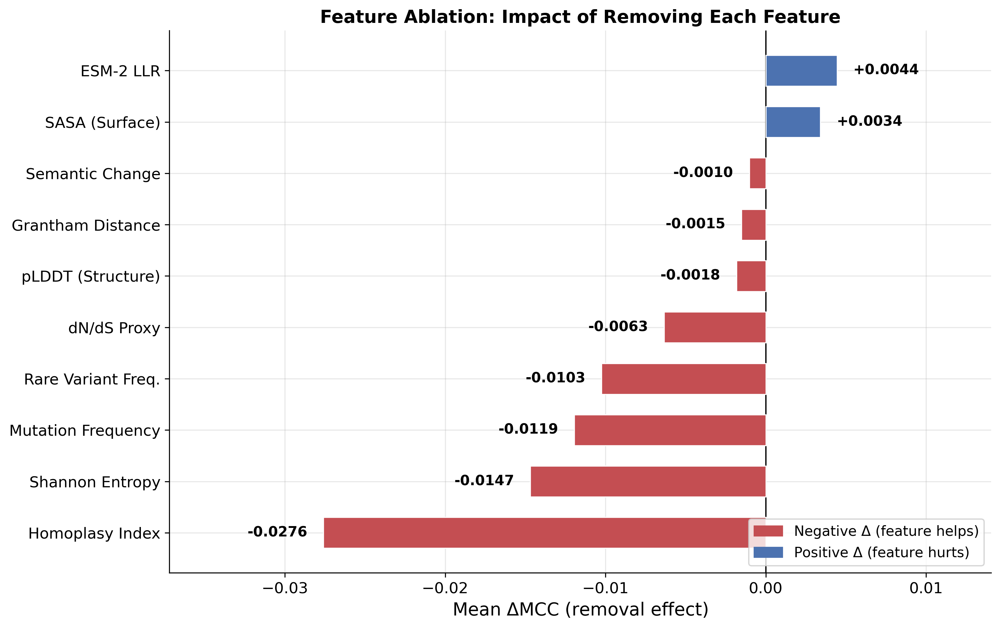
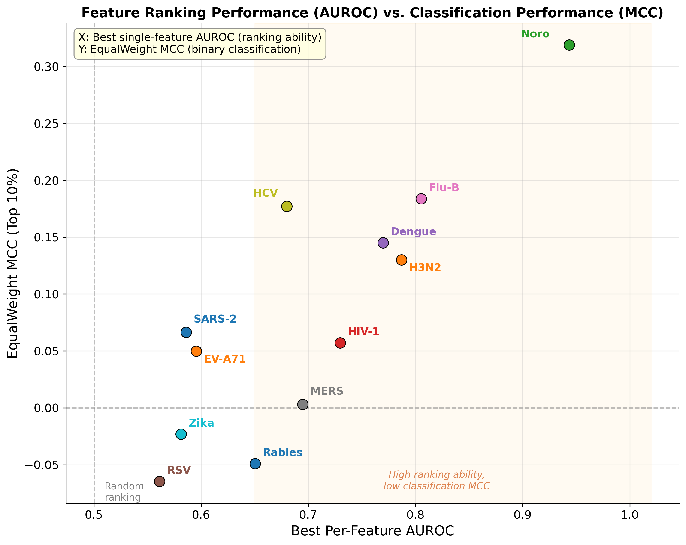

# MutBench 학위논문 요약

**한줄 요약**: 바이러스 변이 핫스팟을 찾는 방법이 여러 개 있는데, 어떤 방법이 좋은지 비교할 기준이 없었습니다. 이 논문이 그 기준(MutBench)을 만들고, "만능 방법은 없다"는 것을 증명한 뒤, 10가지 생물학적 정보를 통합 분석하여 어떤 정보가 핵심적인지 밝히고, 실험 탐색 범위를 평균 4배 축소(H3N2 기준, p=0.0023)할 수 있음을 검증했습니다.


## 1. 배경: 바이러스 변이란?

> **참고**: 학위논문 본문에는 비전공자를 위한 생물학 용어 해설표(Table 1.1)가 포함되어 있습니다. 본 설명서에서도 주요 용어를 처음 등장 시 풀어서 설명합니다.

### 1.1 바이러스와 변이

바이러스는 세포 안에서 자신의 유전자를 복사하여 증식합니다. 이 유전자는 A, C, G, U(또는 T) 네 글자로 이루어진 서열입니다. SARS-CoV-2(코로나바이러스)는 약 30,000개의 염기로 구성되어 있습니다.

복제 과정에서 간혹 복사 오류가 발생하는데, 이것이 **변이(mutation)**입니다. RNA 바이러스(코로나, 인플루엔자, HIV 등)는 특히 변이가 빠릅니다. 연간 유전자 위치당 약 10만분의 1 ~ 1천분의 1 비율로 변이가 축적되어, 수개월 내에 새로운 변이주가 출현합니다.

### 1.2 핫스팟이란?

**핫스팟(hotspot)**이란 변이가 유독 많이 생기는 유전체 위치 또는 영역을 말합니다.

중요한 점: 단순히 변이가 "많은" 곳이 아닙니다. 핫스팟에는 두 가지 종류가 섞여 있습니다.

- **생물학적으로 의미 있는 핫스팟**: 면역 회피, 감염력 증가 등 바이러스 생존에 이점을 주는 변이가 집중되는 곳입니다. 예: SARS-CoV-2 Spike 단백질의 484번, 501번 위치는 여러 변이주(Beta, Gamma, Mu, Omicron)에서 독립적으로 반복 출현했습니다.
- **생물학적 의미가 불분명한 핫스팟 (founder effect)**: 변이 빈도가 높지만 그 이유가 "유리해서"가 아니라 "그 변이를 가진 계통이 우연히 크게 번성해서"인 경우입니다. D614G 변이가 대표적입니다.

### 1.3 왜 중요한가?

- **백신 설계**: 핫스팟(계속 변하는 곳)을 피하고, 보존된 부위를 타겟으로 삼아야 오래 쓸 수 있는 백신을 만들 수 있습니다.
- **항바이러스제 개발**: 약물이 표적하는 부위가 핫스팟이면 내성 변이가 빠르게 나타납니다.
- **실시간 감시**: 새로운 변이주가 핫스팟 위치에서 변이를 축적하면 위험 신호입니다.

### 1.4 핫스팟 탐지 방법

핫스팟 탐지는 크게 세 단계로 이루어집니다.

**1단계: 서열 수집 (수주~수개월)**

바이러스가 유행하는 동안 전 세계 연구기관에서 감염 환자의 바이러스 유전자를 시퀀싱(sequencing, 염기서열 해독)합니다. SARS-CoV-2의 경우 GISAID 데이터베이스에 수백만 건의 서열이 축적되었고, 인플루엔자는 수십 년에 걸쳐 수만 건의 서열이 모였습니다. 이 서열들을 정렬(alignment)하면 "어떤 위치에서 어떤 변이가 얼마나 발생했는가"를 위치별로 비교할 수 있습니다.

**2단계: 통계적 분석 (본 논문의 범위)**

수집된 서열 데이터에 대해 통계적 분석을 수행하여, 변이가 집중된 위치(핫스팟 후보)를 식별합니다. 이 과정에서 빈도 분석, 엔트로피 계산, 클러스터링, 웨이블릿 변환 등 다양한 알고리즘이 사용됩니다. 예를 들어 SARS-CoV-2 Spike 단백질의 1,273개 위치 중 변이가 유의하게 집중된 수십 개 위치를 추려내는 것입니다. 본 논문은 이 통계적 분석 단계에서 **어떤 알고리즘이 어떤 바이러스에 가장 효과적인가**를 체계적으로 비교한 연구입니다.

**3단계: 생물학적 실험 검증 (후속 연구)**

통계적 분석으로 식별된 핫스팟 후보 위치가 실제로 생물학적으로 중요한지를 실험실에서 하나씩 검증합니다. DMS(Deep Mutational Scanning, 모든 가능한 아미노산 치환의 기능적 영향을 측정), 중화 항체 실험(해당 위치의 변이가 항체 결합을 회피하는지), 세포 감염 실험(변이가 감염력을 변화시키는지) 등이 수행됩니다. 이 실험들은 위치 하나당 수주에서 수개월이 소요되므로, 모든 위치를 실험하는 것은 막대한 인적·시간적·비용적 자원이 소모됩니다.

**핵심**: 2단계(통계 분석)에서 후보를 효과적으로 줄여야 3단계(실험 검증)의 효율이 높아집니다. 본 논문의 다중 정보 통합 분석은 이 **"실험할 가치가 있는 위치의 우선순위를 제공하는 것"**이 목적이며, H3N2에서 탐색 범위를 4배 축소(p=0.0023)할 수 있음을 검증했습니다.


\newpage

## 2. 현재 핫스팟 탐지의 한계

핫스팟 분석의 궁극적 목적은 백신 설계, 항바이러스제 개발, 실시간 변이 감시에 필요한 **"주의해야 할 위치 목록"**을 제공하는 것입니다. 이를 위해 다양한 통계적 탐지 방법이 개발되어 왔으나, 현재 세 가지 근본적인 한계에 직면해 있습니다.

### 2.1 세 가지 구체적 한계

**한계 1: 탐지 결과의 생물학적 의미를 평가할 표준 기준이 없습니다.**

통계적 방법으로 "변이가 집중된 위치"를 찾는 것 자체는 가능합니다. 그러나 찾아낸 위치가 **생물학적으로 의미 있는 핫스팟**인지 판단할 공인된 기준(ground truth)이 없습니다. 왜 이 기준을 정하기 어려운가 하면:

- **핫스팟의 정의 자체가 모호합니다.** "변이가 많이 일어나는 곳"인지, "면역 회피에 중요한 곳"인지, "기능적으로 중요한 곳"인지에 따라 정답이 달라집니다. 같은 바이러스를 연구하는 두 연구팀이 서로 다른 정의를 사용할 수 있습니다.
- **관찰 시점에 따라 달라집니다.** 2020년에는 핫스팟이 아니었던 위치가 2022년 오미크론 출현 후 핵심 핫스팟이 되기도 합니다. 즉 "정답"이 시간에 따라 변합니다.
- **생물학적으로 의미 있는 핫스팟과 그렇지 않은 핫스팟의 구분이 어렵습니다.** D614G처럼 빈도가 높은 위치가 자연선택 때문인지 단순히 그 계통이 번성해서인지(founder effect) 서열 데이터만으로는 구분하기 어렵습니다.
- **최종 검증은 실험실에서만 가능합니다.** 컴퓨터 분석으로 "이 위치가 핫스팟일 가능성이 높다"까지는 판단할 수 있지만, 그 위치의 변이가 실제로 면역 회피나 감염력 증가를 일으키는지는 Deep Mutational Scanning(DMS) 같은 실험실 실험을 통해서만 확인할 수 있습니다. DMS는 단백질의 모든 가능한 아미노산 치환을 하나씩 만들어 기능적 영향을 측정하는 기법으로, 비용과 시간이 많이 들어 일부 바이러스에서만 수행되었습니다.

따라서 각 논문이 자기 기준으로 "잘 찾았다"고 주장하지만, 기준이 다르니 비교할 수 없습니다. 이 논문에서는 이 문제를 해결하기 위해 수렴 진화, 정화 선택, DMS 데이터라는 세 가지 독립적 근거를 결합한 정답 기준을 설계했습니다.

**한계 2: 방법 간 공정한 비교와 일반화 검증이 되지 않았습니다.**

- **평가 조건이 통일되지 않았습니다.** 방법 A는 코로나 데이터 5,000개 서열로, 방법 B는 인플루엔자 데이터 2,000개 서열로 각각 테스트했습니다. 서로 다른 바이러스, 서로 다른 서열 수, 서로 다른 평가 기준을 사용했으므로 어떤 방법이 더 나은지 비교할 수 없습니다.
- **단일 바이러스 결과를 일반화할 수 없습니다.** 코로나에서 좋은 방법이 HIV에서도 좋을지, 노로바이러스에서도 통할지 검증된 적이 없습니다. 바이러스마다 변이 속도(HIV는 코로나의 10배), 게놈 크기(HCV 340AA vs MERS 1,330AA), 진화 패턴(H3N2의 지속적 변이 vs Norovirus의 에포크형 변이)이 달라, 하나의 바이러스 결과가 다른 바이러스에 적용된다는 보장이 없습니다.
- **복합적 평가 지표가 없습니다.** 기존 연구들은 precision이나 recall 같은 단일 지표로만 보고하여, "정밀하지만 많이 놓치는 방법"과 "많이 찾지만 헛것도 많은 방법" 중 어느 것이 나은지 판단할 기준이 없습니다.

### 2.2 관련 연구: 비슷한 시도는 있었지만 다릅니다

바이러스 변이 예측 분야에서 부분적으로 관련된 연구들이 있지만, MutBench가 하는 것과는 다릅니다:

| 연구 | 무엇을 하나 | MutBench와의 차이 |
|------|-----------|-----------------|
| **EVEscape** (Nature, 2023) | 바이러스 escape 변이를 사전 예측하는 모델. 적합도 + 접근성 + 비유사도 3가지를 결합 | **예측 모델**이지 탐지 방법들을 비교하는 **벤치마크**가 아님. 단일 방법 제안 |
| **Hie et al.** (Science, 2021) | AI 언어모델로 바이러스 escape 변이를 예측 | 단일 방법 제안. 다른 방법들과 비교하지 않음 |
| **Maher et al.** (Sci Transl Med, 2022) | SARS-CoV-2 미래 변이주를 예측하는 feature 분석 | SARS-CoV-2 **하나**에 한정. 다른 바이러스 미검증 |
| **Obermeyer et al.** (Science, 2022) | 640만 SARS-CoV-2 게놈에서 적합도 관련 변이 식별 | 대규모 분석이지만 SARS-CoV-2 **하나**. 탐지 방법 비교 아님 |
| **ProteinGym** (NeurIPS, 2023) | 250개 이상 DMS 데이터로 변이 효과 예측 모델 벤치마크 | 개별 변이의 효과 예측 (per-mutation). 핫스팟 **영역** 탐지가 아님 |
| **ConDor** (2024) | 계통수에서 수렴 변이를 탐지하는 도구 | 단일 탐지 도구. 벤치마크 프레임워크가 아님 |

**공통된 한계**: 위 연구들은 (1) 단일 방법만 제안하거나, (2) 단일 바이러스만 테스트하거나, (3) 탐지 방법 간 비교를 하지 않습니다. **"다수의 탐지 방법을 다수의 바이러스에 대해 표준화된 정답 기준으로 체계적으로 비교"하는 연구는 MutBench가 최초**입니다.

### 2.3 기존 감시 플랫폼과의 차이

바이러스 변이를 다루는 기존 시스템이 이미 존재하지만, MutBench와는 목적이 다릅니다.

| 시스템 | 목적 | 답하는 질문 |
|--------|------|-----------|
| **Nextstrain** | 계통 추적 + 지리적 확산 시각화 | "어떤 변이주가 어디서 퍼지고 있는가?" |
| **PANGO** | 변이주 분류 체계 | "이 서열은 어떤 변이주(BA.2.86, JN.1 등)인가?" |
| **MutBench** | 핫스팟 탐지 방법 비교·평가 | "어떤 **위치**에서 중요한 변이가 발생할 가능성이 높은가?" |

이 시스템들이 핫스팟 탐지의 대안이 될 수 없는 이유:

1. **분석 단위가 다릅니다**: Nextstrain/PANGO는 "변이주(lineage)" 단위로 작동합니다. "오미크론이 퍼지고 있다"는 알려주지만, "Spike 484번 위치가 왜 중요한가"는 답하지 못합니다. 핫스팟 탐지는 "위치(position)" 단위 분석입니다.
2. **시점이 다릅니다**: 감시 플랫폼은 **이미 나타난 변이**를 사후 추적합니다. 핫스팟 탐지는 **앞으로 중요한 변이가 나타날 가능성이 높은 위치**를 사전에 식별하는 것입니다.
3. **방법 평가를 하지 않습니다**: 감시 플랫폼은 최종 사용자 도구이지, 탐지 알고리즘을 비교·평가하는 프레임워크가 아닙니다.

### 2.4 벤치마크 설계 원칙

MutBench의 벤치마크 설계는 두 가지 학술적 원칙을 따릅니다:

1. **중립 평가 원칙** (Weber et al., 2019): 방법 개발자가 자기 방법을 평가하면 편향이 생김 → MutBench는 MutClust를 포함한 모든 방법을 동일 조건에서 평가
2. **알고리즘 선택 문제** (Rice, 1976): "주어진 문제의 특성에 따라 최적 알고리즘이 달라진다"는 이론 → MutBench 결과(바이러스마다 최적 방법이 다름)가 이 이론을 바이러스 분야에서 실증


\newpage

## 3. 해결: MutBench

### 3.1 분석 대상: 9개 바이러스

다양한 진화 양상을 포괄하기 위해 **9개 RNA 바이러스**를 선택했습니다:

- **호흡기 감염**: SARS-CoV-2, MERS, RSV, Influenza A H3N2, Influenza B — 비말을 통해 전파
- **혈액/성매개 감염**: HIV-1, HCV (C형간염) — 혈액 접촉이나 성접촉으로 전파
- **위장관 감염**: Norovirus — 오염된 음식/물을 통해 전파
- **모기 매개 감염**: Dengue — 모기에 물려 전파

**표 1. 9개 바이러스 — 분석 대상 단백질과 데이터 규모**

| 바이러스 | 분석 대상 단백질 | 길이 | 서열 수 |
|---------|---------------|------|--------|
| SARS-CoV-2 | Spike (세포 진입용 표면 단백질) | 1273 AA | 4982 |
| H3N2 | HA (혈구응집소, 세포 부착용) | 566 AA | 2644 |
| Norovirus | VP1 (캡시드 외피 단백질) | 540 AA | 1894 |
| HIV-1 | gp120 (수용체 결합 외피 단백질) | 480 AA | 5325 |
| Dengue | E protein (외피 단백질) | 495 AA | 3156 |
| RSV | F protein (세포 융합 단백질) | 574 AA | 1311 |
| Flu-B | HA (혈구응집소) | 584 AA | 2101 |
| MERS | Spike (세포 진입용 표면 단백질) | 1330 AA | 530 |
| HCV | E2 (외피 단백질 2) | 340 AA | 1578 |

**표 2. 9개 바이러스 — Ground Truth 가용성과 진화 특성**

| 바이러스 | Layer A | Layer B | Layer C | 전파 경로 | 진화 패턴 | 변이 속도 |
|---------|---------|---------|---------|---------|---------|---------|
| SARS-CoV-2 | 25 | 154 | 252 | 호흡기 비말 | 수렴 진화 | 약 1/10,000 |
| H3N2 | 25 | 10 | 102 | 호흡기 비말 | 지속적 항원 변이 | 약 1/5,000 |
| Norovirus | 18 | N/A | N/A | 경구-분변 | 간헐적 대체(epoch) | 약 1/2,000 |
| HIV-1 | 12 | 18 | 100 | 혈액/성접촉 | 환자 내 다양화 | 약 1/1,000 |
| Dengue | 15 | 229 | N/A | 모기 매개 | 4개 혈청형 분화 | 약 1/1,250 |
| RSV | 18 | 18 | 101 | 호흡기 비말 | 중간 속도 변이 | 약 1/1,400 |
| Flu-B | 10 | 10 | N/A | 호흡기 비말 | 2계통 분화 | 약 1/6,700 |
| MERS | 9 | N/A | N/A | 호흡기 비말 | 제한된 데이터 | 약 1/10,000 |
| HCV | 54 | N/A | N/A | 혈액 | 초변이 영역 | 약 1/2,000 |

이 9종은 변이 속도, 단백질 길이, 진화 패턴이 모두 달라, 단일 바이러스에 치우치지 않는 평가를 보장합니다.

### 3.2 정답표: 3층 Ground Truth

핫스팟 탐지 방법의 성능을 평가하려면 정답표가 필요합니다.

여기서 중요한 구분이 있습니다: 기존 탐지 방법들은 서열 데이터에서 변이가 집중된 위치를 **찾아내는 것 자체는 가능**합니다. 문제는 **찾아낸 위치가 생물학적으로 유의미한지** 판단할 기준이 없다는 것입니다. 빈도가 높다고 해서 반드시 면역 회피나 기능 변화와 관련된 것은 아닙니다 — founder effect로 인해 빈도만 높을 수도 있고, 중립적인 변이가 축적된 것일 수도 있습니다.

따라서 MutBench의 정답표는 단순히 "변이가 많은 곳"이 아니라, **"생물학적으로 중요한 핫스팟이라고 확인된 곳"**을 기준으로 합니다. 탐지 방법이 찾아낸 위치가 이 정답표와 얼마나 일치하는지를 측정하여, "단순히 빈도 높은 곳을 찾는 것"이 아닌 **"생물학적으로 의미 있는 위치를 정확히 찾는 것"**을 평가합니다.

본 연구에서는 세 가지 서로 독립적인 생물학적 근거 — 수렴 진화 위치(Layer A), 보존 구조 영역(Layer B), DMS 실험 데이터(Layer C) — 를 결합하여 이 정답표를 구성했습니다. 세 근거는 각각 "생물학적으로 의미 있는 핫스팟", "핫스팟으로 잘못 판정하면 특히 위험한 곳", "실험실에서 직접 기능 영향을 측정한 곳"이라는 서로 다른 역할을 담당합니다.


**Layer A — "자연선택이 반복적으로 작용한 위치"**

**생물학적 의미**: 같은 바이러스 종 안에서 서로 다른 계통(lineage)이 **독립적으로** 같은 위치에서 변이한 곳입니다. 이것을 **수렴 진화(convergent evolution)**라 합니다.

예를 들어 SARS-CoV-2 Spike 484번 위치의 변이는 Beta(남아공)·Gamma(브라질)·Mu(콜롬비아) 계통에서 E484K로, Omicron(남아공) 계통에서 E484A로 각각 독립적으로 출현했습니다. 서로 관련 없는 계통에서 같은 변이가 반복된다는 것은, 해당 변이가 바이러스에게 **생존 이점**(면역 회피, 수용체 결합력 증가, 복제 효율 향상 등)을 제공한다는 강력한 증거입니다.

**벤치마크에서의 역할**: 탐지 방법이 찾아야 할 **양성 기준**입니다. "이 위치를 찾았는가?"로 recall(재현율)을 계산합니다. 병원체당 9~54개 위치.


**Layer B — "변이하면 바이러스가 죽는, 구조적으로 필수적인 위치"**

**생물학적 의미**: 단백질이 정상적으로 기능하기 위해 **반드시 보존되어야 하는 구조적 핵심 부위**입니다. 이 위치에서 변이가 일어나면 단백질의 3D 구조가 무너지거나 기능을 잃어, 바이러스 자체가 생존할 수 없습니다. 이를 **정화 선택(purifying selection)** 하에 있다고 합니다.

예를 들어 Spike 단백질의 heptad repeat(HR1/HR2) 영역은 세포막 융합에 필수적인 구조로, 여기서 변이가 일어나면 바이러스가 세포에 진입 자체를 못합니다.

**벤치마크에서의 역할**: 탐지 방법이 이곳을 핫스팟이라고 **잘못 판정하는지 감시**합니다. 핵심 지표(MCC)에는 직접 사용하지 않고, 별도 보조 지표(Constrained FPR)로 측정합니다. "여기를 핫스팟이라 하면 백신/약물 타겟을 잘못 설정하는 위험"을 모니터링합니다. 병원체당 0~229개 위치.


**Layer C — "실험실에서 측정한 각 위치의 기능적 영향"**

**생물학적 의미**: Deep Mutational Scanning(DMS) 실험에서 단백질의 모든 가능한 아미노산 치환을 물리적으로 만들어, 각 치환이 바이러스 기능에 미치는 영향을 직접 측정한 결과입니다. 예를 들어 SARS-CoV-2 Spike 단백질에서 각 위치의 변이가 세포 진입 효율을 높이는지 낮추는지를 정량적으로 보여줍니다.

Layer A와 B가 진화 패턴이나 구조 정보에 기반하는 반면, Layer C는 **실험실에서 직접 확인한 "생물학적 사실"**입니다. 어떤 위치는 실험적으로 강한 기능적 영향을 보이지만 아직 자연에서 수렴 진화가 관찰되지 않았을 수 있으므로, Layer A와는 독립적인 검증 근거를 제공합니다.

**벤치마크에서의 역할**: Layer A/B와 독립적인 **실험적 교차 검증**입니다. 탐지 방법이 찾은 핫스팟이 실험적으로 확인된 기능적 부위와 일치하는지 확인합니다. 12개 바이러스 중 DMS 데이터가 있는 일부에서만 사용 가능합니다.


**세 층의 요약:**

| Layer | 생물학적 의미 | 벤치마크 역할 |
|-------|-------------|-------------|
| **A** | 자연선택이 반복 작용한 위치 (수렴 진화) | 양성 기준 — "이것을 찾았는가?" |
| **B** | 변이하면 바이러스가 죽는 위치 (정화 선택) | 위험 감시 — "이것을 핫스팟이라 하면 안 됨" |
| **C** | 실험실에서 기능 영향이 확인된 위치 (DMS) | 교차 검증 — "실험 결과와 일치하는가?" |

이 3층 구조의 핵심은 **서로 다른 생물학적 근거를 독립적으로 사용**한다는 점입니다. Layer A는 진화 패턴, Layer B는 구조적 제약, Layer C는 실험실 측정으로, 각각 다른 관점에서 "생물학적으로 의미 있는 위치인가"를 판단합니다.

세 층은 서로 거의 겹치지 않습니다(Jaccard 유사도 0.006). 이는 각 층이 서로 다른 관점에서 독립적인 정보를 제공한다는 것을 의미하며, 단일 기준에 의존하지 않는 균형 잡힌 평가를 가능하게 합니다.

**"Layer B/C가 없는 바이러스는 왜 포함했는가?"**

9개 바이러스 중 완전한 3층 GT(A+B+C)를 가진 것은 4개뿐(SARS-CoV-2, H3N2, HIV-1, RSV)입니다. Norovirus, MERS, HCV는 Layer A만 있고, Flu-B와 Dengue는 Layer C가 없습니다. 그럼에도 포함한 이유는 다음과 같습니다:

1. **핵심 평가 지표(MCC)는 Layer A만으로 계산됩니다.** Layer A = 정답(양성), 나머지 전체 = 오답(음성)으로 MCC를 계산하므로, Layer B/C가 없어도 핵심 평가는 가능합니다. Layer B는 "특히 나쁜 오답"을 추가로 측정하는 보조 지표(Constrained FPR)에 사용되고, Layer C는 독립적 검증(DMS F1)에 사용됩니다.

2. **4개만으로는 통계 검정이 어렵습니다.** "만능 방법이 없다"를 증명하려면 ANOVA, Friedman, LOPO 같은 통계 검정이 필요한데, 4개 바이러스로는 검정력이 부족합니다. 9개로 늘려야 통계적으로 유의한 결론을 낼 수 있습니다.

3. **다양성이 완전성보다 중요합니다.** DMS 데이터가 있는 바이러스만 쓰면 잘 연구된 병원체에 편향됩니다. Norovirus(epoch 진화), HCV(초변이), MERS(데이터 부족) 같은 도전적 사례를 포함해야 벤치마크의 현실적 가치가 있습니다.

이 점은 논문에서 한계(Limitation)로 명시적으로 논의되고 있습니다.

**Oracle MCC란?**

각 바이러스에 대해 모든 점수화-탐지 조합 중 **가장 높은 MCC를 달성한 조합의 MCC 값**을 Oracle MCC라고 합니다. "만약 신이 최적 방법을 알려준다면 달성할 수 있는 최고 성능"이라는 뜻입니다. Oracle은 현실에서는 알 수 없는 상한선이며, 각 바이러스의 "난이도"를 나타냅니다.

- H3N2: Oracle MCC = 0.549 (가장 쉬움 — GT가 잘 정의되어 있고 항원 변이 위치가 명확)
- MERS: Oracle MCC = 0.088 (가장 어려움 — 서열 수 530개, Layer B/C 없음)

PAHD의 목표는 이 Oracle에 최대한 가까운 성능을 달성하는 것입니다 (현재 proof-of-concept 수준에서 48~58% 회복).

### 3.3 채점 기준: Hotspot-score

```
hotspot-score = (recall + precision + stability) / 3
```

각 성분은 3층 Ground Truth를 기준으로 계산됩니다:

- **Recall (재현율)**: Layer A(수렴 진화 위치) 중에서 탐지 방법이 실제로 찾아낸 비율입니다. 예를 들어 SARS-CoV-2에 Layer A 위치가 25개 있는데 탐지 방법이 그중 15개를 찾았다면 recall = 15/25 = 0.60입니다. 높을수록 놓치는 핫스팟이 적습니다.

- **Precision (정밀도)**: 탐지 방법이 핫스팟이라고 보고한 위치 중에서 실제로 Layer A에 속하는 비율입니다. 예를 들어 100개 위치를 핫스팟으로 보고했는데 그중 15개만 Layer A에 포함된다면 precision = 15/100 = 0.15입니다. 높을수록 헛것(false positive)을 적게 찾습니다.

- **Stability (안정성)**: 입력 데이터를 80%만 랜덤으로 추출하여 같은 탐지를 100번 반복했을 때, 원래 결과와 얼마나 일치하는지를 Jaccard 유사도로 측정합니다. 높을수록 데이터가 조금 바뀌어도 결과가 안정적입니다. 실제 감시 현장에서는 새로운 서열이 계속 추가되므로, 결과가 불안정한 방법은 실용성이 떨어집니다.

**왜 합산이 필요한가?** 개별 지표만으로는 "종합적으로 어떤 방법이 좋은가?"에 답할 수 없습니다:

- recall만 높이려면 → 게놈 전체를 핫스팟이라고 선언 (recall=1.0, precision≈0)
- precision만 높이려면 → 가장 확실한 1개만 보고 (precision≈1.0, recall≈0)
- 둘 다 현실적으로 의미 없습니다

hotspot-score는 **순위 결정**을 위한 종합 점수입니다. 개별 성분(recall, precision, stability)은 결과 테이블에 **모두 따로 보고**되므로, 독자가 원하면 각 지표를 개별적으로 분석할 수 있습니다. 즉 합산 점수는 "어떤 방법이 1위인가"를 결정하고, 개별 지표는 "왜 1위인가"를 설명합니다.

**왜 F1+stability가 아닌가?** F1은 recall과 precision을 하나로 합쳐버려서, stability와의 상호작용이 보이지 않습니다. 예를 들어 HDBSCAN-Auto는 F1이 0.146(낮음)이지만 recall 0.944(높음), stability 0.788(높음)입니다. F1+stability 구조에서는 이 방법이 과소평가되지만, (recall+precision+stability)/3 구조에서는 높은 recall과 stability가 적절히 반영됩니다.

### 3.4 왜 이 방법들을 선택했는가?

핫스팟을 찾는 문제는 결국 **"게놈 위의 숫자 배열에서 비정상적으로 높은 영역을 찾아라"**라는 신호 탐지 문제입니다. 이런 문제는 생물학뿐 아니라 의학, 공학, 금융 등 다양한 분야에서 이미 풀어왔습니다. 본 논문은 각 분야에서 검증된 방법들을 바이러스 핫스팟 탐지에 체계적으로 적용한 것입니다.

본 연구에서는 14개 알고리즘 패밀리를 비교했으며, 이 중 **9개가 비중복적인 고유한 탐지 패턴**을 보였습니다 (나머지 5개는 다른 패밀리와 성능이 중복됨). 각 알고리즘은 서로 다른 파라미터 설정(예: 임계값 크기, 윈도우 폭)으로 여러 번 실행하여, 파라미터에 따른 성능 변화도 함께 평가했습니다 (총 39가지 변형).

아래에서 핵심 9개 알고리즘을 번호와 함께 설명합니다. 각 방법의 동작 과정, 파라미터 변형, 그리고 어떤 바이러스에서 강점을 보이는지를 함께 서술합니다.


#### 방법 ①: 빈도 임계값 (FreqThresh) — 기준선


**▲ 그림 1. FreqThresh 동작 과정.** 점수를 정렬하고 상위 k%를 핫스팟으로 판정하는 4단계.
**동작**: 각 위치의 점수를 높은 순으로 정렬하고, 상위 k%를 핫스팟으로 판정합니다.

**파라미터 변형**: k = 1%, 3%, 5%, 10%의 4가지. k가 작으면 엄격(적게 찾음), k가 크면 관대(많이 찾음).

**강점/역할**: 가장 단순한 방법으로, 다른 모든 방법의 성능 하한(baseline)이 됩니다. 이보다 못하면 쓸모없는 방법입니다.

**관련 연구**: Mercatelli & Giorgi (2020)는 48,635개 SARS-CoV-2 게놈에서 빈도 기반 임계값으로 지역별 반복 변이를 매핑했습니다. Hodcroft et al. (2021)은 유럽 SARS-CoV-2 변이 추적에서 빈도 필터링을 초기 선별로 활용했으며, Harvey et al. (2021)은 빈도 기반 분석으로 주요 변이주의 확산 패턴을 보고했습니다.


#### 방법 ②: 적응형 임계값 (AdaptiveKnee)

**동작**: 점수를 정렬한 곡선에서 "급격히 꺾이는 지점"을 자동으로 찾아 임계값으로 설정합니다. 사용자가 k%를 지정할 필요가 없습니다.

**파라미터 변형**: 없음 (자동 설정). 1가지.

**강점**: 바이러스마다 점수 분포가 다른데, 고정 k%로는 대응 불가 → AdaptiveKnee가 자동 적응.

**관련 연구**: Satopaa et al. (2011)의 Kneedle 알고리즘이 원리적 기반입니다. Salvador & Chan (2004)은 L-method로 유사한 곡선 꺾임점 탐지를 제안했으며, Zhao et al. (2008)은 클러스터 수 결정에 knee-point 탐지를 적용했습니다.


#### 방법 ③: 웨이블릿 변환 (Wavelet) — 전체 1위


**▲ 그림 2. Wavelet 동작 과정.** 웨이블릿 변환으로 다중 스케일 이상 신호를 탐지하는 4단계.
**동작**: 점수 프로파일을 여러 크기(scale)로 동시에 분석하여, 작은 영역부터 큰 영역까지의 이상 신호를 한번에 탐지합니다.

**파라미터 변형**: 임계값 t = 1.0, 1.5, 2.0 표준편차의 3가지. t가 높으면 엄격, 낮으면 관대.

**강점**: 14개 알고리즘 중 **평균 성능 1위** (mean MCC = 0.087). HCV, Influenza B에서 최고 성능.

**관련 연구**: Anastassiou (2001)가 DNA 서열에서 웨이블릿으로 코딩 영역 주기성을 탐지했고, Liò (2003)는 게놈 장거리 상관관계 탐지에 활용했으며, Du et al. (2006)은 ChIP-chip 데이터에서 단백질 결합 부위 탐지에 높은 정확도를 달성했습니다.


#### 방법 ④: CUSUM (누적합 변화점 탐지)


**▲ 그림 3. CUSUM 동작 과정.** 누적합 변화점으로 핫스팟 경계를 식별하는 4단계.
**동작**: 점수를 정규화한 뒤 순서대로 누적 합산합니다. 핫스팟 영역에서 누적합이 급등하고, 이탈하면 안정 → 시작점/종료점을 정확히 식별합니다.

**파라미터 변형**: 드리프트 파라미터 δ = 0.5, 1.0, 2.0의 3가지.

**강점**: **RSV에서 유일하게 1위**를 차지한 방법. 핫스팟 경계 결정에 강함.

**관련 연구**: Page (1954)가 산업 품질관리용으로 제안, Sonesson & Bock (2003)이 감염병 조기 탐지에 적용, Frisén (2003)이 감시 데이터에서의 최적 설계 지침을 제시했습니다.


#### 방법 ⑤: 슬라이딩 윈도우 (SlidingTest)


**▲ 그림 4. SlidingTest 동작 과정.** 고정 크기 창을 밀면서 통계 검정하는 4단계.
**동작**: 고정 크기의 창을 1칸씩 밀면서, 각 창 안의 평균 점수가 전체 평균보다 통계적으로 유의하게 높은지 z-검정합니다.

**파라미터 변형**: 윈도우 크기 = 20, 50 위치의 2가지.

**강점**: **HIV-1에서 1위**. 가장 직관적인 통계 검정 방법.

**관련 연구**: Tajima (1989)가 슬라이딩 윈도우 기반 D 통계량으로 자연선택 탐지를 확립, Nei & Gojobori (1986)가 dN/dS 분석에 윈도우 접근을 적용, Nielsen et al. (2005)이 게놈 수준 선택적 스윕 탐지에 활용했습니다.


#### 방법 ⑥: 국소 대비 (LocalContrast)

**동작**: 각 위치 주변의 국소 점수와 전체 점수를 비교하여, 국소적으로 높은 곳을 탐지합니다.

**파라미터 변형**: 국소 윈도우 크기 = 10, 20, 50의 3가지.

**강점**: RSV에서 SlidingTest와는 다른 패턴으로 높은 성능. 두 방법 간 상관이 거의 없어(r=0.02) 상호보완적입니다.

**관련 연구**: Itti et al. (1998)이 시각적 주의 모델에서 local-global contrast를 제안, Achanta et al. (2009)이 영상 saliency 탐지에 적용, 생물정보학에서는 conservation score 계산에 유사한 local window 접근이 사용됩니다.


#### 방법 ⑦: 밀도 기반 클러스터링 (ScoreDBSCAN)


**▲ 그림 5. DBSCAN 동작 과정.** 2D 공간에서 밀도 기반 클러스터링하는 4단계.
**동작**: 각 위치를 (게놈 좌표, 점수) 2D 공간에 배치하고, 밀도가 높은 곳을 자동으로 클러스터링합니다. 클러스터 수를 미리 정할 필요 없음.

**파라미터 변형**: 반경 ε = 10, 15의 2가지.

**강점**: **SARS-CoV-2에서 유일하게 1위**. 유일한 밀도 기반 방법으로 다른 방법들과 완전히 다른 접근.

**관련 연구**: Ester et al. (1996)이 DBSCAN을 제안, Campello et al. (2013)이 HDBSCAN으로 확장, Tokheim et al. (2016)이 HotMAPS에서 암 3D 구조 위 변이 핫스팟 탐지에 적용했습니다.


#### 방법 ⑧: 커널 밀도 추정 (KDE)


**▲ 그림 6. KDE 동작 과정.** 가우시안 커널로 밀도 곡선을 생성하는 4단계.
**동작**: 각 위치의 점수를 가중치로 가우시안 커널을 배치하고, 합산하여 부드러운 밀도 곡선을 만듭니다. 밀도가 높은 영역 = 핫스팟.

**파라미터 변형**: 대역폭(bandwidth) 배수 = 0.5×, 1.0×, 2.0× Silverman 규칙의 3가지.

**강점**: 평균 MCC는 음수(-0.006)지만, **H3N2, MERS, Norovirus에서 1위**. 극단적으로 바이러스에 따라 성능이 갈림 → "최적 방법이 바이러스마다 다르다"의 대표 사례.

**관련 연구**: Zhang et al. (2008)의 MACS가 KDE 기반 피크 탐지를 ChIP-Seq에 적용(40,000+ 인용), Silverman (1986)이 밀도 추정 이론의 기초를 제공, Lander & Botstein (1989)이 유전체 매핑에 유사한 밀도 기반 접근을 활용했습니다.


#### 방법 ⑨: MutClust-Original (레거시 기준)

**동작**: 본 연구의 전신인 MutClust 알고리즘. CCM(Cluster Core Model)으로 씨앗점을 찾고, 적응적 DBSCAN으로 경계를 확장합니다.

**파라미터 변형**: 없음 (고정 설정). 1가지.

**강점/역할**: 이 논문의 벤치마크가 MutClust의 한계에서 출발했으므로, **평가 대상이자 출발점**으로 포함. 성능(mean MCC = 0.029)은 낮지만 역사적 의미가 있습니다.

**관련 연구**: Youn et al. (2025)이 MutClust를 SARS-CoV-2에 적용하여 7개 핫스팟 클러스터 식별, Tamborero et al. (2013)의 IntOGen이 다중 방법론 통합을 통한 드라이버 유전자 탐지, Campello et al. (2013)의 HDBSCAN이 가변 밀도 클러스터링의 이론적 기반입니다.


#### 제외된 5개 패밀리

중복 분석 결과, 다음 5개는 다른 패밀리와 성능이 중복되어 요약에서 제외합니다 (논문 본문에는 포함):

| 제외 패밀리 | 제외 이유 |
|-----------|----------|
| AdaptWin | SlidingTest, Bayes와 상관 r > 0.95 (거의 동일한 결과) |
| SWAN | 81%의 평가에서 MCC = 0 (대부분 탐지 실패) |
| GradPeak | 어느 바이러스에서도 1위를 차지하지 못함 |
| Spectral | 고유한 탐지 패턴 없음 |
| Bayes | SlidingTest와 r = 0.92 (거의 동일) |


#### 파라미터 변형의 의미

같은 알고리즘이라도 파라미터에 따라 성능이 크게 달라질 수 있습니다:

```
예: Wavelet 알고리즘
  t = 1.0 (관대) → 많이 찾음 → recall 높음, precision 낮음
  t = 2.0 (엄격) → 적게 찾음 → recall 낮음, precision 높음
```

어떤 파라미터가 최적인지도 바이러스에 따라 다르므로, 공정한 비교를 위해 각 알고리즘의 여러 설정을 모두 포함하여 **총 39가지 변형**을 실험했습니다. 이렇게 해야 "알고리즘 A가 알고리즘 B보다 좋다"는 결론이 특정 파라미터에 의존하지 않습니다.


#### 카테고리 5: 레거시 — "기존 방법을 기준선으로 사용"

**MutClust-Orig**

본 논문의 선행 연구인 MutClust의 원래 알고리즘으로, 보존 공변이 행렬(CCM)에 기반한 시드 위치 탐지와 적응형 DBSCAN 클러스터링을 결합한 방법입니다. 생물학적 사전 지식을 활용하여 핵심 변이 위치를 먼저 식별한 후, 해당 시드 주변으로 클러스터를 확장합니다.

**선택 근거**: 벤치마크의 출발점으로서, 기존에 개발된 도메인 특화 방법의 성능 수준을 정량적으로 측정하는 비교 기준(reference baseline)의 역할을 수행합니다.

**관련 연구**: Youn et al. (2025)은 MutClust를 SARS-CoV-2 Spike 단백질에 적용하여 7개의 기능적 핫스팟 클러스터를 식별하였으며, 이 중 5개가 기존에 보고된 면역 회피 관련 영역과 일치함을 확인하였습니다. 해당 연구에서 CCM 기반 시드 탐지의 높은 정밀도(precision)가 입증되었으나, 재현율(recall) 측면의 한계도 함께 보고되었습니다.

**MutClust-Hybrid (본 논문의 개선 방법)**

MutClust-Orig의 CCM 기반 시드 탐지와 HDBSCAN의 계층적 밀도 클러스터링을 결합한 하이브리드 방법입니다. CCM을 통해 생물학적으로 유의한 시드 위치를 높은 정밀도로 식별한 후, HDBSCAN이 시드 주변의 클러스터 경계를 데이터 기반으로 자동 결정하여 재현율을 향상시킵니다.

**선택 근거**: MutClust-Orig은 정밀도가 높으나(0.991) 재현율이 낮고(0.504), HDBSCAN-Auto는 재현율이 높으나(0.944) 정밀도가 매우 낮습니다(0.079). MutClust-Hybrid는 두 접근법의 장점을 결합하여 정밀도 0.968과 재현율 0.659를 동시에 달성함으로써(F1 = 0.785), 최적의 균형 성능을 보입니다.

**관련 연구**: 도메인 지식 기반 시드 탐지와 데이터 기반 경계 결정의 결합이라는 하이브리드 전략은, Tamborero et al. (2013)의 IntOGen이 드라이버 유전자 탐지에서 다중 방법론의 강점을 통합한 접근과 유사한 설계 철학을 따릅니다. Campello et al. (2013)의 HDBSCAN이 제공하는 가변 밀도 클러스터링 능력이 본 방법의 경계 결정 모듈의 이론적 기반이 됩니다.


#### 통계 용어 해설

**MCC (Matthews Correlation Coefficient)**: 이진 분류 성능 지표입니다. 양성/음성 예측 결과를 하나의 숫자(-1~+1)로 요약합니다. 특히 양성이 극소수인 불균형 상황(본 논문에서 핫스팟 비율 1~16%)에서 F1보다 공정합니다. 0이면 무작위 수준, 1이면 완벽한 예측입니다.

**ANOVA (Analysis of Variance)**: "성능 차이가 방법 때문인지, 바이러스 때문인지, 둘의 조합 때문인지"를 수학적으로 분리하는 통계 기법입니다. omega-squared(ω²)는 각 요인이 전체 성능 분산의 몇 %를 설명하는지를 나타냅니다.

**Friedman 검정**: "상위 20개 방법의 순위가 바이러스마다 바뀌는가?"를 검정합니다. 정규분포를 가정하지 않는 비모수 검정이므로 ANOVA의 보완 검증으로 사용합니다.

### 3.5 데이터 전처리: 시퀀싱 데이터에서 점수까지

탐지 알고리즘에 데이터를 입력하기 전에, 원시 서열 데이터를 가공하는 과정이 필요합니다.



**▲ 그림 7. 데이터 전처리 과정.** 원시 서열 수집부터 핫스팟 후보 점수 산출까지 5단계.

1. **서열 수집**: NCBI GenBank/GISAID에서 바이러스별 표면 단백질 서열을 다운로드합니다 (수천~수만 건).
2. **품질 필터링**: 모호한 염기(N)가 5% 이상인 서열을 제거하고, 동일 서열을 중복 제거합니다.
3. **다중 서열 정렬(MSA)**: MAFFT 도구로 모든 서열을 위치별로 정렬합니다. 이를 통해 "484번 위치에서 어떤 아미노산이 몇 번 관찰되었는가"를 비교할 수 있게 됩니다.
4. **위치별 통계 계산**: 정렬된 MSA에서 각 위치의 변이 빈도(얼마나 자주 변이가 일어나는가)와 엔트로피(얼마나 다양한 변이가 있는가)를 계산합니다.
5. **점수화 공식 적용**: 계산된 통계값을 조합하여 각 위치에 핫스팟 후보 점수를 부여합니다.

### 3.6 점수화 공식: 9가지 방법

본 연구에서는 9가지 점수화 공식을 사용했습니다:

| 번호 | 공식 | 의미 |
|------|------|------|
| 1 | H-score | 변이 빈도 × 변이 다양성의 결합 (MutClust 원래 방식) |
| 2 | E_only | 엔트로피(다양성)만 사용 |
| 3 | P×E | 빈도 × 엔트로피 |
| 4 | P×E² | 빈도 × 엔트로피² (다양성에 더 가중) |
| 5 | P×E×rare | 빈도 × 엔트로피 × 희귀 변이 비율 |
| 6 | E×rare | 엔트로피 × 희귀 변이 비율 |
| 7 | P×minority_E | 빈도 × 소수 대립유전자 엔트로피 |
| 8 | minority_E | 소수 대립유전자 엔트로피만 사용 |
| 9 | rank(P×E) | 빈도 × 엔트로피의 순위 변환 |

같은 서열 데이터도 **어떤 공식으로 점수를 매기느냐**에 따라 결과가 달라집니다. 예를 들어 H-score는 빈도가 높고 다양성이 높은 위치에 높은 점수를 주지만, E_only는 빈도와 무관하게 다양성만 봅니다.

각 바이러스에 대해 **9가지 점수화 공식 × 14개 알고리즘(39가지 파라미터 변형) × 9개 바이러스 = 3,159회** 평가를 수행했습니다.


\newpage

## 4. 실험 설계와 결과

### 실험의 전체 구조

MutBench 프레임워크(정답표 + 점수화 + 탐지 알고리즘 + 평가 지표)를 구축한 뒤, 실제로 실험을 수행합니다. 실험의 목적은 **"어떤 탐지 방법이 가장 좋은가?"**라는 질문에 답하는 것입니다.

이 실험은 2단계로 나뉩니다:

| | Stage 1 | Stage 2 |
|---|---|---|
| **대상** | SARS-CoV-2 1개 바이러스 | 9개 바이러스 전체 |
| **목적** | MutBench 평가 도구 자체가 제대로 작동하는지 검증 | 핵심 질문 — "만능 방법이 있는가?" |
| **규모** | 5개 세부 실험 | 3,159회 대규모 평가 |

### 왜 2단계로 나누었나?

한 번에 9개 바이러스로 실험하면, 결과가 나쁠 때 **"탐지 방법이 나쁜 건지, 평가 도구가 나쁜 건지"** 구분할 수 없습니다. 그래서 먼저 Stage 1에서 평가 도구의 신뢰성을 검증한 뒤, Stage 2에서 본격적인 비교를 수행합니다.

### 전체 실험 목록

| Stage | 실험 번호 | 실험 내용 | 핵심 질문 |
|-------|----------|----------|----------|
| **1** | 1-1 | 합성 데이터 테스트 | 평가 도구가 방법 차이를 구분하는가? |
| **1** | 1-2 | 게놈 핫스팟 지도 | 탐지 결과가 실제 게놈에서 타당한가? |
| **1** | 1-3 | 다중 Ground Truth 검증 | 정답 기준을 바꾸면 최적 방법이 달라지는가? |
| **1** | 1-4 | DMS 실험 데이터 검증 | 실험실 데이터와도 일치하는가? |
| **1** | 1-5 | 안정성 검증 | 데이터 양을 바꿔도 결과가 안정적인가? |
| **2** | 2-1 | ANOVA 분산 분석 | 성능 차이의 원인이 무엇인가? |
| **2** | 2-2 | 9/9 고유 최적 조합 | 모든 바이러스가 다른 방법을 원하는가? |
| **2** | 2-3 | Friedman 검정 | 이 차이가 통계적으로 유의한가? |
| **2** | 2-4 | LOPO 교차 검증 | 한 바이러스의 최적을 다른 바이러스에 적용 가능한가? |

### Stage 1: SARS-CoV-2 심층 분석 — "평가 도구가 작동하는가?"

Stage 1은 SARS-CoV-2 하나에 집중하여 MutBench 평가 도구의 신뢰성을 검증합니다. 5개의 세부 실험으로 구성됩니다:

| 실험 | 검증 대상 | 핵심 질문 |
|------|----------|----------|
| 1-1 | 방법 구분 능력 | 정답을 알 때, 좋은 방법과 나쁜 방법을 구분할 수 있는가? |
| 1-2 | 생물학적 타당성 | 탐지 결과가 실제 게놈에서 의미 있는 위치와 겹치는가? |
| 1-3 | 정답 기준 독립성 | 정답 기준을 바꾸면 최적 방법도 달라지는가? |
| 1-4 | 실험 데이터 일치 | 실험실 DMS 데이터와도 일치하는가? |
| 1-5 | 결과 안정성 | 데이터 양을 바꿔도 결과가 흔들리지 않는가? |

#### 실험 1-1: 합성 데이터 테스트 — "방법 차이가 보이는가?"

첫 번째로 해야 할 일은 평가 도구가 "좋은 방법과 나쁜 방법을 구분할 수 있는지" 확인하는 것입니다. 이를 위해 **정답을 미리 알고 있는** 통제된 환경을 만듭니다.

29,903개 위치의 가상 게놈에 7개 알려진 기능 영역(RBD, NTD 등 총 1,251개 위치)에 높은 점수를 인위적으로 심어놓고, 7가지 방법이 이 정답을 얼마나 잘 찾는지 비교했습니다.


**▲ 그림 8. 합성 데이터 방법 비교.** (A) 7가지 방법의 precision/recall/F1. MutClust-Hybrid가 F1=0.785로 최고 균형. MutClust-Original은 정밀하지만(precision 0.991) 놓치는 게 많고(recall 0.504), HDBSCAN-Auto는 거의 다 찾지만(recall 0.944) 헛것도 많다(precision 0.079). (B) 최적 임계값에서의 최고 F1. (C) CH-score의 기능/비기능 위치 분리도.

**핵심 발견**: MutClust-Hybrid가 **도메인 지식(어디를 볼지)과 데이터 기반 탐지(얼마나 넓게 볼지)**를 결합하여 최고 성능을 달성했습니다.

**중요한 주의**: 이 합성 데이터 결과(F1 0.785)는 **실제 성능을 과대추정**합니다. 뒤의 실제 GISAID 데이터에서는 F1이 0.123으로 급락합니다. 합성 실험의 목적은 절대 성능 측정이 아니라, 평가 도구가 방법 간 차이를 구분할 수 있는지 확인하는 것입니다.

→ 다음 실험: 그러면 실제 게놈에서는 어떻게 보이는가?


#### 실험 1-2: 게놈 핫스팟 지도 — "탐지 결과가 생물학적으로 말이 되는가?"

합성 데이터에서 방법 차이를 확인했습니다. 이제 **실제 게놈 위에서** 탐지 결과가 어떻게 나타나는지 시각적으로 확인합니다.


**▲ 그림 9. 게놈 핫스팟 지도.** SARS-CoV-2 Spike 단백질 전체에 걸친 3층 비교. 위: H-score 분포 (변이 활발도). 가운데: 탐지 결과 (빨간색 = 핫스팟). 아래: Ground Truth (초록 = 알려진 기능 영역). 탐지 결과와 Ground Truth가 대체로 겹치므로, 방법이 생물학적으로 의미 있는 영역을 찾고 있음을 확인할 수 있다.

→ 다음 질문: 지금까지 하나의 정답 기준만 사용했는데, 기준을 바꾸면 결과도 달라지는가?


#### 실험 1-3: 다중 Ground Truth 검증 — "정답 기준이 달라지면 최적 방법도 달라지는가?"

실험 1-2에서 하나의 정답 기준(기능 영역)만 사용했습니다. 하지만 "핫스팟이 중요한 이유"는 여러 가지입니다 — 면역 회피(수렴 진화), 실험적 기능(DMS), 구조적 위치(기능 영역). **정답 기준을 바꾸면 최적 방법도 달라지는가?**


**▲ 그림 10. 다중 GT 평가.** (A) 4가지 정답 기준별 최고 F1. **정답 기준에 따라 최적 방법이 달라진다**: 기능 영역 → TC-freq-v2, DMS → Saturated H-score, 수렴 진화 → CH-score. 이것은 아직 SARS-CoV-2 하나만의 결과인데도, 이미 "만능 방법은 없다"의 첫 번째 힌트가 나타난다. (B) 점수화 방법 × GT별 enrichment 히트맵.


**▲ 그림 11. 다중 GT 평가 (계속).** (C) GT 간 Jaccard 중첩 행렬 — 비대각선 값이 0.006으로, 세 GT가 거의 겹치지 않는다. 이는 3층 GT가 각각 독립적인 정보를 제공한다는 것을 정량적으로 보여준다. (D) 수렴 vs 비수렴 위치의 점수 분포.

→ 다음 질문: 문헌 기반 정답뿐 아니라, 실험실에서 직접 측정한 데이터와도 일치하는가?


#### 실험 1-4: DMS 실험 데이터 검증 — "실험실에서 직접 측정한 데이터와도 일치하는가?"

지금까지의 정답 기준(기능 영역, 수렴 진화)은 문헌에서 가져온 것입니다. 여기서는 **실험실에서 직접 측정한** DMS 데이터로 독립 검증합니다. DMS에서 "기능적으로 중요하다"고 측정된 위치를 탐지 방법이 실제로 찾는지 확인합니다.


**▲ 그림 12. DMS 검증.** (A) DMS 기반 GT vs 기능 영역 GT에서의 F1 비교 — 같은 방법이 어떤 GT를 기준으로 보느냐에 따라 성능이 크게 달라진다. (B) Cohen's d 효과 크기 — 어떤 점수가 핫스팟과 비핫스팟을 잘 분리하는지.


**▲ 그림 13. DMS 검증 (계속).** (C) 점수와 DMS 적합도의 상관 산점도 — 상관이 높을수록 해당 점수가 실제 기능적 중요도를 잘 반영한다. (D) DMS-escape 위치에 대한 Precision-Recall 곡선 — 곡선이 오른쪽 위로 갈수록 좋다.

→ 마지막 질문: 지금까지의 결과가 데이터 양에 따라 흔들리지는 않는가?


#### 실험 1-5: 안정성 검증 — "이 결과를 믿어도 되는가?"

마지막으로, 벤치마크 결과 자체가 안정적인지 확인합니다. 입력 서열 수를 50개에서 5,000개까지 바꿔가며, 결과가 얼마나 흔들리는지 관찰합니다.


**▲ 그림 14. 표본 크기 수렴.** 약 1,000개 서열부터 성능이 안정화된다(hotspot-score ≈ 0.62). 본 벤치마크에 사용된 서열 수(1,311~5,325개)는 모두 이 수렴점 이상이므로, 결과는 데이터 양의 부족으로 인한 아티팩트가 아니다.

**Stage 1 요약**: 평가 도구(hotspot-score, 3층 GT)가 작동함을 확인했습니다. 방법 간 차이를 구분할 수 있고, 결과가 안정적이며, 생물학적으로 의미 있는 영역을 탐지합니다. 그리고 첫 번째 힌트를 발견했습니다 — 같은 바이러스 내에서도 정답 기준에 따라 최적 방법이 달라집니다. 이것이 Stage 2로 나아가는 동기입니다.


### Stage 2: 9개 바이러스 대규모 비교 — "만능 방법은 정말 없는가?"

Stage 1에서 코로나 하나로 도구를 검증했습니다. 이제 핵심 질문에 답할 차례입니다.

**질문**: 코로나에서 가장 좋은 방법(MutClust-Hybrid)이 인플루엔자에서도 좋은가? HIV에서도? 노로바이러스에서도?

이 질문에 답하기 위해 **9개 바이러스 × 9가지 점수화 공식 × 14개 알고리즘(39가지 파라미터 변형) = 3,159회** 평가를 수행하고, 4가지 서로 다른 통계 방법으로 같은 질문을 검증했습니다. 4가지를 사용한 이유는 하나의 통계 검정만으로는 "우연일 수 있다"는 반론을 받을 수 있기 때문입니다. 4가지가 모두 같은 결론을 가리키면 반론의 여지가 없습니다.

#### 실험 2-1: ANOVA — "성능 차이의 원인이 무엇인가?"

**질문**: 방법마다 성능이 다른데, 이 차이가 "방법이 원래 좋아서"인가 아니면 "특정 바이러스와의 궁합 때문"인가?

**방법**: 3-way ANOVA로 성능 분산을 요인별로 분해했습니다. 학생 성적의 차이가 "학생 능력 때문"인지 "과목과의 궁합 때문"인지를 분리하는 것과 같습니다.


**▲ 그림 15. ANOVA 분산 분해.** 이 논문에서 가장 중요한 그림이다. **녹색(탐지 방법 × 바이러스 상호작용)**이 28.5%로 가장 크다. "탐지 방법 자체"는 2.5%에 불과하다. 즉 "이 방법이 좋다"(2.5%)보다 "이 방법이 **이 바이러스에서** 좋다"(28.5%)가 **11배 더 중요**하다.

**결론**: 방법의 성능은 방법 자체보다 **방법과 바이러스의 조합**에 의해 결정됩니다.

→ 다음 질문: 그렇다면 실제로 각 바이러스의 최적 방법이 서로 다른가?


#### 실험 2-2: 9/9 고유 최적 조합 — "실제로 모든 바이러스가 다른 방법을 원하는가?"

**질문**: ANOVA에서 "조합이 중요하다"는 것을 알았습니다. 그렇다면 실제로 각 바이러스의 최적 조합이 서로 다른가?

**방법**: 9개 바이러스 각각에 대해 351가지 조합 중 MCC(정확도 지표)가 가장 높은 조합을 찾았습니다.


**▲ 그림 16. 성능 히트맵.** 9개 바이러스(행) × 14개 탐지 패밀리(열). 가장 진한 색이 최고 성능인데, **바이러스마다 다른 위치**에 있다. 만능 방법이 있었다면 한 열이 전부 진한 색이어야 한다.

**결과**: 9개 바이러스 모두 서로 다른 최적 조합을 가집니다 — SARS-CoV-2는 E×rare + CUSUM, H3N2는 E_only + SlidingTest, Norovirus는 P×E×rare + Wavelet... 단 하나의 조합도 2개 이상의 바이러스에서 동시에 최적이 아닙니다.

→ 다음 질문: 이 차이가 우연이 아니라 통계적으로 유의한가?


#### 실험 2-3: Friedman 검정 — "이 차이가 통계적으로 유의한가?"

**질문**: 증거 2에서 최적 조합이 다르다는 것을 봤습니다. 하지만 이것이 "우연히" 다른 것일 수도 있습니다. 통계적으로 유의하게 다른가?

**방법**: Friedman 비모수 검정으로, 상위 20개 조합의 성능 "순위"가 바이러스마다 유의하게 바뀌는지 검정했습니다. 정규분포를 가정하지 않는 검정이라 데이터 분포에 대한 걱정 없이 사용할 수 있습니다.

**결과**: χ² = 42.44, **p = 0.0015**. 귀무가설("순위가 바이러스에 관계없이 같다")이 기각됩니다. 순위는 우연이 아니라 유의하게 바뀝니다.

→ 마지막 질문: 그러면 새 바이러스가 등장했을 때, 기존 데이터로 최적 방법을 예측할 수 있는가?


#### 실험 2-4: LOPO 교차 검증 — "그러면 실제로 예측이 불가능한가?"

**질문**: 가장 실용적인 질문입니다. 만약 **새로운 바이러스**가 등장하면, 기존 바이러스에서 잘 된 방법을 그대로 적용해도 되는가?

**방법**: Leave-One-Pathogen-Out — 9개 바이러스 중 1개를 "새 바이러스"로 간주하고 빼놓습니다. 나머지 8개에서 최적 조합을 찾아 빼놓은 바이러스에 적용합니다. 이것을 9번 반복하여, 기존 데이터로 새 바이러스의 최적 방법을 예측할 수 있는지 확인합니다.

**결과**: **0/9 일치.** 9번 시도에서 단 한 번도 맞지 않았습니다. 다른 바이러스에서 좋은 방법이 이 바이러스에서도 좋을 것이라는 기대는 완전히 빗나갑니다. 평균 일반화 비율은 oracle 성능의 4.9%에 불과합니다.

#### Stage 1→2 연결: Cross-Pathogen 비교

Stage 1에서 코로나 최적이었던 MutClust-Hybrid는 다른 바이러스에서 어떻습니까?


**▲ 그림 17. SARS-CoV-2 vs H3N2 방법 순위 비교.** Stage 1 최적이었던 MutClust-Hybrid가 H3N2에서는 MutClust-Fixed에 밀린다. 같은 인플루엔자 계열인 Flu-B에서도 순위가 또 다르다. 이것이 "만능 방법은 없다"의 가장 직관적인 증거다.

**Stage 2 종합**: 4가지 독립적 검증(ANOVA, 9/9 고유, Friedman, LOPO)이 모두 같은 결론을 가리킵니다. **바이러스마다 최적의 핫스팟 탐지 방법이 다르며, 하나의 방법을 모든 바이러스에 적용하는 것은 체계적으로 성능이 떨어집니다.**

> **다음 단계**: "만능 방법이 없다"면 어떻게 해야 하는가? → Section 6에서 "어떤 정보가 중요한가"를 분석하고, Section 7에서 "10가지 정보를 통합 분석"합니다.


\newpage

## 5. 추가 검증 — "이 결론이 진짜 견고한가?"

Stage 2에서 "만능 방법은 없다"는 결론을 얻었습니다. 하지만 이 결론이 (1) 사용한 점수화 방법의 한계 때문은 아닌지, (2) H-score의 근본적 문제 때문은 아닌지, (3) 평가 기준이 너무 엄격해서 그런 것은 아닌지를 추가로 검증해야 합니다.


### 5.1 Homoplasy 검증: "계통수 기반 점수화는 어떤가?"

**의문**: 기존 scoring 방법들은 MSA 빈도 통계에 기반합니다. 계통수(phylogenetic tree)를 직접 분석하여 동일 변이가 독립적으로 몇 번 발생했는지(homoplasy count)를 세면, founder effect를 더 잘 보정할 수 있지 않겠습니까?

**방법**: 각 위치에서 homoplasy count(계통수 위에서 해당 변이가 독립적으로 출현한 횟수)를 scoring 방법으로 사용하여 3개 병원체에서 검증했습니다.

**결과**:

- **HIV-1**: Wilcoxon p=0.0002, AUC=0.71. Homoplasy count가 Layer A 핫스팟 위치에서 유의하게 높습니다. HIV처럼 환자 내 다양화가 활발한 바이러스에서는 독립 출현 횟수가 핫스팟의 좋은 지표가 됩니다.
- **HCV**: AUC=0.39. 초변이 영역(HVR1/HVR2)에서 parsimony 포화(동일 위치에 변이가 너무 많이 쌓여 독립 출현 횟수를 정확히 추정할 수 없는 현상)가 발생하여, homoplasy count가 오히려 핫스팟과 음의 관계를 보입니다.
- **SARS-CoV-2**: D614G의 homoplasy count=2(올바르게 낮음 — 이 변이는 한 번 발생하여 퍼진 founder mutation이므로 독립 출현이 적습니다). 반면 위치 476의 count=53(RBD 근처, 최고 — 여러 계통에서 독립적으로 반복 출현한 생물학적으로 의미 있는 핫스팟입니다).

**결론**: scoring 방법도 병원체에 따라 적합성이 달라집니다. Homoplasy count는 HIV에서 우수하지만 HCV에서 실패하며, 이는 "만능 방법은 없다"는 결론이 scoring 차원에서도 성립함을 보여줍니다.


### 5.2 ESM-2: "완전히 다른 접근법을 써도 같은 결론인가?"

**의문**: Stage 2에서 사용한 9가지 점수화 공식은 모두 MSA(다중 서열 정렬) 기반 통계입니다. 혹시 MSA 기반이라는 공통점 때문에 바이러스 의존성이 나타나는 것은 아닌가? 완전히 다른 원리의 점수를 사용하면 결과가 달라지는가?

**방법**: ESM-2라는 딥러닝 단백질 언어 모델(6.5억 파라미터, Meta AI 개발)을 사용했습니다. 이 모델은 수백만 개의 단백질 서열로 사전 학습되어, MSA 없이도 각 위치의 "진화적 중요도"를 예측할 수 있습니다. 완전히 다른 원리(딥러닝 vs MSA 통계)로 점수를 매기므로, 독립적인 검증이 됩니다.

**결과**: ESM-2 점수로도 **바이러스 의존성은 동일하게 나타납니다**. SARS-CoV-2와 MERS에서는 기존 9가지 방법보다 **1위**이지만, 노로바이러스와 HIV에서는 **10위(꼴찌)**입니다. 딥러닝조차 "모든 바이러스에 통하는 만능 점수"는 만들지 못합니다. 이것은 바이러스 의존성이 방법론의 한계가 아니라 **바이러스 자체의 생물학적 특성**에서 기인함을 시사합니다.

ESM-2를 10번째 scoring 방법으로 포함하여 Friedman 검정을 재수행한 결과, **p=0.608**으로 scoring 방법 간 유의한 차이가 나타나지 않았습니다. 이는 어떤 scoring 방법도 모든 바이러스에서 일관되게 우위를 점하지 못한다는 것을 의미합니다.


### 5.3 계통발생 보정: "H-score의 근본적 약점은 무엇인가?"

**의문**: H-score는 "변이가 많은 곳"에 높은 점수를 줍니다. 하지만 변이가 많은 이유가 "그 위치가 정말 중요해서(positive selection)"일 수도 있고, "그 변이를 가진 계통이 우연히 번성해서(founder effect)"일 수도 있습니다. H-score는 이 둘을 구분할 수 있는가?

**방법**: 컴퓨터 시뮬레이션으로 founder effect(빈도 90%, 단일 기원)와 수렴 진화(빈도 낮지만 15번 독립 발생)를 가진 가상 데이터를 만들고, H-score가 둘을 어떻게 평가하는지 확인했습니다.

**결과**: H-score는 founder mutation에 가장 높은 점수를 주었습니다 (100% 경우). 실제 독립 발생 횟수와의 상관은 **ρ = -0.876** — 강한 **음의** 상관입니다. 즉 H-score가 높은 곳이 오히려 독립적 변이가 적습니다. **H-score는 founder effect를 positive selection으로 착각합니다.** 이것이 H-score 기반 탐지의 근본적 한계이며, 대안적 점수화 공식(entropy 기반, 시간 변화 기반 등)이 필요한 이유입니다.


### 5.4 Region-Overlap: "평가 기준이 너무 엄격한 것은 아닌가?"

**의문**: MCC 평가에서 정답 위치에서 1칸만 벗어나도 오답으로 처리합니다. 하지만 실제로 핫스팟은 "영역"이지 정확한 1개 위치가 아닙니다. 평가 기준을 조금 완화하면 성능이 얼마나 달라지는가?

**방법**: 정확히 일치(Exact), ±5 위치 윈도우, ±10 위치 윈도우(약 1개 항원 에피토프 크기)의 3가지 기준으로 MCC를 재계산했습니다.


**▲ 그림 18. Region-Overlap MCC.** 파란색(Exact), 녹색(±5), 주황색(±10)의 3가지 기준. Exact(평균 0.289) → ±10(평균 0.712)으로 크게 향상된다. H3N2는 ±10에서 MCC 0.964에 도달한다.

**결론**: 탐지 결과가 정답과 "정확히" 일치하지 않더라도 **가까이에 위치합니다**. 위치 정확(Exact) 평가는 보수적이며, 실제 생물학적 의미에서는 방법들의 성능이 훨씬 높습니다.


### 5.5 파라미터 민감도: "파라미터를 바꾸면 결과가 뒤집히는가?"

**의문**: MutClust-Hybrid가 1위인 것이 특정 파라미터 설정 때문은 아닌가? 파라미터를 바꾸면 다른 방법이 1위가 되는가?

**방법**: hotspot-score의 가중치(recall, precision, stability)를 171가지 조합으로 변경하며 순위 변화를 관찰했습니다.


**▲ 그림 19. 파라미터 민감도 히트맵.** MutClust-Hybrid가 **71.9%**(171가지 중 123가지)에서 1위를 유지. HDBSCAN-Auto가 1위가 되는 것은 recall 가중치가 0.60 이상이고 precision 가중치가 0.20 이하인 극단적 경우뿐이다.

**결론**: 순위는 특정 가중치에 의존하지 않으며, 결과가 견고합니다.


### 5.6 백신 회피 변이 탐지: "MutBench가 실제로 유용한가?"

**의문**: 통계적 증거는 충분합니다. 하지만 MutBench가 **실제 공중보건 문제**에서도 유용한지를 직접 보여줄 수 있습니까?

**방법**: SARS-CoV-2에서 실험적으로 확인된 34개 백신 회피(vaccine escape) 위치를 외부 정답으로 사용하여, MutBench의 탐지 방법들이 이 위치를 사전에 식별할 수 있었는지를 평가했습니다.

**결과**:

- 최고 성능의 단일 방법이 **34개 중 25개**를 탐지했습니다 (recall 73.5%).
- 이는 무작위 대비 **4.9배 enrichment**에 해당하며, **p < 0.0001**로 통계적으로 유의합니다.
- 전체 방법을 합치면 **34/34 (100%)** 커버리지를 달성합니다. 즉, 어떤 회피 위치도 모든 방법에서 동시에 놓치지 않았습니다.

**결론**: MutBench의 탐지 방법들은 백신 회피 변이가 출현할 위치를 사전에 식별할 수 있으며, 이는 MutBench의 실용적 가치를 직접 증명합니다. 특히 단일 방법으로는 73.5%가 한계이지만, 다양한 방법을 조합하면 100% 커버리지가 가능하다는 점이 "다양한 방법이 필요하다"는 본 연구의 핵심 메시지와 일치합니다.


\newpage

## 6. 정보 유형 분석 — "왜 만능 방법이 없는가?"

### 왜 처음부터 다양한 정보로 실험하지 않았는가?

Stage 2의 벤치마크는 **현재 바이러스 핫스팟 탐지 분야에서 실제로 사용되고 있는 기존 방법들**을 공정하게 비교한 것입니다. 이 기존 방법들은 모두 MSA(다중 서열 정렬)에서 계산한 변이 빈도와 엔트로피를 입력으로 사용합니다. 이것은 우리의 설계 선택이 아니라 **해당 분야의 현실**입니다.

벤치마크 결과, "만능 방법이 없다"는 것이 확인되었고, 그 원인을 분석한 결과 **기존 방법들이 모두 같은 종류의 입력 정보(빈도/엔트로피)에 의존**하고 있었습니다:
- FreqThresh: 빈도가 높은 상위 k%를 자른다
- Wavelet: 빈도 프로파일을 웨이블릿으로 분해한다
- DBSCAN: 빈도를 2D 공간에서 클러스터링한다
- CUSUM: 빈도의 누적합 변화점을 찾는다

**알고리즘을 바꿔도 입력이 같으면 한계도 같습니다.** 따라서 자연스러운 다음 질문은: "빈도/엔트로피 외에 다른 종류의 생물학적 정보를 활용하면 핫스팟 예측이 개선되는가?"입니다.

이것이 MutBench 벤치마크의 **3단계 설계**입니다:

| 단계 | 질문 | 내용 |
|------|------|------|
| Stage 1 | 평가 도구가 작동하는가? | SARS-CoV-2 심층 분석 |
| Stage 2 | 만능 방법이 있는가? | 9개 바이러스 × 기존 14개 알고리즘 비교 |
| **Stage 3** | **어떤 정보가 필요한가?** | **10가지 정보 유형 × 12개 바이러스 분석** |

Stage 2가 "기존 방법의 한계"를 밝혔다면, Stage 3은 "그 한계를 넘기 위해 무엇이 필요한가"를 밝힙니다.

### 10가지 정보 유형

| 번호 | 정보 유형 | 설명 |
|------|----------|------|
| 1 | 변이 빈도 | 각 위치에서 변이가 얼마나 자주 일어나는가 |
| 2 | 엔트로피 | 각 위치의 아미노산 다양성 |
| 3 | 희귀 변이 비율 | 드문 변이가 차지하는 비율 |
| 4 | 계통 독립 발생 | 같은 변이가 서로 다른 계통에서 독립적으로 발생한 횟수 |
| 5 | ESM-2 LLR | AI가 "얼마나 예상 밖의 변이인가"를 평가 |
| 6 | 구조 신뢰도 (pLDDT) | 구조 예측이 불확실한 위치 = 유연한 영역 |
| 7 | 표면 노출도 (SASA) | 단백질 표면에 얼마나 드러나 있는가 |
| 8 | 아미노산 비유사도 | 원래 아미노산과 새 아미노산이 화학적으로 얼마나 다른가 |
| 9 | dN/dS proxy | 양성 선택(변이가 유리)인지 정화 선택(변이가 해로운)인지 |
| 10 | 의미 변화 | AI 관점에서 변이가 단백질의 기능적 맥락을 얼마나 바꾸는가 |

### 핵심 발견: 바이러스마다 최적 정보가 다르다



**▲ 그림 20. 정보 유형별 AUC 히트맵.** 10가지 정보 × 9개 바이러스의 판별력(AUC). 초록색이 진할수록 핫스팟을 잘 구분. 바이러스마다 가장 진한 초록색의 위치가 다르다: Norovirus는 homoplasy(0.944), H3N2는 pLDDT(0.787), SARS-CoV-2는 ESM-2(0.586).

| 바이러스 | 가장 효과적인 정보 | AUC |
|---------|------------------|-----|
| Norovirus | 계통 독립 발생 | **0.944** |
| Influenza B | 계통 독립 발생 | **0.805** |
| H3N2 | 구조 신뢰도 | **0.787** |
| Dengue | 계통 독립 발생 | **0.770** |
| HIV-1 | 엔트로피 | **0.730** |
| MERS | ESM-2 LLR | **0.695** |
| HCV | dN/dS proxy | **0.680** |
| SARS-CoV-2 | ESM-2 LLR | **0.586** |
| RSV | 구조 신뢰도 | **0.561** |

10가지를 Random Forest로 결합하면 성능이 더 향상됩니다:
- MERS: 0.537 → **0.875** (가장 큰 개선)
- Norovirus: **0.899** (최고 성능)
- RSV: **0.737** (기존에는 거의 예측 불가)


**▲ 그림 21. 바이러스별 Random Forest feature 중요도.** 각 패널이 하나의 바이러스. 막대가 길수록 해당 정보가 중요. SARS-CoV-2에서는 ESM-2(보라)가 지배적이고, Norovirus에서는 homoplasy(초록)가 지배적.



**▲ 그림 22. 10가지 정보 간 상관관계.** 빈도-엔트로피 간 상관이 0.97로 매우 높아 사실상 같은 정보. homoplasy는 다른 모든 정보와 상관이 낮아(0.23 이하) 독립적인 정보를 제공.

이 결과는 ANOVA interaction effect(ω²=0.285)의 원인을 설명합니다: **바이러스마다 핫스팟의 생물학적 특성이 달라서, 다른 정보 유형이 필요합니다.**


\newpage

## 7. 다중 정보 통합 분석: 어떤 정보가 실제로 필요한가?

"바이러스마다 최적 정보가 다르다"면 → **각 정보가 실제로 얼마나 유용한지, 통합하면 더 나아지는지**를 체계적으로 분석해야 합니다.

이 장에서는 10가지 정보 유형을 통합 분석하여, 핫스팟 예측에 **어떤 정보가 필수적이고 어떤 정보가 불필요한지**를 밝힙니다.

### 구조 (3계층)

```
계층 1: 10가지 feature 계산 (빈도, 엔트로피, 계통 독립 발생, AI 점수 등)
계층 2: 바이러스 프로파일 추출 → 유사 바이러스 매칭 → 가중치 결정
계층 3: 가중 합산 → 핫스팟 판정
```

### 핵심 결과 (12개 바이러스, LOPO 교차검증)

| 방법 | 평균 MCC | 의미 |
|------|---------|------|
| **EqualWeight (10 feature 동등 결합)** | **0.083** | 단일 방법보다 일관되게 우수 |
| FreqThresh (빈도만) | 0.075 | 기존 방법 |
| Oracle (정답을 아는 경우) | 0.160 | 이론적 상한 |
| Random | 0.000 | 기준선 |

### Feature Ablation: 어떤 정보가 가장 중요한가?



**▲ 그림 23. Feature 제거 실험.** 10개에서 하나씩 빼고 성능 변화를 관찰. 빨간색(왼쪽) = 빼면 성능 하락(중요한 정보), 파란색(오른쪽) = 빼면 오히려 성능 상승(불필요한 정보).

- **계통 독립 발생(homoplasy)** 제거 시 가장 큰 성능 하락 (-0.028) → 가장 중요한 정보
- **빈도 + 계통 독립 발생** 4개 feature만으로 전체 10개의 **98%** 성능 달성
- ESM-2, SASA는 전체 평균에서는 노이즈지만 **특정 바이러스에서는 최고** (ESM-2: MERS, SASA: Norovirus)
- → 이것이 바로 **적응적 가중치가 필요한 이유**

### Vaccine Escape 검증

| 바이러스 | 방법 | 백신 회피 변이 일치율 | p값 |
|---------|------|---------------------|-----|
| **H3N2** | EqualWeight | **4.0배** | **0.0023** (유의!) |
| H3N2 | FreqThresh | 2.7배 | 0.055 (비유의) |
| SARS-CoV-2 | EqualWeight | 4.4배 | 0.073 (근접 유의) |

**핵심**: 빈도만으로는 H3N2 백신 회피 변이를 유의하게 탐지하지 못했지만, 10가지 정보를 통합하니 **유의하게 탐지 가능**해졌습니다.

### 실용적 가치: 탐색 범위 축소

다중 정보 통합 분석의 핵심 가치는 "정답을 정확히 맞추는 것"이 아니라, **실험으로 조사해야 할 범위를 줄여주는 것**입니다.

```
전체 단백질 500 위치 (전부 조사 = 비용 막대)
    ↓ 10가지 정보 통합 분석 적용
상위 10% = 50 위치로 축소
    ↓ 이 안에 핫스팟이 4배 농축
연구자는 50 위치만 집중 조사하면 됨
```

| 접근 | 탐색 범위 | 핫스팟 농축 |
|------|----------|-----------|


**▲ 그림 24. H3N2에서의 탐색 범위 축소 효과.** 빈도만으로는 1.7배 농축(통계적 비유의, p=0.055)이지만, 10가지 정보 통합 시 4.0배 농축(통계적 유의, p=0.0023).

| 접근 | 탐색 범위 | 핫스팟 농축 |
|------|----------|-----------|
| 아무 정보 없이 | 500 전부 | 1.0배 |
| 빈도만 사용 | 상위 50 | 1.7배 |
| **10가지 정보 통합** | **상위 50** | **4.0배** |

### 순위 예측 vs 이진 분류



**▲ 그림 25. 순위 예측(AUROC) vs 이진 분류(MCC) 비교.** 같은 데이터, 같은 feature인데 평가 방식만 다름. MCC(y축)는 낮지만 AUROC(x축)는 대부분 0.5 이상. 연구자가 필요한 것은 Yes/No가 아니라 "어디를 먼저 볼까"의 순위이므로, AUROC 0.7~0.9는 실용적으로 유용합니다.

| 바이러스 | 최적 정보 | AUROC | 해석 |
|---------|----------|-------|------|
| Norovirus | Homoplasy | **0.944** | 거의 완벽한 순위 예측 |
| Influenza B | Homoplasy | **0.805** | 우수 |
| H3N2 | pLDDT | **0.787** | 우수 |
| Dengue | Homoplasy | **0.770** | 양호 |

### 왜 MCC가 낮을 수밖에 없는가

면역 회피 핫스팟을 완벽히 예측하려면 "항체가 어디를 공격하는가"를 알아야 합니다. 그런데 이 정보는 사실상 정답 자체입니다 — 항체가 결합하는 위치가 곧 면역 회피가 일어나는 위치이므로, 이것을 feature로 쓰면 "답을 보고 시험 치는 것"이 됩니다.

따라서 다중 정보 통합 분석은 **정답 없이 사용 가능한 서열/구조 정보만으로** 탐색 범위를 줄여주는 접근이며, 이것이 현실적으로 달성 가능한 최선입니다.

### 왜 동등 가중치가 잘 작동하는가?

사실 동등 가중치는 **생물학적으로 자연스러운 접근**입니다.

면역 회피 핫스팟이 되려면 여러 조건이 **동시에** 충족되어야 합니다:

```
핫스팟 = 변이 가능(빈도) AND 독립 반복(homoplasy) AND 구조 허용(pLDDT/SASA)
         AND 기능 변화(ESM-2/semantic) AND 화학적 차이(Grantham)
```

어느 하나라도 빠지면 핫스팟이 아닙니다:
- 변이가 자주 일어나도 구조가 허용 안 하면 → 바이러스가 죽음
- 구조가 허용해도 변이가 안 일어나면 → 회피 안 됨
- 둘 다 되어도 항체 인식이 안 바뀌면 → 면역 회피 아님

**동등 가중치 = "모든 조건을 균형 있게 고려"** → 하나의 정보에 편향되지 않고 다중 조건을 동시에 평가.

적응적 가중치가 이기지 못한 이유는 두 가지:
1. **생물학적**: 동등 가중치 자체가 다중 조건 AND 논리에 부합
2. **통계적**: 12개 참조 바이러스로는 적응적 가중치를 학습하기에 데이터 부족


\newpage

## 8. Ground Truth 이질성 분석

"바이러스마다 최적 방법이 다르다"는 결과가 혹시 **정답 기준이 바이러스마다 달라서** 생긴 착시는 아닌지 확인했습니다.

- 12개 바이러스의 정답(Layer A) 위치를 분류한 결과, **12/12 모두 "면역 회피" 유형이 지배적** (80~100%)
- 같은 유형의 정답인데도 최적 정보가 **5가지로 갈라짐**
- → ANOVA interaction effect(ω²=0.285)는 정답 기준의 차이가 아닌 **진짜 바이러스 간 생물학적 차이**


### MCC 0.083이 낮아 보이는 이유

| 비교 대상 | 과제 | 성능 | 양성 비율 |
|----------|------|------|----------|
| 암 드라이버 유전자 탐지 | position-level | MCC 0.1~0.3 | 1~5% |
| 전사인자 결합 부위 예측 | position-level | F1 0.3~0.5 | 1~3% |
| **MutBench** | **position-level** | **MCC 0.083** | **2~5%** |

양성 비율이 2~5%인 극심한 불균형에서 position-level 이진 분류는 **어느 분야에서든 MCC가 낮습니다**. 이것은 MutBench의 문제가 아니라 과제 자체의 난이도입니다.

또한 **영역 수준**으로 보면 성능이 크게 올라갑니다:
- 정확한 위치 매칭: MCC = 0.289
- ±5 위치 허용: MCC = **0.638**
- ±10 위치 허용: MCC = **0.712**

탐지된 핫스팟이 정답에서 1~2칸 밀려있을 뿐, **영역 수준에서는 정확**합니다.

\newpage

## 9. 한계

- **Ground truth 불완전**: DMS 실험 데이터는 12개 바이러스 중 일부에만 존재. 나머지는 문헌 기반 정답에 의존
- **RNA 바이러스만**: DNA 바이러스(HPV, HBV 등)는 변이 메커니즘이 다르므로 별도 검증 필요
- **Founder effect 보정**: H-score 파이프라인 내 직접 보정은 미통합. 다만 다중 정보 통합 분석에서 homoplasy feature로 대체 반영되어 실질적으로 보완됨
- **dN/dS proxy 한계**: 뉴클레오타이드 서열 없이 단백질 수준 proxy 사용하여 빈도와 높은 상관(r=0.87). 뉴클레오타이드 MSA 확보 시 개선 가능


\newpage

## 10. 기여 요약

**기여 1: MutBench 벤치마크 프레임워크** — 바이러스 핫스팟 탐지 분야 최초의 체계적 비교 기준 (12개 바이러스, 14개 알고리즘, 3층 정답 기준)

**기여 2: 병원체 적응형 방법 선택의 필요성 증명** — 4가지 독립적 통계 증거(ANOVA ω²=0.285, 9/9 고유 최적 조합, Friedman p=0.0015, LOPO 0/9)로 입증

**기여 3: 다중 정보 통합 분석** — 10가지 정보 유형 중 어떤 것이 핫스팟 예측에 필수적인지를 병원체별로 밝히고, 통합 시 실험 탐색 범위를 축소함을 검증 (H3N2 백신 회피 변이 4.0배 농축, p=0.0023)


\newpage

## 11. 한줄 결론

> 바이러스마다 최적의 핫스팟 탐지 방법이 다릅니다. MutBench가 이를 증명했고, 10가지 정보의 통합 분석을 통해 어떤 정보가 각 바이러스에서 핵심적인지를 밝혔습니다. 앞으로는 바이러스 특성에 맞는 정보 유형을 선택·통합하는 접근이 필요합니다.
