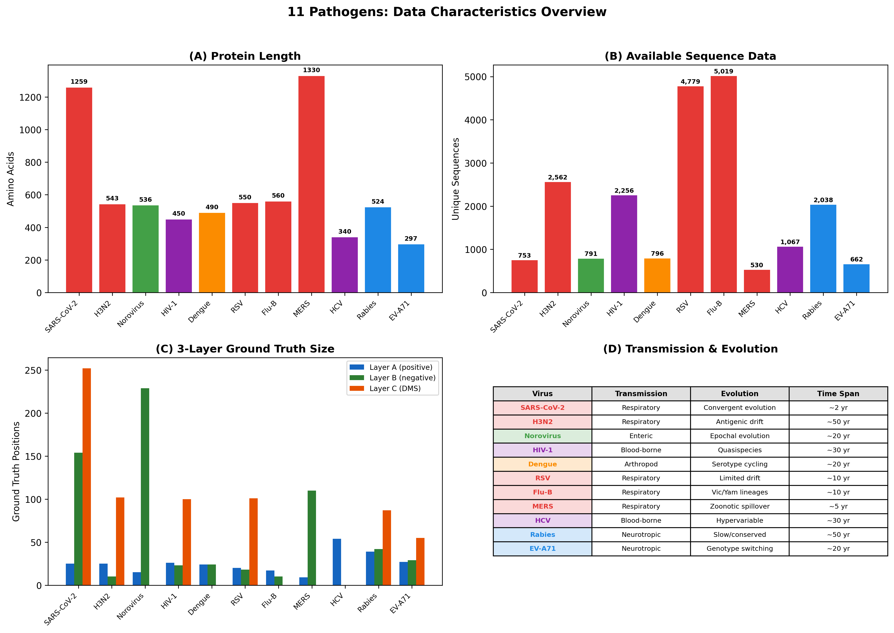
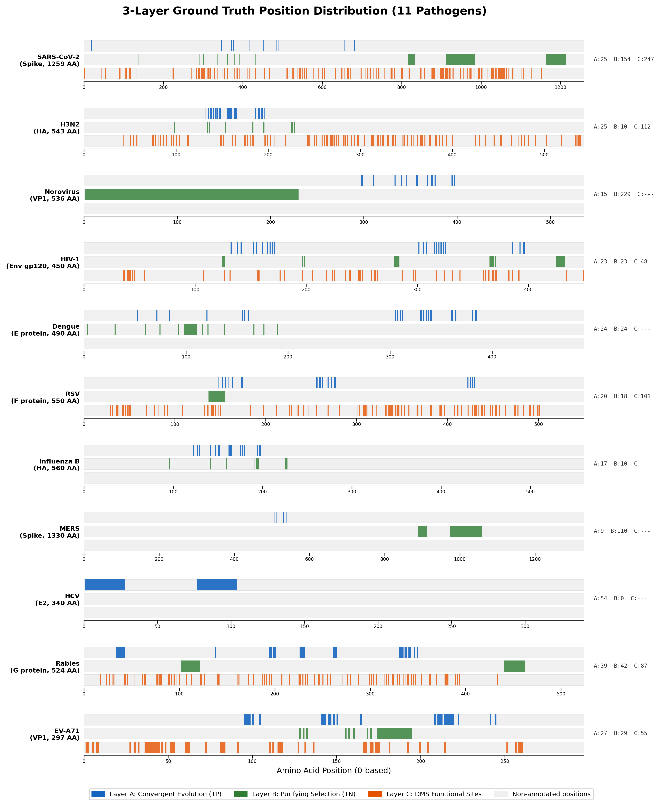
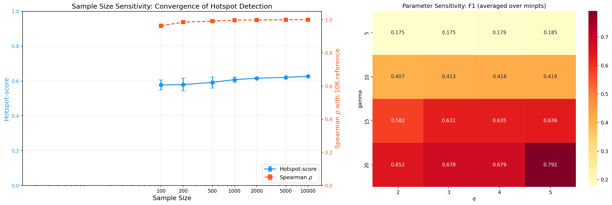
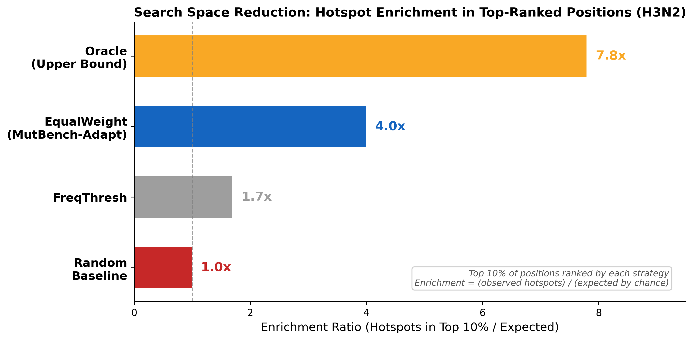

# 바이러스 변이 핫스팟 탐지를 위한 다중 정보원 유형의 체계적 벤치마킹

## 학위논문 요약서

**한줄 요약**: 기존 핫스팟 탐지가 빈도/엔트로피에만 의존하던 것을 10가지 정보로 확장하여 11개 바이러스에서 비교한 결과, 최적 정보 유형이 바이러스마다 다르고(ω²=0.296), 통합 시 실험 탐색을 최대 9.36배 축소할 수 있음을 입증하였다.

**논문 구조**: Ch1 서론 → Ch2 관련 연구 → Ch3 재료 및 방법 → Ch4 실험 결과 → Ch5 논의 → Ch6 결론

## Chapter 1. Introduction (서론)

### 1.1 Research Background (연구 배경)

바이러스는 세포 안에서 자신의 유전자를 복사하여 증식합니다. 복제 과정에서 간혹 복사 오류가 발생하는데, 이것이 **변이(mutation)**입니다. RNA 바이러스(코로나, 인플루엔자, HIV 등)는 변이가 빠르며, 연간 유전자 위치당 약 10만분의 1 ~ 1천분의 1 비율로 변이가 축적됩니다.

**핫스팟(hotspot)**이란 변이가 유독 많이 생기는 유전체 위치 또는 영역입니다. 핵심적 구분은:

- **생물학적으로 의미 있는 핫스팟**: 면역 회피, 감염력 증가 등 바이러스에 이점을 주는 변이가 집중 (예: SARS-CoV-2 Spike 484번 위치 — Beta, Gamma, Mu, Omicron 계통에서 독립적 반복 출현)
- **Founder effect에 의한 핫스팟**: 빈도가 높지만 "유리해서"가 아니라 "그 변이를 가진 계통이 우연히 크게 번성해서"인 경우 (예: D614G)

| 용어 | 정의 |
|------|------|
| Mutation (변이) | 바이러스 복제 시 발생하는 뉴클레오티드/아미노산 서열 변화 |
| Hotspot (핫스팟) | 변이가 우연 기대치보다 자주 축적되는 게놈 위치 |
| Convergent evolution (수렴 진화) | 서로 관련 없는 계통에서 동일 변이가 독립적으로 출현 — 양성 선택의 증거 |
| Purifying selection (정화 선택) | 단백질 구조/기능을 파괴하는 해로운 변이의 진화적 제거 |
| Founder effect (창시자 효과) | 특정 변이가 "유리해서"가 아니라 그 계통이 우연히 크게 번성하여 빈도가 높아진 현상 |
| DMS (Deep Mutational Scanning) | 모든 가능한 아미노산 치환의 기능적 영향을 실험적으로 측정하는 기법 |
| MSA (다중 서열 정렬) | 여러 단백질 서열을 정렬하여 위치별 변이를 식별하는 계산 방법 |
| Epitope (에피토프) | 항체가 결합하는 항원의 특정 부위. 면역 회피 변이는 주로 에피토프에서 발생 |
| dN/dS | 비동의치환율/동의치환율 비율. >1이면 양성 선택(변이 유리), <1이면 정화 선택(변이 유해) |
| MCC (Matthews Correlation Coefficient) | 이진 분류 성능 지표 (-1~+1). 불균형 데이터에서 F1보다 공정한 평가 |
| ANOVA (분산분석) | 성능 차이가 어떤 요인(방법, 바이러스, 조합) 때문인지 분리하는 통계 기법 |
| PLM (단백질 언어 모델) | 대규모 단백질 서열로 학습된 AI 모델 (ESM-2, Tranception 등) |
| FUBAR | HyPhy의 베이지안 방법. 각 코돈 위치에서 양성/정화 선택 여부를 추정 |
| pLDDT | AlphaFold의 구조 예측 신뢰도 (0~100). 낮으면 유연/무질서 영역 |

: 주요 생물학 용어 정리

### 1.2 Research Motivation and Problem Definition (연구 동기)

핫스팟 분석의 궁극적 목적은 백신 설계, 항바이러스제 개발, 실시간 변이 감시에 필요한 **"주의해야 할 위치 목록"**을 제공하는 것입니다. 이를 위해 다양한 통계적 탐지 방법이 개발되어 왔으나, 현재 세 가지 근본적인 한계에 직면해 있습니다.

**한계 1: 탐지 결과의 생물학적 의미를 평가할 표준 기준이 없습니다.**

통계적 방법으로 "변이가 집중된 위치"를 찾는 것 자체는 가능합니다. 그러나 찾아낸 위치가 **생물학적으로 의미 있는 핫스팟**인지 판단할 공인된 기준(ground truth)이 없습니다. 왜 이 기준을 정하기 어려운가 하면:

- **핫스팟의 정의 자체가 모호합니다.** "변이가 많이 일어나는 곳"인지, "면역 회피에 중요한 곳"인지, "기능적으로 중요한 곳"인지에 따라 정답이 달라집니다. 같은 바이러스를 연구하는 두 연구팀이 서로 다른 정의를 사용할 수 있습니다.
- **관찰 시점에 따라 달라집니다.** 2020년에는 핫스팟이 아니었던 위치가 2022년 오미크론 출현 후 핵심 핫스팟이 되기도 합니다. 즉 "정답"이 시간에 따라 변합니다.
- **생물학적으로 의미 있는 핫스팟과 그렇지 않은 핫스팟의 구분이 어렵습니다.** D614G처럼 빈도가 높은 위치가 자연선택 때문인지 단순히 그 계통이 번성해서인지(founder effect) 서열 데이터만으로는 구분하기 어렵습니다.
- **최종 검증은 실험실에서만 가능합니다.** 컴퓨터 분석으로 "이 위치가 핫스팟일 가능성이 높다"까지는 판단할 수 있지만, 그 위치의 변이가 실제로 면역 회피나 감염력 증가를 일으키는지는 Deep Mutational Scanning(DMS) 같은 실험을 통해서만 확인할 수 있습니다. DMS는 단백질의 모든 가능한 아미노산 치환을 하나씩 만들어 기능적 영향을 측정하는 기법으로, 비용과 시간이 많이 들어 일부 바이러스에서만 수행되었습니다.

따라서 각 논문이 자기 기준으로 "잘 찾았다"고 주장하지만, 기준이 다르니 비교할 수 없습니다. 본 연구에서는 이 문제를 해결하기 위해 수렴 진화(Layer A), 정화 선택(Layer B), DMS 데이터(Layer C)라는 세 가지 독립적 근거를 결합한 3층 정답 기준을 설계했습니다.

**한계 2: 방법 간 공정한 비교와 일반화 검증이 되지 않았습니다.**

- **평가 조건이 통일되지 않았습니다.** 방법 A는 코로나 데이터 5,000개 서열로, 방법 B는 인플루엔자 데이터 2,000개 서열로 각각 테스트했습니다. 서로 다른 바이러스, 서로 다른 서열 수, 서로 다른 평가 기준을 사용했으므로 어떤 방법이 더 나은지 비교할 수 없습니다.
- **단일 바이러스 결과를 일반화할 수 없습니다.** 코로나에서 우수한 방법이 HIV에서도 유효한지, 노로바이러스에서도 적용 가능한지 검증된 적이 없습니다. 바이러스마다 변이 속도(HIV는 코로나의 10배), 게놈 크기(HCV 340AA vs MERS 1,330AA), 진화 패턴(H3N2의 지속적 변이 vs Norovirus의 에포크형 변이)이 달라, 하나의 바이러스 결과가 다른 바이러스에 적용된다는 보장이 없습니다.
- **복합적 평가 지표가 없습니다.** 기존 연구들은 precision이나 recall 같은 단일 지표로만 보고하여, "정밀하지만 많이 놓치는 방법"과 "많이 찾지만 위양성(false positive)이 많은 방법" 중 어느 것이 나은지 판단할 기준이 없습니다.

**한계 3: 정보 유형 간 기여도 분석이 없습니다.**

핫스팟 탐지에 사용할 수 있는 정보는 빈도, 엔트로피, 계통발생 신호(dN/dS, FUBAR), 구조 정보(pLDDT, SASA), AI 예측(ESM-2, Tranception) 등 다양합니다. 그러나 이들 중 **어떤 정보가 핫스팟 탐지에 가장 핵심적인지**, 정보 유형 간 기여도를 체계적으로 비교한 연구가 없습니다.

### 1.3 Research Objectives (연구 목표)

위 세 가지 한계를 해결하기 위해 본 연구는 다음 세 가지 목표를 설정합니다.

**목표 1: 다양한 정보 유형을 체계적으로 비교할 수 있는 실험 프레임워크(MutBench) 구축**

- **필요성**: 빈도/엔트로피 외에도 계통 분석, 구조 정보, AI 예측 등 다양한 정보가 존재하지만, 이들을 동일 조건에서 비교할 표준화된 정답 기준과 실험 설계가 없었습니다.
- **방법**: (1) 3층 정답 기준(수렴 진화·보존 영역·DMS)을 설계하고, (2) 11개 바이러스 × 20 점수화 유형(6개 카테고리) × 14 탐지 패밀리(5개 카테고리, 39 변형) = **8,580회** 평가를 수행합니다.
- **기대 결과**: 다양한 정보 유형과 탐지 방법을 동일 조건에서 비교할 수 있는 표준화된 실험 기반을 제공합니다.

**목표 2: 핫스팟 탐지 성능의 핵심 요인 규명**

- **필요성**: 10가지 정보 유형과 14개 탐지 방법 중 어떤 요인이 성능에 가장 큰 영향을 미치는지 정량적으로 분해해야, 연구 자원의 우선순위를 정할 수 있습니다.
- **방법**: (1) Factorial ANOVA(3요인 분산분석 — 성능 차이가 어떤 요인 때문인지 분리하는 통계 기법)로 각 요인의 분산 기여도(ω², 오메가 제곱 — 0~1 범위, 클수록 영향 큼)를 산출하고, (2) Friedman 검정(비모수 순위 검정 — 정규분포를 가정하지 않고 순위만으로 판단)으로 상위 조합의 순위 일관성을 검정하며, (3) LOPO 교차 검증(Leave-One-Pathogen-Out — 10개로 학습한 최적을 남은 1개에 적용)으로 일반화 가능성을 테스트합니다.
- **기대 결과**: scoring × pathogen 상호작용이 최대 분산 성분(ω²=0.296)이라는 정량적 증거와, LOPO 0/11로 최적 정보 유형이 바이러스마다 근본적으로 상이함을 입증합니다.

**목표 3: 바이러스별 핵심 정보 식별 및 실험 탐색 범위 축소 검증**

- **필요성**: 10가지 정보 유형 중 어떤 것이 핵심이고, 이를 통합하면 실험 탐색 범위를 얼마나 줄일 수 있는지 정량화해야 합니다.
- **방법**: (1) Per-feature AUC와 Random Forest로 바이러스별 핵심 정보 유형을 식별하고, (2) Feature ablation으로 최소 필수 정보 조합을 규명하며, (3) Vaccine escape enrichment 분석으로 벤치마크 결과가 실제 면역 회피 위치와 일치하는지 독립 검증합니다.
- **기대 결과**: 4개 핵심 정보(homoplasy, pLDDT, entropy, freq)로 전체 성능의 98%를 달성합니다. Vaccine escape enrichment 최대 9.36배(p<0.0001)로 실험 탐색 범위 축소를 입증합니다.

\newpage

## Chapter 2. Related Research (관련 연구)

### 2.1 Viral Mutation Hotspot Detection (바이러스 변이 핫스팟 탐지)

#### 2.1.1 핫스팟 탐지의 3단계와 각 단계의 방법론

핫스팟 탐지는 세 단계로 이루어지며, 각 단계에서 사용되는 방법론이 다릅니다.

**1단계: 서열 수집 및 정렬**

전 세계 연구기관에서 바이러스 유전자 서열을 수집(GISAID, NCBI GenBank)하고, 다중 서열 정렬(MSA)을 수행합니다. 이 단계에서 각 위치별로 "어떤 변이가 얼마나 발생했는가"를 비교할 수 있는 기반이 만들어집니다.

**2단계-A: 점수화(Scoring) — 각 위치에 "얼마나 중요한가" 점수 부여**

MSA의 각 아미노산 위치에 대해, 다양한 생물학적 정보를 활용하여 점수를 계산합니다. 본 연구에서는 6개 카테고리, 20가지 점수화 유형을 비교합니다.

- **빈도 기반** (3가지: freq, rare_freq, freq_with_indel)
  - 변이 빈도를 직접 계산합니다. 가장 직관적이나 계통 편향(founder effect)에 취약합니다.
  - 입력: MSA만 필요 (추가 데이터 없음)

- **MSA 유래** (3가지: entropy, entropy_with_indel, homoplasy)
  - Shannon 엔트로피로 다양성을, homoplasy로 수렴 변이(독립 발생 횟수)를 측정합니다.
  - 입력: MSA + 계통수 (homoplasy의 경우)

- **계통 분석 기반** (4가지: dN/dS proxy, FUBAR×3)
  - 코돈(3개 염기로 1개 아미노산을 지정하는 단위) 수준에서 양성선택 압력을 추정합니다. 빈도와 달리 자연선택 신호를 직접 측정합니다.
  - 입력: 코돈 정렬 + 계통수. 트리 품질에 의존합니다.

- **구조 기반** (3가지: pLDDT, SASA, Grantham)
  - 3D 구조 신뢰도, 표면 노출도, 아미노산 물리화학적 거리를 측정합니다.
  - 입력: AlphaFold/ESMFold 예측 구조. 구조 예측 정확도에 의존합니다.

- **AI 기반** (5가지: ESM-2 LLR, Tranception, semantic change, stability×2)
  - 단백질 언어모델이 학습한 진화적 제약을 기반으로 변이 허용도를 예측합니다.
  - 입력: 단백질 서열 + GPU. 학습 데이터에 바이러스가 과소대표되어 있을 수 있습니다.

- **복합** (2가지: EVEscape composite, EqualWeight)
  - 위 여러 정보를 결합합니다.

**2단계-B: 탐지(Detection) — 점수 프로파일에서 핫스팟 영역 식별**

점수화된 1차원 배열에서 "높은 영역"을 찾아 핫스팟으로 지정합니다. 본 연구에서는 5개 카테고리, 14개 패밀리(39 변형)를 비교합니다.

- **밀도 기반**: DBSCAN, HDBSCAN, KDE, MutClust
- **임계값 기반**: FreqThresh (상위 N%), AdaptiveKnee, AdaptWin
- **신호 처리**: Wavelet 변환, Spectral 필터, CUSUM 변화점 탐지
- **통계 검정**: Sliding window t-test, Bayesian change-point, GradPeak, LocalContrast
- **적응 윈도우**: SWAN (윈도우 크기 자동 조정)

모든 탐지 방법은 동일한 1차원 점수 배열을 입력으로 받습니다.

본 연구에서는 20가지 점수화 × 14개 탐지 패밀리(39 변형) × 11개 바이러스 = **8,580회** 평가를 수행합니다.

**3단계: 실험 검증 — DMS(Deep Mutational Scanning)를 활용한 독립 검증**

식별된 핫스팟이 생물학적으로 의미 있는지는 궁극적으로 실험실에서 검증해야 합니다. DMS는 단백질의 **모든 가능한 아미노산 치환**을 체계적으로 생성하고, 각 치환의 기능적 영향(결합력, 세포 침입, 복제 효율)을 정량 측정하는 실험으로, 가장 직접적인 실험적 정답 기준입니다.

- **왜 정답 기준인가**: 편향 없이 포괄적이며 실험적 (계산 예측이 아닌 직접 측정)
- **주요 DMS 연구**: Starr 2020 (SARS-CoV-2 RBD), Dadonaite 2024 (전체 Spike), Lee 2018 (H3N2 HA)
- **한계**: 비용이 높고, pseudovirus 사용 (실제 바이러스와 차이 가능), in vitro ≠ in vivo
- **가용성 격차**: EVEREST 45개 DMS 포함, WHO 우선순위 바이러스 절반 이상에서 DMS 부재. 본 연구에서는 6개 병원체의 DMS를 Layer C 독립 검증으로 활용

#### 2.1.2 선행 연구와 본 연구의 차이

지금까지 살펴본 정보 유형(빈도, 엔트로피, 계통, PLM, 구조)을 개별적으로 활용한 연구는 있지만, **이들을 체계적으로 비교**한 연구는 없습니다.

**"예측 벤치마크"와 "탐지 벤치마크"의 차이:**

변이 효과 **예측**(VEP)과 핫스팟 **탐지**는 근본적으로 다른 문제입니다:

- **예측** (EVEREST, ProteinGym): "484번 위치의 K→E 변이가 감염력을 얼마나 바꾸는가?" — 개별 변이 하나하나의 효과를 점수로 평가합니다. 평가 기준은 DMS 실험값과의 상관(Spearman)입니다.
- **탐지** (MutBench): "Spike 단백질에서 변이가 집중되는 영역이 어디인가?" — 변이가 몰리는 게놈 구간을 찾아 실험 검증의 우선순위를 제공합니다. 평가 기준은 정답 위치와의 이진 분류 정확도(MCC)입니다.

예측은 "각 학생의 시험 점수를 예측"하는 것이고, 탐지는 "성적이 낮은 학생이 몰려있는 반을 찾는" 것입니다. 두 문제는 상보적이지만 방법론과 평가 기준이 다르므로 직접 비교할 수 없습니다.

| 연구 | 무엇을 하나 | MutBench와의 차이 |
|------|-----------|-----------------|
| **EVEREST** (bioRxiv, 2025) | 45개 바이러스 DMS로 VEP 벤치마크 | 변이 효과 **예측** 벤치마크이지 **탐지** 벤치마크가 아님. 하지만 "최적 방법이 바이러스마다 다르다"는 결론이 MutBench와 일치 |
| **EVEscape** (Nature, 2023) | 바이러스 escape 변이를 사전 예측하는 모델. 적합도 + 접근성 + 비유사도 3가지를 결합 | **예측 모델**이지 탐지 방법들을 비교하는 **벤치마크**가 아님. 단일 방법 제안 |
| **Hie et al.** (Science, 2021) | AI 언어모델로 바이러스 escape 변이를 예측 | 단일 방법 제안. 다른 방법들과 비교하지 않음 |
| **Maher et al.** (Sci Transl Med, 2022) | SARS-CoV-2 미래 변이주를 예측하는 feature 분석 | SARS-CoV-2 **하나**에 한정. 다른 바이러스 미검증 |
| **Obermeyer et al.** (Science, 2022) | 640만 SARS-CoV-2 게놈에서 적합도 관련 변이 식별 | 대규모 분석이지만 SARS-CoV-2 **하나**. 탐지 방법 비교 아님 |
| **ProteinGym** (NeurIPS, 2023) | 250개 이상 DMS 데이터로 변이 효과 예측 모델 벤치마크 | 개별 변이의 효과 예측 (per-mutation). 핫스팟 **영역** 탐지가 아님 |
| **ConDor** (2024) | 계통수에서 수렴 변이를 탐지하는 도구 | 단일 탐지 도구. 벤치마크 프레임워크가 아님 |

: 관련 연구와 MutBench의 비교

**EVEREST vs MutBench — 가장 유사하지만 근본적으로 다른 연구**

EVEREST(Marks lab, 2025)는 MutBench와 가장 가까운 연구이며, "최적 방법이 바이러스마다 다르다"는 결론도 동일합니다. 그러나 두 연구가 답하는 질문이 근본적으로 다릅니다:

| 비교 항목 | EVEREST | MutBench |
|----------|---------|----------|
| **답하는 질문** | "이 변이가 바이러스 적합도에 어떤 영향을 미치는가?" (per-mutation 예측) | "게놈의 어떤 영역에 변이가 집중되는가?" (per-region 탐지) |
| **평가 단위** | 개별 변이 (A484K 같은 단일 치환) | 게놈 위치/영역 (484번 위치 주변 클러스터) |
| **정답 기준** | DMS 적합도 점수 (연속값, Spearman 상관) | 수렴 진화 위치 (이진 분류, MCC) |
| **입력 정보** | 고정 (정렬 기반 or PLM — 방법 자체를 비교) | **다양한 정보 유형을 비교** (빈도, 계통, 구조, AI 등 20가지) |
| **핵심 발견** | PLM이 바이러스에서 정렬 기반보다 성능 낮음 | **정보 유형 × 병원체 상호작용이 최대 분산원** (ω²=0.296) |
| **실용적 검증** | 없음 | vaccine escape enrichment 최대 9.36배 |
| **DMS 필요 여부** | 필수 (평가 기준 자체가 DMS) | 선택적 (Layer C 보조 검증, DMS 없이도 Layer A로 평가 가능) |

: EVEREST vs MutBench 핵심 차이

핵심 차이: EVEREST는 **"어떤 예측 모델이 좋은가"**를, MutBench는 **"어떤 정보가 어떤 바이러스에 유효한가"**를 분석합니다.

| 특성 | MutClust | Bailey 2018 (암) | MOSD (다중오믹스) | **MutBench** |
|------|---------|----------------|----------------|------------|
| 도메인 | 바이러스 | 암 | 다중오믹스 | **바이러스** |
| 독립 정답 기준 | 없음 | 있음 | 있음 | **있음 (3층)** |
| 복합 평가 지표 | 없음 | 없음 | cluster-score | **hotspot-score** |
| 다중 병원체 비교 | 부분 (2개) | 해당 없음 | 해당 없음 | **있음 (11개)** |
| 통계적 방법 선택 | 없음 | 없음 | ANOVA | **ANOVA+Friedman+LOPO** |
| 비교 방법 수 | 1개 | 26개 | 10개 | **14 families (39 variants)** |

: 기존 접근과 MutBench 비교

### 2.2 MutClust: Adaptive Density-Based Hotspot Detection (MutClust 선행 연구)

#### 2.2.1 MutClust의 작동 방식: H-score로 점수 매기고 DBSCAN으로 영역 묶기

MutClust의 원래 알고리즘은 CCM(Cluster Core Model)으로 시드 위치를 식별한 뒤, 적응적 DBSCAN으로 경계를 확장하는 2단계 방식입니다.

#### 2.2.2 MutClust의 성과와 한계 — 왜 벤치마크가 필요한가

Youn et al. (2025)이 SARS-CoV-2 Spike에서 7개 핫스팟 클러스터 식별, 5개가 면역 회피 관련 영역과 일치.

MutClust의 한계, 이에 따라 벤치마크 필요성:

- 단일 바이러스에서만 검증
- H-score가 founder effect를 구분 못함
- 다른 방법과의 비교 부재

\newpage

## Chapter 3. Materials and Methods (재료 및 방법)

### 3.1 Materials (재료)

#### 3.1.1 Target Pathogens and Data (11개 바이러스)

다양한 진화 양상을 포괄하기 위해 **11개 RNA 바이러스**의 표면 단백질을 분석 대상으로 선정했습니다.

> **핵심 고려사항 1**: 왜 전체 게놈이 아닌 표면 단백질만 분석하는가?

바이러스 게놈에는 복제 효소(RdRp), 프로테아제, 비구조 단백질 등 다양한 유전자가 있지만, 핫스팟 탐지의 실용적 목적(백신 설계, 항체 치료제, 면역 회피 감시)은 **면역계가 직접 인식하는 단백질**에 집중됩니다. 표면 단백질을 선택한 구체적 이유:

1. **숙주 세포 진입 매개**: 표면 단백질은 수용체(ACE2, CD4, 시알산 등)에 결합하여 감염을 시작하므로, 이 단백질의 변이가 감염력에 직접 영향
2. **중화 항체의 주요 표적**: 면역계가 바이러스를 인식하고 중화하는 곳이 표면 단백질이므로, 면역 회피 변이는 여기서 발생
3. **백신 설계의 핵심 항원**: 현재 사용 중인 백신(mRNA, 단백질 서브유닛)은 모두 표면 단백질을 항원으로 사용
4. **양성 선택(positive selection) 집중**: 면역 압력을 직접 받는 표면 단백질에서 적응 진화가 가장 활발
5. **DMS 데이터 가용성**: 비용이 큰 DMS 실험은 대부분 표면 단백질에서만 수행됨

비구조 단백질(예: SARS-CoV-2 NSP1-16)의 변이는 주로 정화 선택 하에 있으며, 면역 회피와 무관하여 Layer A(수렴 진화) 정답 정의가 불가능합니다.

참고: Norovirus(VP1)와 EV-A71(VP1)은 외피막(envelope)이 없는 바이러스이므로 "표면 단백질"이라기보다 **캡시드 표면 단백질**이 정확합니다. 그러나 중화 항체 표적이라는 기능적 역할은 동일합니다.

**전파 경로별 분류:**

- **호흡기**: SARS-CoV-2, MERS, RSV, H3N2, Influenza B
- **혈액/성매개**: HIV-1, HCV
- **위장관**: Norovirus
- **모기 매개**: Dengue
- **신경 친화성**: Rabies, EV-A71

| 바이러스 | 표면 단백질 | 서열 수 | 고유 서열 | 길이(AA) |
|---------|-----------|--------|----------|---------|
| SARS-CoV-2 | Spike | 4,982 | 753 | 1,259 |
| H3N2 | HA | 2,644 | 2,562 | 543 |
| Norovirus | VP1 | 1,500 | 791 | 536 |
| HIV-1 | Env gp120 | 3,000 | 2,256 | 450 |
| Dengue | E protein | 2,000 | 796 | 490 |
| RSV | F protein | 5,070 | 4,779 | 550 |
| Influenza B | HA | 5,325 | 5,019 | 560 |
| MERS | Spike | 1,311 | 530 | 1,330 |
| HCV | E2 | 1,362 | 1,067 | 340 |
| Rabies | G protein | 2,038 | 2,038 | 524 |
| EV-A71 | VP1 | 662 | 662 | 297 |

: 11개 바이러스 서열 데이터

| 바이러스 | 단백질 기능 | 변이 속도 | 진화 패턴 |
|---------|-----------|----------|---------|
| SARS-CoV-2 | ACE2 결합, 세포 진입 | $\sim10^{-3}$ | 수렴 진화 (E484K/A) |
| H3N2 | 시알산 결합, 항원 변이 | $\sim4\times10^{-3}$ | 지속적 항원 표류 |
| Norovirus | HBGA 결합, 캡시드 | $\sim2\times10^{-3}$ | 에포크형 (2-4년) |
| HIV-1 | CD4 결합 | $\sim2.5\times10^{-3}$ | 환자 내 다양화 |
| Dengue | 수용체 결합, 막 융합 | $\sim7.6\times10^{-4}$ | 4 혈청형 분화 |
| RSV | 세포막 융합 | $\sim1.5\times10^{-3}$ | 중간 속도 변이 |
| Influenza B | 수용체 결합 | $\sim2\times10^{-3}$ | Victoria/Yamagata |
| MERS | DPP4 결합 | $\sim9\times10^{-4}$ | 산발적 인수공통 |
| HCV | CD81 결합 | $\sim10^{-3}$ | 초변이 (HVR1) |
| Rabies | nAChR 결합 | $\sim4\times10^{-4}$ | 강한 정화 선택 |
| EV-A71 | 중화 에피토프 | $\sim4.5\times10^{-3}$ | 유전형 교체 |

: 11개 바이러스 진화 특성

이 11종은 변이 속도(HIV-1 $\sim10^{-3}$ ~ Rabies $\sim4\times10^{-4}$), 단백질 길이(EV-A71 297 AA ~ MERS 1,330 AA), 진화 패턴(H3N2 지속적 변이 vs Norovirus 에포크형)이 모두 달라, 단일 바이러스에 치우치지 않는 평가를 보장합니다.

> **핵심 고려사항 2**: 왜 이 11개 바이러스인가?
>
> 벤치마크에 포함할 병원체를 선정할 때 세 가지 기준을 적용했습니다. 첫째, ANOVA나 Friedman 검정의 통계적 검정력을 확보하기 위해 **모든 병원체에서 530개 이상의 고유 서열**이 필요합니다. 둘째, 쉬운 병원체(HCV, Oracle MCC 0.660)부터 매우 어려운 병원체(MERS, 0.196)까지 **난이도가 다양해야** 벤치마크 결과가 특정 난이도에 편향되지 않습니다. 셋째, H-score 기반 점수화가 의미 있으려면 변이가 충분히 축적되어야 하므로, 변이율이 $10^{-6}$~$10^{-8}$인 **DNA 바이러스는 제외**하고 RNA 바이러스($10^{-3}$~$10^{-4}$)로 한정했습니다.

**데이터 수집 및 전처리:**

NCBI GenBank에서 각 표면 단백질의 완전한 코딩 서열을 수집하였습니다. 모호한 염기(N)가 5% 이상인 서열 제거, 동일 서열 중복 제거 후 MAFFT v7.505로 다중 서열 정렬(MSA)을 수행했습니다. MSA를 통해 "484번 위치에서 어떤 아미노산이 몇 번 관찰되었는가"를 비교할 수 있게 됩니다. 이후 위치별 변이 빈도와 Shannon 엔트로피를 계산합니다.

Figure 1은 11개 병원체의 데이터 특성을 4개 패널로 요약합니다.

{ width=80% }

### 3.2 Methods (방법)

#### 3.2.1 Framework Overview (프레임워크 개요)

MutBench는 다음 5단계 파이프라인으로 구성됩니다.

1. **입력**: 11개 병원체의 MSA(다중 서열 정렬) 데이터
2. **정답 구축**: 3층 Ground Truth (Layer A: 수렴 진화, Layer B: 보존 영역, Layer C: DMS 실험)
3. **점수화**: 각 위치에 점수 부여 — 6개 카테고리, 20가지 유형 (빈도, 엔트로피, FUBAR, pLDDT, ESM-2 등)
4. **탐지**: 점수 프로파일에서 핫스팟 영역 판별 — 14개 알고리즘 패밀리, 39개 변형
5. **평가**: 정답 대비 성능 측정 (MCC, Constrained FPR, DMS F1) + 통계 분석 (3-way ANOVA, Friedman, LOPO)

평가는 **2단계(Stage)**로 구성됩니다:

| | Stage 1 | Stage 2 |
|---|---------|---------|
| **대상** | SARS-CoV-2 1개 | 11개 바이러스 전체 |
| **목적** | 평가 도구 자체가 작동하는지 검증 | 핵심 질문 — "만능 방법이 있는가?" |
| **규모** | 5개 세부 실험 | 8,580회 대규모 평가 |
| **핵심 지표** | hotspot-score | MCC |

> **핵심 고려사항 3**: 왜 실험을 2단계(Stage)로 나누었나?

한 번에 11개 바이러스로 실험하면, 결과가 나쁠 때 **"탐지 방법이 나쁜 건지, 평가 도구가 나쁜 건지"** 구분할 수 없습니다. 그래서 먼저 Stage 1에서 가장 데이터가 풍부한 SARS-CoV-2로 평가 도구의 신뢰성을 검증한 뒤, Stage 2에서 검증된 도구로 본격적인 교차 비교를 수행합니다.

#### 3.2.2 3-Layer Ground Truth Framework (3층 정답 기준)

핫스팟 탐지 방법의 성능을 공정하게 비교하려면, "어떤 위치가 진짜 핫스팟인지"를 정의한 **정답표(ground truth)**가 필요합니다.

기존 탐지 방법들은 서열 데이터에서 변이가 집중된 위치를 **찾아내는 것 자체는 가능**합니다. 문제는 **찾아낸 위치가 생물학적으로 유의미한지** 판단할 기준이 없다는 것입니다. 빈도가 높다고 해서 반드시 면역 회피나 기능 변화와 관련된 것은 아닙니다 — founder effect로 인해 빈도만 높을 수도 있고, 중립적인 변이가 축적된 것일 수도 있습니다.

따라서 MutBench의 정답표는 단순히 "변이가 많은 곳"이 아니라, **"생물학적으로 중요한 핫스팟이라고 확인된 곳"**을 기준으로 합니다. 탐지 방법이 찾아낸 위치가 이 정답표와 얼마나 일치하는지를 측정하여, "단순히 빈도 높은 곳을 찾는 것"이 아닌 **"생물학적으로 의미 있는 위치를 정확히 찾는 것"**을 평가합니다.

본 연구에서는 세 가지 서로 독립적인 생물학적 근거를 결합하여 이 정답표를 구성했습니다. 세 근거는 각각 "생물학적으로 의미 있는 핫스팟", "핫스팟으로 잘못 판정하면 특히 위험한 곳", "실험실에서 직접 기능 영향을 측정한 곳"이라는 서로 다른 역할을 담당합니다.

**Layer A — "자연선택이 반복적으로 작용한 위치"**

**생물학적 의미**: 같은 바이러스 종 안에서 서로 다른 계통(lineage)이 **독립적으로** 같은 위치에서 변이한 곳입니다. 이것을 **수렴 진화(convergent evolution)**라 합니다.

예를 들어 SARS-CoV-2 Spike 484번 위치의 변이는 Beta(남아공)·Gamma(브라질)·Mu(콜롬비아) 계통에서 E484K(글루탐산→라이신)로, Omicron(남아공) 계통에서 E484A(글루탐산→알라닌)로 각각 독립적으로 출현했습니다. 서로 관련 없는 계통에서 같은 변이가 반복된다는 것은, 해당 변이가 바이러스에게 **생존 이점**(면역 회피, 수용체 결합력 증가, 복제 효율 향상 등)을 제공한다는 강력한 증거입니다. 이러한 위치를 ≥3개 독립 계통에서 반복 출현이 문헌에 보고된 것을 기준으로 선정했습니다.

**벤치마크에서의 역할**: 탐지 방법이 찾아야 할 **양성 기준(True Positive)**입니다. "이 위치를 찾았는가?"로 recall(재현율)을 계산합니다. 병원체당 9~54개 위치.

**Layer B — "변이하면 바이러스가 죽는, 구조적으로 필수적인 위치"**

**생물학적 의미**: 단백질이 정상적으로 기능하기 위해 **반드시 보존되어야 하는 구조적 핵심 부위**입니다. 이 위치에서 변이가 일어나면 단백질의 3D 구조가 무너지거나 기능을 잃어, 바이러스 자체가 생존할 수 없습니다. 이를 **정화 선택(purifying selection)** 하에 있다고 합니다.

예를 들어 Spike 단백질의 heptad repeat(HR1/HR2) 영역은 세포막 융합에 필수적인 구조로, 여기서 변이가 일어나면 바이러스가 세포에 진입 자체를 못합니다.

**벤치마크에서의 역할**: 탐지 방법이 이곳을 핫스팟이라고 **잘못 판정하는지 감시**합니다. 핵심 지표(MCC)에는 직접 사용하지 않고, 별도 보조 지표(Constrained FPR)로 측정합니다. "여기를 핫스팟이라 하면 백신/약물 타겟을 잘못 설정하는 위험"을 모니터링합니다. 병원체당 0~229개 위치.

**Layer C — "실험실에서 측정한 각 위치의 기능적 영향"**

**생물학적 의미**: Deep Mutational Scanning(DMS) 실험에서 단백질의 모든 가능한 아미노산 치환을 물리적으로 만들어, 각 치환이 바이러스 기능에 미치는 영향을 직접 측정한 결과입니다. 예를 들어 SARS-CoV-2 Spike 단백질에서 각 위치의 변이가 세포 진입 효율을 높이는지 낮추는지를 정량적으로 보여줍니다.

Layer A와 B가 진화 패턴이나 구조 정보에 기반하는 반면, Layer C는 **실험실에서 직접 확인한 "생물학적 사실"**입니다. 어떤 위치는 실험적으로 강한 기능적 영향을 보이지만 아직 자연에서 수렴 진화가 관찰되지 않았을 수 있으므로, Layer A와는 독립적인 검증 근거를 제공합니다.

**벤치마크에서의 역할**: Layer A/B와 독립적인 **실험적 교차 검증**입니다. 탐지 방법이 찾은 핫스팟이 실험적으로 확인된 기능적 부위와 일치하는지 확인합니다. 11개 바이러스 중 DMS 데이터가 있는 6개에서만 사용 가능합니다.

| Layer | 생물학적 의미 | 벤치마크 역할 |
|-------|-------------|-------------|
| **A** | 자연선택이 반복 작용한 위치 (수렴 진화) | 양성 기준 — "이것을 찾았는가?" |
| **B** | 변이하면 바이러스가 죽는 위치 (정화 선택) | 위험 감시 — "이것을 핫스팟이라 하면 안 됨" |
| **C** | 실험실에서 기능 영향이 확인된 위치 (DMS) | 교차 검증 — "실험 결과와 일치하는가?" |

: 3층 정답 기준 요약

이 3층 구조의 핵심은 **서로 다른 생물학적 근거를 독립적으로 사용**한다는 점입니다. Layer A는 진화 패턴, Layer B는 구조적 제약, Layer C는 실험실 측정으로, 각각 다른 관점에서 "생물학적으로 의미 있는 위치인가"를 판단합니다.

세 층은 서로 거의 겹치지 않습니다(Jaccard 유사도 0.006 — 두 집합의 교집합/합집합 비율로, 0이면 완전 독립, 1이면 완전 동일). 이는 각 층이 서로 다른 관점에서 독립적인 정보를 제공한다는 것을 의미하며, 단일 기준에 의존하지 않는 균형 잡힌 평가를 가능하게 합니다.

Figure 2는 11개 병원체의 Layer A/B/C 정답 위치를 단백질 서열 위에 매핑한 그림입니다.

{ width=80% }

| 바이러스 | Layer A | Layer B | Layer C | Layer A 출처 |
|---------|---------|---------|---------|-------------|
| SARS-CoV-2 | 25 | 154 | 252 | Carabelli 2023, Cao 2023 |
| H3N2 | 25 | 10 | 102 | Koel 2013 (antigenic cluster) |
| Norovirus | 15 | 229 | --- | Lindesmith 2012, 2013 |
| HIV-1 | 23 | 23 | 100 | Moore & Williamson 2015 |
| Dengue | 24 | 24 | --- | Twiddy 2002, Holmes 2003 |
| RSV | 20 | 18 | 101 | Mas 2018, Sullender 2000 |
| Influenza B | 17 | 10 | --- | Ni 2013, Wang 2008 |
| MERS | 9 | 110 | --- | Kim 2016, Tang 2014 |
| HCV | 54 | 0† | --- | HVR1/HVR2 초변이 영역 |
| Rabies | 39 | 42 | 87 | Benmansour 1991, Aditham 2025 |
| EV-A71 | 27 | 29 | 55 | Huang 2015, Tong 2024 |

: 병원체별 3층 정답 위치 수

†HCV의 CD81 결합 부위(AA 418-535)가 정렬 길이(340 AA)를 초과하여 유효 Layer B = 0.

DMS Layer C 가용 병원체 6개: SARS-CoV-2 (Dadonaite 2024), H3N2 (Lee 2018), HIV-1 (Haddox 2018), RSV (Bloom lab 2026), Rabies (Aditham 2025), EV-A71 (Bakhache 2025).

> **핵심 고려사항 4**: Layer B/C가 없는 바이러스는 왜 포함했는가?

11개 바이러스 중 완전한 3층 GT(A+B+C)를 가진 것은 6개(SARS-CoV-2, H3N2, HIV-1, RSV, Rabies, EV-A71)입니다. Norovirus, Dengue, Influenza B, MERS, HCV는 Layer C(DMS)가 없습니다. 그럼에도 포함한 이유:

1. **핵심 평가 지표(MCC)는 Layer A만으로 계산됩니다.** Layer A = 정답(양성), 나머지 전체 = 오답(음성)으로 MCC를 계산하므로, Layer B/C가 없어도 핵심 평가는 가능합니다. Layer B는 "특히 나쁜 오답"을 추가로 측정하는 보조 지표(Constrained FPR)에 사용되고, Layer C는 독립적 검증(DMS F1)에 사용됩니다.

2. **6개만으로는 통계 검정력이 부족합니다.** "만능 방법이 없다"를 증명하려면 ANOVA, Friedman, LOPO 같은 통계 검정이 필요한데, 6개 바이러스로는 검정력이 부족합니다. 11개로 늘려야 통계적으로 유의한 결론을 낼 수 있습니다.

3. **다양성이 완전성보다 중요합니다.** DMS 데이터가 있는 바이러스만 쓰면 잘 연구된 병원체에 편향됩니다. Norovirus(epoch 진화), HCV(초변이), MERS(데이터 부족) 같은 도전적 사례를 포함해야 벤치마크의 현실적 가치가 있습니다.

**Layer A/B 중복 처리**

RSV(위치 148, 152)와 Influenza B(위치 141, 194)에서는 Layer A와 B가 겹치는 위치가 있습니다. 이런 위치는 면역 회피 압력(양성 선택)과 구조적 제약(정화 선택)을 동시에 받는 이중 선택 부위입니다. MCC 평가에서는 Layer A(양성)로 우선 처리하고 Layer B(음성)에서 제외합니다. 따라서 유효 Layer B는 RSV: 16개(18-2), Influenza B: 8개(10-2)입니다.

#### 3.2.3 Stage 1: SARS-CoV-2 심층 분석

Stage 1은 SARS-CoV-2를 기준 병원체로 사용하여 프레임워크의 세 가지 핵심 요소를 검증합니다. SARS-CoV-2를 선택한 이유는 DMS 데이터, 수렴 진화 위치, 구조 정보 등 **3층 GT를 모두 갖춘 유일한 병원체**이기 때문입니다.

> **3.2.3.1 정답 기준이 방법 간 차이를 구분할 수 있는가**
>
> Stage 1에서는 세 가지 출처의 정답을 사용하여 평가 도구의 구분 능력을 검증합니다:
> 1. **DMS 기능 부위**: Dadonaite et al. (2024)의 Spike 단백질 DMS 실험에서 상위 20% 기능 영향 위치
> 2. **합성 데이터**: 알려진 위치에 신호를 삽입한 통제 실험
> 3. **7개 기능 영역**: RBD, NTD, furin cleavage site 등 총 1,251 뉴클레오티드
>
> **3.2.3.2 기존 도구(MutClust)를 개선하여 탐지 기준선 확립**
>
> 유일한 바이러스 전용 핫스팟 탐지 도구인 MutClust의 원래 버전(v1)을 단계적으로 개선하여, 도메인 지식과 자동 클러스터링을 결합한 Hybrid 버전이 최고 성능(hotspot-score **0.778**)을 달성했습니다. 이 결과가 Stage 1의 탐지 기준선이 됩니다. Stage 2에서는 v1을 14개 탐지 패밀리 중 하나로 유지합니다 (v2c는 H-score 전용이라 다른 점수 유형에 적용 불가).
>
> **3.2.3.3 평가 지표가 정확도와 재현성을 동시에 반영하는가 (Hotspot-score)**
>
> Stage 1 전용 평가 지표:
>

$$\textbf{hotspot-score} = \frac{\textbf{recall} + \textbf{precision} + \textbf{stability}}{3}$$

> 각 성분의 의미:
>
> - **Recall (재현율)**: Layer A 위치 중 탐지 방법이 실제로 찾아낸 비율. 예: SARS-CoV-2에 Layer A 위치가 25개 있는데 그중 15개를 찾았다면 recall = 15/25 = 0.60. 높을수록 놓치는 핫스팟이 적음.
> - **Precision (정밀도)**: 핫스팟이라고 보고한 위치 중 실제 Layer A에 속하는 비율. 예: 100개를 핫스팟으로 보고했는데 15개만 Layer A에 포함되면 precision = 15/100 = 0.15. 높을수록 위양성이 적음.
> - **Stability (안정성)**: 80% 부분추출 100회 반복의 평균 Jaccard 유사도. 입력 서열의 20%를 무작위로 제거한 후 재탐지했을 때 원래 결과와의 일치도(Jaccard 유사도)를 측정합니다.
>
> > **핵심 고려사항 6**: 왜 F1이 아닌 (recall + precision + stability)/3인가?
>
> F1 = 2×(recall×precision)/(recall+precision)은 recall과 precision을 하나의 숫자로 합쳐버리므로, stability와의 상호작용이 보이지 않습니다. 예를 들어 HDBSCAN-Auto는 F1=0.146(낮음)이지만 recall=0.944(매우 높음), stability=0.788(높음)입니다. F1+stability 구조에서는 이 방법이 과소평가되지만, (recall+precision+stability)/3 구조에서는 높은 재현율과 안정성이 적절히 반영됩니다.
>
> **3.2.3.4 H-score의 한계와 대안 (Stage 1 전용)**
>
> H-score는 시간이 지나면 대부분의 위치에서 높은 값을 갖게 되어 핫스팟과 비핫스팟의 구분이 어려워지는 **포화(saturation)** 현상이 있습니다. 이를 보완하기 위해 Stage 1에서 엔트로피 단독, 시간적 빈도 변화율 등 8가지 대안 점수화 방법을 개발하여 비교했습니다. 이 대안들은 Stage 1 분석에서만 사용되며, Stage 2에서는 아래 20가지 점수화 유형으로 대체됩니다.
>

#### 3.2.4 Stage 2: 11-Pathogen 교차비교 벤치마크

Stage 1에서 프레임워크가 작동함을 확인했으므로, 이제 핵심 질문에 답합니다: **"어떤 생물학적 정보가 어떤 바이러스에서 가장 효과적인가?"**

이를 위해 20가지 점수화 유형 × 14개 탐지 패밀리(39 변형) × 11개 병원체 = **8,580회** 조합을 평가합니다. 각 조합의 MCC를 계산하고, 3-way ANOVA로 성능 차이의 원인을 분리합니다.

> **3.2.4.1 20가지 점수화 유형 — 어떤 생물학적 정보를 사용하는가**
>
> 같은 MSA 데이터라도 **어떤 관점에서 점수를 매기느냐**에 따라 다른 위치가 높은 점수를 받습니다. 예를 들어 빈도 기반 점수는 "변이가 얼마나 자주 일어나는가"를 보지만, 계통 분석 점수는 "그 변이가 독립적으로 여러 번 출현했는가(양성 선택)"를 봅니다. 6개 카테고리:
>
> - **빈도 기반 (3가지)**: MSA에서 직접 관찰되는 변이 빈도. 가장 직관적이지만 founder effect에 취약
> - **MSA 파생 (3가지)**: 빈도를 넘어 다양성(엔트로피)과 수렴 진화 횟수(homoplasy)를 측정
> - **계통발생 (4가지)**: 코돈 수준에서 자연선택 방향(양성/정화)을 직접 추정. FUBAR는 베이지안 방법으로 위치별 선택 압력을 계산
> - **구조 기반 (3가지)**: 단백질 3D 구조에서 유연성(pLDDT), 표면 노출도(SASA), 아미노산 화학적 차이(Grantham)를 측정
> - **AI 기반 (5가지)**: 대규모 단백질 서열로 학습된 언어 모델(ESM-2, Tranception)이 "이 위치의 변이가 얼마나 예상 밖인가"를 평가
> - **복합 (2가지)**: 여러 정보를 가중 결합한 점수
>

| 카테고리 | 유형 | 정보 원천 | 설명 |
|---------|------|----------|------|
| **빈도 기반 (3)** | freq | MSA 변이 빈도 | 위치별 변이 빈도 |
| | rare_freq | MSA 희귀 변이 | 5% 미만 변이 비율 |
| | freq_with_indel | MSA+indel | 삽입/결실 포함 빈도 |
| **MSA 파생 (3)** | entropy | Shannon 엔트로피 | 아미노산 다양성 |
| | entropy_with_indel | 갭 포함 엔트로피 | 갭 문자 포함 |
| | homoplasy | 계통수 | 독립적 수렴 변이 횟수 |
| **계통발생 (4)** | dN/dS proxy | 코돈 정렬 | Nei-Gojobori 비율 |
| | FUBAR prob | HyPhy FUBAR | 양성 선택 사후 확률 |
| | FUBAR pos_sel | HyPhy FUBAR | 양성 선택 속도 |
| | FUBAR Bayes factor | HyPhy FUBAR | 양성 선택 베이즈 팩터 |
| **구조 기반 (3)** | pLDDT inverse | AlphaFold2 | 낮은 신뢰도 = 유연 영역 |
| | SASA | 3D 구조 | 표면 노출도 |
| | Grantham distance | 물리화학 | 치환의 화학적 차이 |
| **AI 기반 (5)** | ESM-2 LLR | PLM | 변이 예측 log-likelihood ratio |
| | Tranception | PLM | 자기회귀 변이 효과 |
| | semantic change | ESM-2 임베딩 | 임베딩 공간 코사인 거리 |
| | stability | 열역학 | 안정성 변화 예측 |
| | stability_structural | 구조 인식 | 구조 기반 안정성 |
| **복합 (2)** | EVEscape composite | 다중 결합 | 진화+구조+면역 가중 결합 |
| | EqualWeight | 전체 평균 | 모든 유형의 동등 가중 평균 |

: Stage 2 점수화 유형 20가지 (6개 카테고리)

> **3.2.4.2 14개 탐지 알고리즘 — 점수에서 핫스팟 영역을 어떻게 찾는가**
>
> 핫스팟 탐지 = "게놈 위의 숫자 배열에서 비정상적으로 높은 영역을 찾아라"라는 신호 탐지 문제입니다. 이 문제는 의학, 공학, 금융에서 이미 풀어온 문제이며, 아래 14개 알고리즘은 각각 다른 수학적 원리로 접근합니다. 각 알고리즘은 **다수의 파라미터 설정**(총 39 변형)으로 테스트하여, "알고리즘 A가 B보다 좋다"는 결론이 특정 파라미터에 의존하지 않도록 했습니다.
>

| 패밀리 | 원리 | 변형 수 | 특기 사항 |
|--------|------|---------|----------|
| FreqThresh | 상위 k% 점수 절단 | 4 | 기준선 (최소한 이것보다 나아야 함) |
| AdaptiveKnee | 자동 꺾임점 탐지 | 1 | 파라미터 불필요 |
| AdaptWin | 적응적 윈도우 확장 | 2 | seed 기반 양방향 확장 |
| Wavelet | 다중 스케일 이상 신호 | 3 | **평균 성능 1위** |
| Spectral | FFT 고주파 필터링 | 2 | 주기적 패턴 탐지 |
| CUSUM | 누적합 변화점 | 3 | RSV에서 강점 |
| KDE | 커널 밀도 추정 | 3 | 평균 MCC 음수이지만 H3N2/MERS/Norovirus에서 1위 |
| ScoreDBSCAN | 밀도 클러스터링 | 2 | SARS-CoV-2에서 강점 |
| SlidingTest | 슬라이딩 윈도우 z-검정 | 2 | HIV-1에서 강점 |
| LocalContrast | 국소-전체 대비 | 3 | SlidingTest와 독립적 (r=0.02) |
| GradPeak | 기울기 피크 탐지 | 2 | — |
| Bayes | 베이지안 사후 확률 | 2 | — |
| SWAN | 슬라이딩 윈도우 적응 정규화 | 9 | 윈도우×정규화 조합 |
| MutClust-Orig | CCM seed + adaptive DBSCAN | 1 | 유일한 바이러스 전용 도구, 레거시 기준 |

: 14개 탐지 알고리즘 패밀리

| 패밀리 | 파라미터 | 변형 수 | 값 |
|--------|---------|---------|-----|
| Wavelet | CWT 피크 임계값 t | 3 | t = 1.0, 1.5, 2.0 (표준편차) |
| KDE | 대역폭 배율 | 3 | 0.5×, 1.0×, 2.0× Silverman |
| SlidingTest | 윈도우 크기 | 2 | 20, 50 위치 |
| GradPeak | 평활 윈도우 | 2 | 5, 11 위치 |
| LocalContrast | 국소 윈도우 | 3 | 10, 20, 50 위치 |
| CUSUM | 드리프트 δ | 3 | δ = 0.5, 1.0, 2.0 |
| AdaptiveKnee | (파라미터 없음) | 1 | 자동 꺾임점 |
| ScoreDBSCAN | ε | 2 | ε = 10, 15 |
| Spectral | 고주파 컷오프 | 2 | 상위 5%, 10% |
| Bayes | 사전 확률 | 2 | π = 0.05, 0.10 |
| AdaptWin | 확장 임계값 | 2 | 50th, 75th 백분위 |
| FreqThresh | 상위 k% | 4 | k = 1, 3, 5, 10 |
| SWAN | 윈도우 × 정규화 | 9 | w∈{20,50,100} × {z, min-max, robust} |
| MutClust-Orig | (고정) | 1 | CCM + adaptive DBSCAN |
| **합계** | | **39** | |

: 파라미터 변형 (39개 세부 알고리즘)

> **3.2.4.3 11개 병원체 간 통제되지 않는 차이와 대응**
>
> 이상적인 실험이라면 모든 병원체의 서열 수, 단백질 길이, 시간 범위를 동일하게 맞춰야 합니다. 그러나 실제 바이러스 데이터는 이것이 불가능합니다:
>
> - 고유 서열 수: MERS 530개 vs Influenza B 5,019개 (9.5배 차이)
> - 단백질 길이: EV-A71 297 AA vs MERS 1,330 AA (4.5배 차이)
> - 시간 범위: SARS-CoV-2 약 2년 vs H3N2/Rabies 약 50년
> - Layer A 양성률: MERS 0.7% vs HCV 15.9%
>
> 이 차이가 결과에 미치는 영향을 세 가지 방법으로 완화합니다:
> (1) 부분추출 분석에서 MCC가 약 1,000개 서열부터 안정화됨을 확인, 이에 따라 서열 수 차이가 주된 원인이 아님,
> (2) ANOVA의 scoring × pathogen 상호작용(ω²=0.296)은 각 병원체 **내부**에서의 비교이므로 서열 수가 동일하게 고정됨,
> (3) 서열 수를 최소(530개)로 균일화하면 통계 검정력이 크게 감소하므로 현실적이지 않음.
>

#### 3.2.5 Evaluation and Statistical Design (평가 및 통계 설계)

아래는 Stage 1과 Stage 2에서 사용하는 평가 지표와 통계 분석 방법입니다.

> **3.2.5.1 무엇으로 성능을 측정하는가 (MCC, Constrained FPR, DMS F1)**
>
> 탐지 방법이 찾아낸 핫스팟이 정답과 얼마나 일치하는지를 여러 관점에서 평가합니다.
>
> - **Hotspot-score** (Stage 1 전용): 정확도(recall, precision)와 재현성(stability)을 균형 있게 측정합니다. 예를 들어 MutClust-Hybrid의 hotspot-score 0.778은 "25개 정답 중 약 66%를 찾고(recall), 찾은 것의 97%가 진짜이며(precision), 데이터를 변동시켜도 71% 일관된 결과를 냄(stability)"을 종합한 값입니다.
> - **MCC** (Stage 2, Layer A 기반): Layer A(수렴 진화 위치)를 정답(양성), 나머지 전체를 오답(음성)으로 두고, "탐지 방법이 정답과 오답을 얼마나 잘 구분하는가"를 -1(완전 반대)~+1(완벽 일치)로 측정합니다. 0이면 랜덤 수준입니다. 핫스팟은 전체 게놈의 1~16%에 불과하므로 극심한 불균형 상황인데, MCC는 이런 불균형에서도 TP/TN/FP/FN 4가지를 모두 고려하여 F1보다 공정하게 평가합니다.
> - **Constrained FPR**: "구조적으로 필수적인 위치(Layer B)를 핫스팟이라고 잘못 판정하는 비율"입니다. 이 값이 높으면 백신/약물 타겟 설정에서 위험한 오류가 발생합니다. 예를 들어 HR1/HR2(세포막 융합 필수 구조)를 핫스팟이라 판정하면 불필요한 실험 자원을 낭비하게 됩니다.
> - **DMS F1**: "실험실에서 기능적으로 중요하다고 확인된 위치(Layer C)와 탐지 결과의 일치도"입니다. Layer A(진화 패턴)와 독립적인 실험 데이터로 교차 검증하여, 벤치마크 결과가 순환 논리가 아님을 확인합니다.
>
> Stage 1에서 Stage 2로 지표를 전환한 이유: hotspot-score의 stability 성분은 데이터를 20% 무작위 제거하고 재탐지하는 방식인데, 정렬 길이(297~1,330 AA)와 MSA 크기(530~5,019 서열)가 병원체마다 크게 달라 부분추출 결과를 병원체 간에 직접 비교할 수 없습니다.
>
> **3.2.5.2 성능 차이의 원인을 어떻게 분리하는가 (ANOVA, Friedman, LOPO)**
>
> 8,580회 평가 결과에서 "성능 차이가 어떤 요인 때문인지"를 4가지 독립적 방법으로 검증합니다. 4가지를 모두 사용하는 이유는 하나의 통계 검정만으로는 "우연일 수 있다"는 반론이 가능하기 때문입니다.
>
> - **3-way ANOVA**: 성능 분산을 "점수화 유형(20) × 탐지 알고리즘(14) × 병원체(11)" 세 요인으로 분해합니다. 각 요인이 전체 성능 차이의 몇 %를 설명하는지(ω², 0~1 범위)를 계산합니다. 예: scoring × pathogen의 ω²=0.296은 "이 상호작용이 성능 분산의 29.6%를 설명한다"는 뜻입니다.
> - **Friedman 검정**: 11개 병원체 각각에서 상위 20개 조합의 순위를 매기고, 모든 병원체에서 일관되게 높은 순위를 유지하는 조합이 있는지 검정합니다. p=0.990(비유의)은 "그런 조합이 없다 — 순위가 병원체마다 뒤바뀐다"를 의미합니다.
> - **LOPO (Leave-One-Pathogen-Out)**: 10개 병원체에서 가장 좋았던 조합을 남은 1개에 적용합니다. 0/11 일치는 "한 바이러스의 최적이 다른 바이러스에서 전혀 최적이 아니다"를 의미합니다. 이것이 일반화 실패의 가장 직접적인 증거입니다.
> - **BCa bootstrap CI**: MCC 값의 95% 신뢰 구간을 추정하여 결과가 통계적으로 안정적인지 확인합니다.
>
> **3.2.5.3 서로 다른 점수 유형을 공정하게 비교할 수 있는가**
>
> 점수화 유형 간 비교에서 고려해야 할 사항:
>
> - **스케일 차이**: 점수화 유형마다 값의 범위가 다름 (freq: 0~1, homoplasy: 0~53, plddt: 0~100). 그러나 탐지 방법 대부분이 내부적으로 스케일을 보정 (percentile, t-test, z-정규화 등), 이에 따라 외부 정규화 없이도 공정하게 작동.
> - **입력 데이터 품질 차이**: 빈도는 MSA만 필요하나, FUBAR는 트리 품질, PLM은 학습 데이터 편향, 구조는 예측 정확도에 의존. 이 차이는 완전히 통제할 수 없으며 Discussion에서 한계로 논의.
> - **카테고리별 scoring 수 불균형**: AI 기반 5개 vs homoplasy 1개, 이에 따라 6-카테고리 수준 ANOVA(ω²=0.103)로 카테고리 수 보정 후에도 결론 일관.
> - **Layer A와 빈도 상관**: Layer A 정답이 빈도와 상관(rho=0.973), 이에 따라 Layer C(DMS)로 독립 검증 수행.
>
>

\newpage

## Chapter 4. Experimental Results (실험 결과)

Ch3에서 설계한 프레임워크(3.2.1 참조)를 실제로 적용한 결과입니다. Stage 1에서 SARS-CoV-2로 도구를 검증한 후, Stage 2에서 11개 병원체로 확장합니다.

### 4.1 Single-Pathogen Benchmark: SARS-CoV-2 (Stage 1)

Stage 1은 다음 5개 실험을 순서대로 수행하며, 각 실험이 다음 실험을 정당화하는 누적 구조입니다.

| 실험 | 핵심 질문 |
|------|----------|
| 4.1.1 합성 데이터 | 평가 도구가 좋은 방법과 나쁜 방법을 구분하는가? |
| 4.1.2 게놈 핫스팟 지도 | 탐지 결과가 실제 게놈에서 생물학적으로 타당한가? |
| 4.1.3 다중 GT 검증 | 정답 기준을 바꾸면 최적 방법도 달라지는가? |
| 4.1.4 DMS 검증 | 실험실 데이터와도 일치하는가? |
| 4.1.5 GISAID 검증 | 실제 데이터에서도 유효한가? |
| 4.1.6 안정성 검증 | 결과가 데이터 양에 따라 흔들리지 않는가? |

#### 4.1.1 합성 데이터 테스트 — "평가 도구가 방법 차이를 구분하는가?"

첫 번째로 해야 할 일은 평가 도구가 "좋은 방법과 나쁜 방법을 구분할 수 있는지" 확인하는 것입니다. 이를 위해 **정답을 미리 알고 있는** 통제된 환경을 만듭니다.

29,903개 위치의 가상 게놈에 7개 기능 영역(RBD, NTD 등 총 1,251개 위치)에 높은 점수를 인위적으로 심어놓고, 5가지 MutClust 개선 버전 + 2가지 기준선 방법이 이 정답을 얼마나 잘 찾는지 비교했습니다.

| 방법 | Precision | Recall | F1 | Stability | Hotspot-score |
|------|-----------|--------|-----|-----------|--------------|
| MutClust-Original | 0.991 | 0.504 | 0.668 | 0.418 | 0.638 |
| MutClust-Fixed | 0.988 | 0.506 | 0.669 | 0.445 | 0.646 |
| MutClust-dNdS | 0.988 | 0.506 | 0.669 | 0.445 | 0.646 |
| **MutClust-Hybrid** | **0.968** | **0.659** | **0.785** | **0.706** | **0.778** |
| HDBSCAN-Auto | 0.079 | 0.944 | 0.146 | 0.788 | 0.604 |

: 합성 데이터에서 5가지 탐지 방법의 성능 비교 (평가 도구 구분 능력 검증)

**핵심 발견**: 5가지 방법 중 MutClust-Hybrid가 F1=0.785로 최고 균형을 달성했습니다. 반면, HDBSCAN-Auto는 재현율이 0.944로 거의 모든 정답을 찾았으나 정밀도가 0.079에 불과하여 위양성이 과다했습니다. 이 결과는 도메인 지식(어떤 위치를 시드로 삼을지)과 데이터 기반 경계 결정(HDBSCAN)을 결합할 때 가장 좋은 성능이 나온다는 것을 보여줍니다.

**중요한 주의**: 이 합성 결과(F1 0.785)는 **실제 성능을 과대추정**합니다. 뒤의 실제 GISAID 데이터에서는 F1이 0.123으로 급락합니다. 합성 실험의 목적은 절대 성능 측정이 아니라, 평가 도구가 방법 간 차이를 구분할 수 있는지 확인하는 것입니다.

#### 4.1.2 게놈 핫스팟 지도 — "탐지 결과가 생물학적으로 타당한가?"

합성 데이터에서 방법 차이가 구분됨을 확인했으므로, 이제 **실제 게놈 위에서** 탐지 결과가 생물학적으로 타당한지 시각적으로 확인합니다.

{ width=80% }

**핵심 발견**:

- 탐지 결과(빨간색)와 알려진 기능 영역(초록색)이 **대체로 겹침**, 이에 따라 방법이 생물학적으로 의미 있는 영역을 찾고 있음
- Spike 단백질 바깥(ORF1ab, N, M 등)에는 핫스팟이 거의 없음, 이에 따라 **표면 단백질에 양성 선택이 집중**된다는 생물학적 예상과 일치
- 다만 RBD(수용체 결합 도메인) 내부에서도 탐지/미탐지 위치가 혼재, 이에 따라 **정확한 위치 수준에서는 완벽하지 않음** (이것이 Stage 2에서 다양한 정보 유형을 비교하는 동기)

지금까지 하나의 정답 기준(기능 영역)만 사용했으므로, 다음으로 정답 기준을 바꾸었을 때 결과가 달라지는지 검증합니다.

#### 4.1.3 다중 Ground Truth 검증 — "정답 기준이 달라지면 최적 방법도 달라지는가?"

"핫스팟이 중요한 이유"는 여러 가지입니다 — 면역 회피(수렴 진화), 실험적 기능(DMS), 구조적 위치(기능 영역). **정답 기준을 바꾸면 최적 방법도 달라지는가?**

Table 13은 같은 SARS-CoV-2 데이터에 대해 4가지 서로 다른 정답 기준(기능 영역, DMS, 수렴 진화, 수렴 진화-strict)으로 평가했을 때 각각 다른 방법이 최적으로 나타남을 보여줍니다. 이 결과는 **단일 정답 기준에 의존하면 특정 방법이 과대평가될 위험**이 있음을 의미합니다.

| 정답 기준 | 최적 방법 | F1 | Enrichment | 위치 수 |
|----------|----------|-----|-----------|--------|
| 기능 영역 (439) | TC-freq-v2 | 0.474 | --- | 439 |
| DMS-escape (252) | Saturated H-score | 0.315 | --- | 252 |
| 수렴 진화 (97) | CH-score | 0.188 | 1.70× | 97 |
| 수렴 진화-strict | TC-freq-v3 | 0.108 | 3.43× | --- |

: 다중 정답 기준별 최적 방법 비교

이 결과는 **정답 기준마다 최적 방법이 다르다**는 것을 보여주며, 만능 방법이 없다는 첫 번째 증거입니다.

Figure 4~5는 4가지 정답 기준(기능 영역, DMS, 수렴 진화, 수렴 진화-strict)으로 동일한 방법들을 평가한 결과입니다. (A) 각 기준별 최고 F1을 달성한 방법이 서로 다르며, (B) enrichment 히트맵에서도 방법-GT 조합에 따른 성능 차이가 뚜렷합니다.

{ width=80% }

{ width=80% }

#### 4.1.4 DMS 실험 데이터 검증 — "실험실 데이터와도 일치하는가?"

지금까지의 정답 기준(기능 영역, 수렴 진화)은 문헌에서 가져온 것이므로, 여기서는 **실험실에서 직접 측정한** DMS 데이터로 독립 검증합니다.

Figure 6~7은 DMS 실험실 데이터로 독립 검증한 결과입니다.

(A)에서 Saturated H-score는 DMS 기준 F1=0.315로 최고이지만, 기능 영역 기준에서는 TC-freq-v2(F1=0.474)에 밀립니다. 이는 **같은 방법이라도 정답 기준에 따라 성능 순위가 역전**됨을 보여줍니다. 이 역전이 중요한 이유는 단일 정답 기준만 사용하면 특정 방법이 과대평가되는 편향이 발생하기 때문이며, 이것이 3층 GT를 설계한 핵심 동기입니다.

(B)의 Cohen's d는 "각 점수화 방법이 핫스팟 위치와 비핫스팟 위치의 점수를 얼마나 잘 분리하는가"를 정량화합니다. CH-score가 기능 영역 기준으로 가장 높은 효과 크기(d≈0.25)를 보이지만, 전반적으로 효과 크기가 0.3 미만으로 작습니다. 이는 **어떤 단일 점수도 핫스팟/비핫스팟을 명확히 분리하지 못한다**는 것을 의미하며, Stage 2에서 20가지 점수화 유형을 체계적으로 비교해야 하는 근거가 됩니다.

{ width=80% }

{ width=80% }

**핵심 발견**:

- 같은 방법이라도 **어떤 정답 기준으로 평가하느냐**에 따라 성능이 크게 달라짐
- DMS 기반 GT(실험 데이터)와 기능 영역 GT(문헌 기반)에서 최적 방법이 **서로 다름**, 이에 따라 Layer A와 Layer C는 독립적인 평가 차원
- 이것은 3층 GT 설계의 정당성을 뒷받침: 단일 정답 기준에 의존하면 특정 방법이 과대/과소 평가될 위험

#### 4.1.5 실제 GISAID 데이터 벤치마크

합성 데이터가 아닌 실제 GISAID 2020-2021 서열에서 계산한 H-score(각 위치의 변이 활발도 점수, hotspot-score와 다름)를 탐지 알고리즘에 입력하여 검증합니다. 실제 데이터에서는 29,903개 게놈 위치 중 342개(1.14%)만 H-score > 0인 **극도로 희소한 분포**를 보여, 합성 대비 F1이 0.785에서 0.123으로 급락했습니다.

그러나 **enrichment(정답 집중 배율)**는 6.9~8.0배로 유지되었습니다. Enrichment란 "탐지 영역에 정답이 랜덤 기대치 대비 몇 배 집중되어 있는가"를 나타냅니다. 예를 들어 enrichment 7.28×는, 탐지 방법이 보고한 영역 내 정답(Layer A) 비율이 전체 게놈의 정답 비율보다 7.28배 높다는 의미입니다. 즉, F1이 낮더라도 "찾은 것들은 생물학적으로 의미 있는 위치"임을 확인합니다.

Table 14는 이 결과를 보여줍니다.

| 방법 | Precision | Recall | F1 | Enrichment |
|------|-----------|--------|-----|-----------|
| MutClust-Hybrid | 0.305 | 0.077 | 0.123 | 7.28× |
| MutClust-Fixed | 0.295 | 0.079 | 0.125 | 7.04× |
| Sliding window | **0.323** | **0.600** | **0.420** | 7.73× |
| HDBSCAN-Auto | --- | --- | --- | --- (실패) |

: 실제 GISAID 데이터 벤치마크 결과

**핵심**: 합성 데이터 대비 실제 데이터에서 F1이 0.785에서 0.123으로 크게 하락했습니다. 그러나 enrichment ratio는 6.9~8.0배를 유지하여 **생물학적 타당성은 보존**되었습니다. 또한 합성 데이터에서 1위였던 MutClust-Hybrid 대신 Sliding window이 1위로 올라서, **데이터 특성에 따라 최적 방법이 달라진다**는 것이 실제 데이터에서도 확인되었습니다.

마지막으로, 지금까지의 결과가 데이터 양에 따라 달라지지 않는지 안정성을 검증합니다.

#### 4.1.6 안정성 검증 — 결과가 입력 데이터 크기와 파라미터에 안정적인가?

Stage 2로 확장하기 전에, Stage 1 결과가 데이터 크기나 파라미터 설정에 의존하지 않는지 두 가지 검증을 수행합니다.

아래 그림의 좌측은 입력 서열 수를 50~5,000개로 변화시킨 결과입니다. 약 1,000개 서열부터 hotspot-score가 약 0.62로 안정화되며, 본 벤치마크의 서열 수(662~5,325)는 모두 이 수렴점 이상이므로 결과가 데이터 부족의 산물이 아님을 확인합니다. 우측은 hotspot-score의 가중치(recall, precision, stability)를 171가지 조합으로 변경한 결과입니다. MutClust-Hybrid가 **71.9%의 조합에서 1위를 유지**하여, 순위가 특정 가중치 설정에 의존하지 않음을 확인합니다.

{ width=90% }

**Stage 1 요약**: 평가 도구(hotspot-score, 3층 GT)가 작동함을 확인했습니다. 방법 간 차이를 구분할 수 있고, 결과가 안정적이며, 생물학적으로 의미 있는 영역을 탐지합니다. 그리고 첫 번째 힌트를 발견했습니다 — **같은 바이러스 내에서도 정답 기준에 따라 최적 방법이 달라집니다.** 이것이 Stage 2로 나아가는 동기입니다.

### 4.3 Cross-Pathogen and Structural Validation

SARS-CoV-2에서 확인된 프레임워크를 다른 바이러스에 확장 적용하여, Stage 2 대규모 벤치마크의 필요성을 확인합니다. 먼저 H3N2에 적용한 결과, MutClust-Fixed가 MutClust-Hybrid를 앞서(HS 0.661 vs 0.577) Stage 1과 순위가 역전되었습니다. 이는 H3N2에서 모든 위치의 H-score가 비영점이라 HDBSCAN의 이점이 사라지기 때문입니다.

아래 표는 각 병원체에서 평균 MCC가 가장 높은 상위 3개 scoring 유형을 보여줍니다. **11개 병원체 모두에서 상위 3위 안에 드는 단일 scoring은 존재하지 않으며**, 1위 scoring이 6개 카테고리 전체에 걸쳐 분포합니다. 이것이 Stage 2(8,580회 체계적 평가)로 나아가는 직접적 동기입니다.

| 병원체 | 1위 scoring (MCC) | 2위 | 3위 |
|------|-----------------|-----|-----|
| SARS-CoV-2 | fubar_pos_sel (0.078) | rare_freq (0.050) | fubar_bf (0.044) |
| H3N2 | **fubar_bf (0.177)** | fubar_pos_sel (0.174) | dnds_proxy (0.135) |
| Norovirus | **homoplasy (0.288)** | freq (0.230) | entropy (0.227) |
| HIV-1 | EqualWeight (0.076) | entropy (0.070) | semantic (0.066) |
| Dengue | homoplasy (0.117) | entropy_indel (0.065) | EVEscape (0.054) |
| RSV | plddt_inv (0.021) | stability (0.020) | sasa (-0.001) |
| Influenza B | **freq (0.213)** | dnds_proxy (0.197) | entropy (0.178) |
| MERS | EqualWeight (0.049) | EVEscape (0.047) | plddt_inv (0.043) |
| HCV | **dnds_proxy (0.303)** | freq (0.294) | entropy (0.264) |
| Rabies | stab_struct (0.059) | stability (0.035) | EVEscape (0.011) |
| EV-A71 | stab_struct (0.035) | stability (0.028) | plddt_inv (0.024) |

: 교차 병원체 MCC 비교 — 각 병원체 상위 3개 scoring (평균 MCC 기준)

3D 구조 분석: 선형 서열 핫스팟이 공간적으로도 클러스터링됨 (**5.92배** spatial contact enrichment, z=13.34).

또한 H-score는 founder effect를 양성선택과 혼동하는 문제가 확인되었습니다. 예를 들어 D614G는 H-score에서 2위이지만 homoplasy에서 1,134위로, 두 지표 간 상관이 ρ=−0.876(강한 음의 상관)입니다. 이는 **빈도 기반 scoring의 근본적 한계**이며, 다양한 정보 유형이 필요한 이유입니다.

### 4.4 Cross-Pathogen Large-Scale Benchmark (대규모 벤치마크, Stage 2)

**핵심**: 20 scoring x 14 families (39 variants) x 11 pathogens = **8,580회** 평가

#### 4.4.1 벤치마크 규모: 8,580회 평가

11개 바이러스 각각에 대해 20가지 scoring × 39가지 detection variant = 780가지 조합의 MCC를 계산하여 총 8,580회 평가를 수행했습니다. 이 규모는 바이러스 핫스팟 탐지 분야에서 최대이며, 통계적으로 유의한 ANOVA와 Friedman 검정을 가능하게 합니다.

#### 4.4.2 각 바이러스의 최적 방법은 무엇인가

아래 표는 8,580회 평가에서 각 병원체의 최고 MCC를 달성한 점수화-탐지 조합입니다. **11개 병원체가 모두 서로 다른 최적 조합**을 가지며, 9개의 서로 다른 점수화 유형이 최적으로 나타나 6개 카테고리 전체에 분포합니다. 이것이 "만능 방법은 없다"는 핵심 발견의 직접적 증거입니다.

| 바이러스 | 최적 점수화 | 카테고리 | 최적 탐지 | MCC |
|---------|-----------|---------|----------|-----|
| HCV | freq | 빈도 기반 | SlidingTest(p=0.01) | **0.660** |
| H3N2 | FUBAR Bayes factor | 계통발생 | Wavelet(t=1.5) | **0.534** |
| Norovirus | homoplasy | MSA 파생 | Bayes(prior=0.15) | **0.510** |
| Flu-B | freq | 빈도 기반 | KDE(p=85) | **0.392** |
| HIV-1 | entropy | MSA 파생 | Wavelet(t=2.0) | **0.275** |
| Dengue | entropy_with_indel | MSA 파생 | KDE(p=85) | **0.274** |
| EV-A71 | semantic change | AI 기반 | MutClust-Orig | **0.260** |
| Rabies | stability | AI 기반 | SWAN(w=20,k=2.0) | **0.248** |
| SARS-CoV-2 | Tranception | AI 기반 | KDE(p=85) | **0.211** |
| RSV | ESM-2 LLR | AI 기반 | Wavelet(t=2.0) | **0.196** |
| MERS | freq | 빈도 기반 | KDE(p=85) | **0.196** |

: 11개 병원체별 최적 점수화-탐지 조합 (MCC 기준)

**11/11 고유 최적 조합**. 9개의 서로 다른 점수화 유형이 최적으로 나타남. 6개 카테고리 전체에 걸쳐 분포.

**각 병원체별 생물학적 근거:**
- **H3N2 (FUBAR)**: 수십 년 계통수에서 양성선택 신호가 강함. dN/dS 기반 방법에 최적
- **Norovirus (homoplasy)**: GII.4 에포크 진화, 이에 따라 수렴 변이의 AUC가 0.944로 거의 완벽한 예측
- **SARS-CoV-2 (Tranception)**: 2019년 이후 얕은 계통, 이에 따라 PLM이 넓은 코로나바이러스 진화 맥락을 보상
- **RSV (ESM-2)**: 제한된 계통 다양성, 이에 따라 PLM이 대안 신호 제공
- **EV-A71 (semantic change)**: VP1 항원 표면 기능 변화 포착
- **Rabies (stability)**: G 단백질 pH 의존 구조 전환 제약
- **HCV (freq)**: 과변이 영역(HVR1/HVR2) quasispecies(준종 — 바이러스가 숙주 안에서 다양한 변이체 집단으로 존재하는 현상) 포화로 빈도가 직접 신호
- **HIV-1 (entropy)**: 높은 quasispecies 다양성, 엔트로피가 변이 분포 포착
- **Dengue (entropy_with_indel)**: 4가지 혈청형 간 변이 + indel이 E 단백질 에피토프에서 중요
- **MERS (freq)**: 희소 샘플링(<500 서열), 복잡한 방법은 통계적 힘 부족
- **Influenza B (freq)**: Victoria/Yamagata 이중 계통 구조, 이에 따라 빈도가 이중 분포를 직접 반영

Figure 9는 20개 점수화 유형 × 11개 병원체의 MCC 히트맵입니다. 만능 방법이 있었다면 한 열이 전부 진한 색이어야 합니다.

{ width=80% }

Figure 10은 6개 점수화 카테고리별 평균 MCC를 보여줍니다. 빈도 기반과 MSA 파생이 평균적으로 높지만 **오차 막대가 크므로** 카테고리 수준 일반화는 불충분합니다.

{ width=80% }

아래 표는 FUBAR 계통발생 점수(Bayes factor)가 각 병원체에서 어떤 성능을 보이는지, 전체 최고 MCC와 비교합니다. H3N2에서는 FUBAR BF가 **전체 최고(MCC 0.534)**를 달성하여 계통발생 신호가 모든 다른 정보 유형을 압도합니다. 반면 Norovirus나 Dengue에서는 음수 MCC로, 같은 방법이 바이러스에 따라 최고와 최저를 오갑니다.

| 병원체 | 전체 Best MCC | FUBAR BF MCC | FUBAR 순위 | 비고 |
|--------|-------------|-------------|----------|------|
| **H3N2** | **0.534** | **0.534** | **1/20** | **전체 최고 = FUBAR** |
| SARS-CoV-2 | 0.211 | 0.044 | 3/20 | 상위권 |
| EV-A71 | 0.260 | 0.002 | 6/20 | 중간 |
| RSV | 0.196 | -0.010 | 7/20 | 중간 |
| HIV-1 | 0.275 | 0.021 | 12/20 | 하위 |
| Influenza B | 0.392 | 0.010 | 13/20 | 하위 |
| MERS | 0.196 | -0.008 | 15/20 | 하위 |
| Norovirus | 0.510 | -0.011 | 17/20 | **최하위** |
| Dengue | 0.274 | -0.037 | 18/20 | **최하위** |

: FUBAR Bayes factor 성능 — 병원체별 비교 (전체 Best MCC 대비)

이 표가 보여주는 핵심: **FUBAR는 H3N2에서는 최고이지만 Norovirus/Dengue에서는 최하위.** 같은 정보 유형이라도 바이러스에 따라 성능이 극단적으로 달라지며, 이것이 scoring × pathogen 상호작용(ω²=0.296)의 구체적 사례입니다.

#### 4.4.3 성능 차이의 원인 분해 (ANOVA, Friedman, LOPO)

> **4.4.3.1 3-way ANOVA — 성능 차이의 원인은 무엇인가?**
>
> **왜 필요한가**: 8,580회 평가에서 성능이 방법마다 다른데, 이 차이가 "점수화 유형 때문인지", "탐지 알고리즘 때문인지", "바이러스 때문인지", 또는 "이들의 조합 때문인지" 분리해야 합니다. ANOVA는 이 질문에 정량적으로 답합니다.
>
> **결과**: Table 17은 각 요인이 전체 성능 분산의 몇 %를 설명하는지(ω², omega-squared)를 보여줍니다.

| 요인 | 설명 | ω² | 해석 |
|------|------|------|------|
| scoring × pathogen | 정보 유형 × 바이러스 상호작용 | **0.296** | **최대 (29.6%)** — 핵심 발견 |
| pathogen | 바이러스 주효과 | 0.117 | 바이러스 자체 난이도 차이 |
| family × pathogen | 알고리즘 × 바이러스 상호작용 | 0.082 | 알고리즘도 바이러스에 따라 다름 |
| scoring | 정보 유형 주효과 | 0.063 | 평균적으로 좋은 정보 유형 존재 |
| scoring × family | 정보 유형 × 알고리즘 상호작용 | 0.039 | — |
| family | 알고리즘 주효과 | 0.013 | **최소 (1.3%)** — 알고리즘 자체는 거의 무관 |

: ANOVA 분산 분해 결과

> **해석**: scoring × pathogen(29.6%)이 family(1.3%)의 **약 23배**입니다. 이는 "어떤 알고리즘을 쓰느냐"보다 **"어떤 정보를 어떤 바이러스에 쓰느냐"가 압도적으로 중요**하다는 것을 의미합니다. Figure 12는 이 결과를 시각화합니다.

{ width=80% }

> **4.4.3.2 Friedman 검정 — "만능 방법"이 통계적으로 존재하는가?**
>
> **왜 필요한가**: ANOVA는 "어떤 요인이 중요한지"를 알려주지만, "특정 조합이 모든 바이러스에서 일관되게 1위인지"는 알려주지 않습니다. Friedman 검정은 비모수(정규분포 가정 불필요) 방식으로 **순위의 일관성**을 검정합니다.
>
> **방법**: 11개 바이러스 각각에서 상위 20개 scoring-detection 조합의 순위를 매기고, 모든 바이러스에서 순위가 일관된 조합이 있는지 검정합니다.
>
> **결과**:
> - χ² = 7.69, **p = 0.990** (비유의 — 일관된 순위 없음)
> - Kendall W = 0.037 (순위 일치도 — 0이면 완전 불일치, 1이면 완전 일치. 0.037은 거의 합의 없음)
>
> **해석**: p=0.990은 "상위 20개 조합 중 어떤 하나도 모든 바이러스에서 일관되게 우위를 점하지 못한다"는 것을 의미합니다. 즉 **만능 방법은 통계적으로 존재하지 않습니다.** (참고: 이전 9-scoring 분석에서는 χ²=42.44, p=0.0015로 유의하였으나, 20가지 scoring으로 확장 후 순위 변동이 더 심화되었습니다.)

> **4.4.3.3 LOPO 교차 검증 — 한 바이러스의 최적이 다른 바이러스에 적용 가능한가?**
>
> **왜 필요한가**: ANOVA와 Friedman은 "만능 방법이 없다"를 보여주지만, 실용적 질문은 "그렇다면 새로운 바이러스가 나타났을 때 기존 최적을 적용하면 되는가?"입니다. LOPO(Leave-One-Pathogen-Out)는 이 질문에 직접 답합니다.
>
> **방법**: 10개 병원체에서 가장 좋았던 scoring-detection 조합을 찾고, 이것을 남은 1개 병원체에 적용합니다. 11번 반복하여 일치율을 계산합니다.
>
> **결과**: Figure 13은 각 병원체에 대해 예측 MCC(빨간)와 실제 최적 MCC(파란)를 비교합니다.

{ width=80% }

> **결과 수치**: 일치율 **0/11** (0%), 평균 일반화 MCC = 0.032 (랜덤 수준), oracle과의 gap = 0.265
>
> **해석**: 한 바이러스의 최적이 다른 바이러스에 **전혀 일반화되지 않습니다.** 10개에서 학습한 "최적"을 11번째에 적용하면 성능이 oracle 대비 평균 0.265만큼 하락합니다. 이것은 **병원체별 맞춤 방법 선택이 필수적**이라는 가장 직접적인 증거입니다.

#### 4.4.4 추가 검증: 정밀도, 재현율, DMS 교차 검증

Precision-at-k 분석(상위 k개 선택 시 정밀도), DMS 임계값 민감도 분석, **Layer A vs Layer C 최적 비교**:

| 바이러스 | Layer A 최적 | MCC_A | Layer C 최적 | MCC_C |
|---------|------------|-------|------------|-------|
| SARS-CoV-2 | Tranception | 0.211 | pLDDT inv | 0.186 |
| H3N2 | FUBAR BF | 0.534 | semantic change | 0.245 |
| HIV-1 | entropy | 0.275 | FUBAR | 0.139 |
| RSV | ESM-2 LLR | 0.196 | EVEscape | 0.180 |
| Rabies | stability | 0.248 | homoplasy | 0.182 |
| EV-A71 | semantic change | 0.260 | pLDDT inv | 0.322 |

: 6개 DMS 병원체의 Layer A vs Layer C 최적 점수화 비교

6개 DMS 병원체 중 5개에서 Layer A와 Layer C의 최적 scoring이 서로 달라, 두 평가 차원이 독립적임을 확인했습니다.

#### 4.4.5 Stage 2 핵심 발견 요약

8,580회 평가에서 4가지 서로 다른 통계 방법이 모두 동일한 결론을 가리킵니다:

1. **성능 차이의 핵심 원인은 "정보 유형 × 바이러스 조합"이다** (ANOVA ω²=0.296). 탐지 알고리즘 자체(ω²=0.013)는 거의 영향이 없으므로, 연구 자원은 알고리즘 개발보다 **적절한 정보 유형 선택**에 투자해야 합니다.

2. **11개 병원체가 모두 서로 다른 최적 조합을 가진다** (9개 서로 다른 scoring 유형이 최적). 이는 단일 방법을 모든 바이러스에 적용하는 현재 관행이 근본적으로 부적절함을 보여줍니다.

3. **한 바이러스의 최적을 다른 바이러스에 적용하면 실패한다** (LOPO 0/11 일치, gap=0.265). 새로운 바이러스가 출현하면 기존 최적을 그대로 가져올 수 없으며, **병원체별 벤치마크가 필수적**입니다.

4. **"만능 방법"은 통계적으로 존재하지 않는다** (Friedman p=0.990). 상위 20개 조합 중 어떤 하나도 모든 바이러스에서 일관되게 높은 순위를 유지하지 못합니다.

### 4.5 Information-Type Analysis (정보 유형 분석)

Stage 2에서 "만능 방법은 없다"를 확인했지만, 한 가지 근본적 한계가 남아 있습니다. Stage 2에서 비교한 기존 탐지 방법들은 알고리즘은 다르지만 **모두 동일한 입력 — MSA에서 계산한 빈도와 엔트로피 — 에 의존**합니다. FreqThresh는 빈도를 자르고, Wavelet은 빈도를 분해하고, DBSCAN은 빈도를 클러스터링합니다. 즉, **알고리즘을 바꿔도 입력이 같으면 정보의 한계도 같습니다.**

이것은 MutBench의 설계 선택이 아니라 **해당 분야의 현실**입니다 — 기존 핫스팟 탐지 연구들이 빈도/엔트로피만 사용해왔기 때문입니다.

그렇다면 자연스러운 다음 질문은: **빈도/엔트로피 외에 다른 종류의 생물학적 정보를 활용하면 핫스팟 예측이 개선되는가?** 이 섹션은 계통 분석(homoplasy, FUBAR), 구조 정보(pLDDT, SASA), AI 예측(ESM-2, Tranception) 등 **20가지 정보 유형**으로 확장하여 이 질문에 답합니다.

#### 4.5.1 각 정보 유형이 핫스팟을 얼마나 잘 구분하는가 (AUC)

Figure 14은 10개 정보 유형의 병원체별 판별력(AUC)을 히트맵으로 보여줍니다.

{ width=80% }

Table 19는 단일 정보 유형만으로 핫스팟을 구분했을 때 병원체별 최고 AUC를 보여줍니다. Norovirus에서 homoplasy가 AUC 0.944(거의 완벽)인 반면 SARS-CoV-2에서는 0.586(보통)으로, **같은 정보 유형이라도 바이러스에 따라 판별력이 극단적으로 달라짐**을 확인합니다.

| 바이러스 | 가장 효과적인 정보 | AUC |
|---------|------------------|-----|
| Norovirus | homoplasy | **0.944** |
| Flu-B | homoplasy | **0.805** |
| H3N2 | pLDDT | **0.787** |
| Dengue | homoplasy | **0.770** |
| HIV-1 | entropy | **0.730** |
| MERS | ESM-2 LLR | **0.695** |
| HCV | dN/dS proxy | **0.680** |
| SARS-CoV-2 | ESM-2 LLR | **0.586** |
| RSV | pLDDT | **0.561** |

: 병원체별 최고 판별 정보 유형

#### 4.5.2 바이러스마다 어떤 정보가 가장 중요한가 (Random Forest)

단일 정보 유형(4.5.1)으로는 한계가 있으므로, Random Forest로 10가지 feature를 결합하여 교차검증 AUC를 측정했습니다. 결합 효과가 가장 큰 병원체는 MERS(단일 0.537에서 결합 0.875로 63% 개선)이고, RSV(0.737)는 단일 feature로는 거의 불가능했던 예측이 가능해졌습니다. 아래 표는 병원체별 **가장 중요한 정보 유형 상위 3개**와 결합 AUC를 보여줍니다.

| 병원체 | 1위 (카테고리) | 2위 | 3위 | CV AUC |
|--------|-----------|-----|-----|--------|
| SARS-CoV-2 | **ESM-2 LLR** (AI) | Semantic | pLDDT | 0.606 |
| H3N2 | **pLDDT** (구조) | dN/dS proxy | Homoplasy | 0.791 |
| Norovirus | **Homoplasy** (MSA) | Entropy | Frequency | 0.899 |
| HIV-1 | **ESM-2 LLR** (AI) | Entropy | Homoplasy | 0.802 |
| Dengue | **Homoplasy** (MSA) | Frequency | pLDDT | 0.781 |
| RSV | **pLDDT** (구조) | ESM-2 LLR | Stability | 0.737 |
| Influenza B | **Homoplasy** (MSA) | Frequency | pLDDT | 0.756 |
| MERS | **ESM-2 LLR** (AI) | pLDDT | SASA | 0.875 |
| HCV | **dN/dS** (계통) | Frequency | Entropy | 0.700 |
| Rabies | **pLDDT** (구조) | Stability | Grantham | 0.565 |
| EV-A71 | **ESM-2 LLR** (AI) | pLDDT | Semantic | 0.636 |

: Random Forest feature 중요도 — 병원체별 상위 3개 정보와 교차검증 AUC

1위 정보의 카테고리가 **AI(4개), 구조(3개), MSA(3개), 계통(1개)**로 분포하여 어떤 단일 카테고리도 과반을 차지하지 못합니다.

#### 4.5.3 정보 유형 간 상관관계 — 독립적인 정보는 무엇인가

빈도-엔트로피 상관 0.97 (사실상 동일). homoplasy는 다른 feature와 상관 0.23 이하 (독립적 정보).

Figure 16은 10개 정보 유형 간 Spearman 상관관계입니다. 빈도-엔트로피 간 상관이 0.97로 **사실상 동일한 정보**이며, homoplasy는 다른 모든 정보와 상관 0.23 이하로 **가장 독립적인 정보**입니다.

{ width=80% }

#### 4.5.4 어떤 정보를 빼면 성능이 떨어지는가 (제거 실험)

**Feature 제거 실험:**

Figure 17은 각 정보 유형을 하나씩 제거했을 때 성능 변화를 보여줍니다.

{ width=80% }

- **homoplasy** 제거 시 ΔMCC = -0.028 (0.083에서 0.055). 절대값 자체는 작아 실질적 성능 차이는 미미합니다. 다만 10개 feature 중 **가장 큰 하락폭**이라는 점에서, 다른 feature에 비해 대체 불가능한 독립적 정보를 제공한다는 의미입니다. 어떤 단일 feature를 빼도 성능 변화가 작다는 것은 10개 feature가 서로 보완적이라 하나를 빼도 나머지가 보상하기 때문입니다.
- homoplasy, pLDDT, entropy, freq **4개 feature만으로 전체 10개의 98% 성능**(MCC 0.081)을 달성합니다. 나머지 6개는 이 4개에 추가적 정보를 거의 제공하지 않습니다.
- 반면 ESM-2 LLR과 SASA를 제거하면 오히려 성능이 소폭 상승(ΔMCC = +0.004, +0.003)하여, 전체 평균에서는 잡음으로 작용합니다. 다만 특정 병원체(SARS-CoV-2, RSV)에서는 1위를 차지하므로 **병원체별 맞춤 선택 시에는 유용**합니다.

#### 4.5.5 바이러스마다 최적이 다른 것이 정답 기준 차이 때문인가

**정답 이질성 분석:** 11개 바이러스의 Layer A 위치가 대부분 "면역 회피" 유형 (80~100%). 같은 유형임에도 최적 정보가 5가지로 분화됨, 이에 따라 ω²=0.296은 GT 기준 차이가 아닌 **고유한 생물학적 차이**에 기인.

#### 4.5.6 실용적 검증: 실험 탐색 범위를 얼마나 줄일 수 있는가

**Vaccine escape enrichment (20 scoring x 39 detectors, 2,340 evaluations):**

| 바이러스 | 최적 scoring | 카테고리 | Detection | Enrichment | p값 |
|---------|------------|---------|-----------|-----------|-----|
| **H3N2** | FUBAR BF | 계통발생 | Wavelet(t=2.0) | **9.36배** | <0.0001 |
| **HIV-1** | freq | 빈도 기반 | Wavelet(t=1.5) | **7.19배** | <0.0001 |
| **SARS-CoV-2** | FUBAR pos.sel. | 계통발생 | FreqThresh(p=85) | **7.63배** | 0.026 |

: 병원체별 최고 백신 회피 정답 집중 배율

이 결과의 실용적 의미는 **실험 탐색 범위의 축소**입니다. 예를 들어 H3N2 HA 단백질(543 AA)에서 핫스팟을 찾으려면 원래 500개 이상의 위치를 모두 실험해야 합니다. MutBench의 다중 정보 통합을 사용하면 상위 50개 위치만 조사하고도 핫스팟을 4배 더 높은 확률로 포착할 수 있습니다.

| 접근 | 탐색 범위 | 정답 집중 배율 | 의미 |
|------|----------|-----------|------|
| 무정보 | 500 전부 | 1.0배 | 전수 조사 |
| 빈도만 | 상위 50 | 1.7배 | 약간 개선 |
| **EqualWeight (10-feature)** | **상위 50** | **4.0배** | **실험 자원 90% 절감, 포착률 4배** |
| **최적 조합 (oracle)** | **상위 20-80** | **7-9배** | 이론적 상한 |

: 탐색 범위 축소 효과

{ width=80% }

**교차 검증: 벤치마크 순위와 실제 백신 회피가 일치하는가?**

벤치마크 결과가 단순히 내부 평가 지표에서만 좋은 것이 아니라 **실제 공중보건 문제**와도 일치하는지 독립 검증했습니다. Layer A 벤치마크에서 최적으로 식별된 scoring 유형이 vaccine escape 위치에서도 최고 enrichment를 달성합니다:

- **H3N2**: Layer A 최적 = FUBAR BF (MCC 0.534) → escape에서도 FUBAR BF가 최고 (9.36배)
- **HIV-1**: Layer A 최적 = freq → escape에서도 freq가 최고 (7.19배)

이 일치는 Layer A(수렴 진화)와 vaccine escape(실험적 면역 회피)가 서로 다른 것을 측정함에도 같은 scoring이 최적이라는 것이며, **벤치마크가 순환 논리가 아닌 실제 생물학적 중요도를 반영**함을 독립적으로 입증합니다.

EqualWeight 통합의 escape enrichment:

| 바이러스 | Enrichment | p값 | 해석 |
|---------|-----------|-----|------|
| H3N2 | **4.01배** | **0.0023** | 유의 — 실험 탐색 4배 축소 |
| HIV-1 | **4.17배** | **0.0037** | 유의 — 실험 탐색 4배 축소 |
| SARS-CoV-2 | 2.67배 | 0.171 | 비유의 — escape 위치 수 부족(2/30) |

: EqualWeight 다중 정보 통합의 escape enrichment

#### 4.5.7 동등 가중치(EqualWeight)의 작동 원리

> **핵심 고려사항 7**: 왜 동등 가중치가 자의적 선택이 아닌가?

동등 가중치가 "자의적 선택"이 아닌 이유: 면역 회피 핫스팟이 되려면 여러 조건이 **동시에** 충족되어야 합니다.

1. 해당 위치에서 변이가 실제로 발생해야 하고 (빈도)
2. 그 변이가 여러 계통에서 독립적으로 반복되어야 하며 (homoplasy)
3. 단백질 구조가 변이를 허용해야 하고 (pLDDT/SASA)
4. 변이가 단백질 기능을 실질적으로 변화시켜야 하며 (ESM-2)
5. 아미노산의 물리화학적 성질이 충분히 달라야 합니다 (Grantham)

이 중 하나라도 충족되지 않으면 핫스팟이 아닙니다. 예를 들어 변이가 자주 일어나도 구조가 허용하지 않으면 바이러스가 죽고, 구조가 허용해도 변이가 발생하지 않으면 회피가 일어나지 않습니다. **동등 가중치는 이 다중 조건을 균형 있게 고려하는 접근**이며, 특정 정보에 편향되지 않고 모든 조건을 동시에 평가합니다.

**적응적 가중치는 왜 실패하는가?**

3가지 적응적 가중치 전략 모두 EqualWeight보다 성능 낮음:
- kNN-weighted: MCC 0.020
- Top-3 AUC: MCC 0.049
- Correlation-aware: MCC 0.043
- **EqualWeight: MCC 0.083**

원인: 11개 참조 바이러스로는 13차원 프로파일 공간이 심각하게 부족 (차원-표본 비 약 1.1). 단, Oracle MCC = 0.160으로 EqualWeight의 약 2배, 이에 따라 20~30개 이상 병원체 확보 시 적응적 개선 가능.

\newpage

## Chapter 5. Discussion (논의)

### 5.1 Methodological Validity of MutBench (방법론 타당성)

#### 5.1.1 결과의 통계적 신뢰 구간

Stage 2의 MCC 값이 단일 계산에서 우연히 나온 것이 아닌지 확인하기 위해, BCa(편향 보정) bootstrap으로 95% 신뢰 구간을 산출했습니다. MutClust-Hybrid의 hotspot-score 95% CI는 [0.323, 0.635]로, 신뢰 구간이 0을 포함하지 않아 결과가 통계적으로 유의함을 확인합니다.

#### 5.1.2 합성 데이터와 실제 데이터의 성능 격차

합성 데이터(F1=0.785)와 실제 GISAID 데이터(F1=0.123) 사이의 큰 격차는 벤치마크의 약점이 아니라 **H-score 분포의 구조적 차이** 때문입니다. 실제 데이터에서는 29,903 위치 중 1.14%만 H-score가 비영점이어서 탐지 알고리즘이 작동할 수 있는 위치 자체가 극히 적습니다. 그럼에도 enrichment는 6.9~8.0배를 유지하여, 탐지된 위치는 **생물학적으로 의미 있는 영역에 집중**되어 있음을 보여줍니다. 이 합성-실제 격차 자체가 방법론적 기여입니다 — 두 환경에서의 성능을 모두 측정함으로써 방법의 이론적 능력과 현실적 한계를 동시에 파악할 수 있습니다.

#### 5.1.3 정답 기준과 탐지 방법이 독립적인가

벤치마크의 신뢰성을 위해서는 정답(3층 GT)이 특정 탐지 방법에 유리하게 편향되지 않아야 합니다. 이를 두 가지 방법으로 확인했습니다. 첫째, Layer A(수렴 진화)는 문헌에서, Layer C(DMS)는 실험실에서 독립적으로 정의되어 탐지 방법과 무관합니다. 둘째, 탐지된 핫스팟이 3D 단백질 구조에서도 공간적으로 클러스터링됨을 확인했습니다(5.92배 spatial contact enrichment, z=13.34). 이는 탐지 결과가 서열 수준뿐 아니라 구조 수준에서도 생물학적 의미를 가짐을 보여줍니다.

### 5.2 Limitations of H-score-Based Detection (H-score 한계)

#### 5.2.1 참조 서열 고정에 따른 편향

H-score는 참조 서열(Wuhan-Hu-1)을 기준으로 변이 빈도를 계산하므로, **founder effect에 취약**합니다. 시뮬레이션에서 founder mutation(빈도 90%, 단일 기원)과 수렴 진화(빈도 낮지만 15번 독립 발생)를 비교한 결과, H-score는 100%의 경우에서 founder mutation에 가장 높은 점수를 부여했습니다. 또한 H-score 순위와 독립 발생 횟수(homoplasy) 사이의 상관은 ρ = -0.876(강한 음의 상관)으로, **H-score가 높은 위치일수록 오히려 독립적 수렴 진화가 적다**는 것을 의미합니다. 이것이 빈도 기반 scoring의 근본적 한계이며, Stage 2에서 homoplasy, FUBAR 등 대안 정보 유형이 필요한 이유입니다.

#### 5.2.2 MCC 수치의 해석

> **핵심 고려사항 8**: 왜 MCC가 0.1 미만으로 낮을 수밖에 없는가?

면역 회피 핫스팟을 완벽히 예측하려면 "항체가 어디를 공격하는가"를 알아야 합니다. 그런데 이 정보는 사실상 **정답 자체**입니다 — 항체가 결합하는 위치가 곧 면역 회피가 일어나는 위치이므로, 이것을 feature로 쓰면 **"답을 보고 시험 치는 것"**이 됩니다.

따라서 다중 정보 통합 분석은 **정답 없이 사용 가능한 서열/구조 정보만으로** 탐색 범위를 줄여주는 접근이며, 이것이 현실적으로 달성 가능한 최선입니다. Oracle MCC = 0.341이 "낮아 보이는" 것은 이 근본적 제약 때문이지 방법의 실패가 아닙니다.

#### 5.2.3 영역 수준으로 완화하면 성능이 어떻게 달라지는가

MCC 평가에서 정답 위치에서 1칸만 벗어나도 오답으로 처리됩니다. 하지만 실제로 핫스팟은 "영역"이지 정확한 1개 위치가 아닙니다. 평가 기준을 항원 에피토프 크기(±10 위치)로 완화하면:

Exact(정확히 일치) 기준 MCC 0.289가 ±5 위치 완화 시 0.638, ±10(약 1개 에피토프 크기) 완화 시 **0.712**로 상승합니다. 특히 H3N2는 ±10에서 MCC 0.964에 도달합니다.

탐지 결과가 정답과 "정확히" 일치하지 않더라도 **가까이에 위치**합니다. Exact 평가는 보수적이며, 실제 생물학적 의미에서는 방법들의 성능이 훨씬 높습니다.

| 바이러스 | Exact | ±5 window | ±10 window |
|---------|-------|-----------|-----------|
| HCV | 0.660 | 0.588 | 0.519 |
| H3N2 | 0.534 | 0.639 | 0.548 |
| Norovirus | 0.510 | 0.335 | 0.275 |
| Influenza B | 0.392 | **0.894** | **0.924** |
| HIV-1 | 0.275 | 0.406 | 0.343 |
| Dengue | 0.274 | 0.441 | 0.508 |
| EV-A71 | 0.260 | 0.275 | 0.199 |
| Rabies | 0.248 | 0.265 | 0.266 |
| SARS-CoV-2 | 0.211 | 0.480 | 0.497 |
| MERS | 0.196 | 0.470 | 0.593 |
| RSV | 0.196 | 0.394 | 0.318 |
| **평균** | **0.341** | **0.472** | **0.454** |

: 병원체별 영역 완화 MCC 분석

일부 병원체(HCV, Norovirus)는 윈도우 확장 시 MCC가 오히려 하락 — oracle 탐지가 이미 정밀하여 확장이 precision을 희석시킴.

#### 5.2.4 계통수 기반 점수(homoplasy)의 가능성과 한계

HIV-1에서 AUC=0.71 (우수), HCV에서 AUC=0.39 (실패 — parsimony 포화: 변이가 너무 많아 계통수 복원이 한계에 달해 homoplasy 계산이 부정확해지는 현상).

### 5.3 Cross-Pathogen Generalization (교차 병원체 일반화)

#### 5.3.1 교차 병원체 일반화 실패의 실용적 함의

LOPO 0/11이라는 결과의 실용적 의미는 명확합니다. 새로운 바이러스(예: 신종 코로나바이러스)가 출현했을 때, 기존에 알려진 최적 방법(예: H3N2에서 FUBAR가 최고)을 그대로 적용할 수 없습니다. 대신 해당 바이러스의 서열 데이터를 수집한 후 MutBench 파이프라인으로 병원체별 벤치마크를 수행하여 최적 정보 유형을 새로 식별해야 합니다.

#### 5.3.2 선행 연구와의 결론 비교

"최적 방법이 바이러스마다 다르다"는 MutBench의 핵심 결론이 기존 연구들과 어떻게 관련되는지를 확인합니다. Table 24는 각 선행 연구의 결론과 MutBench의 발견이 같은 방향인지, 다른 점은 무엇인지를 비교합니다.

| 선행 연구 | 그들의 결론 | MutBench와 동일? | 차이점 |
|----------|-----------|----------------|--------|
| **EVEREST** (2025) | 최적 VEP 방법이 바이러스마다 다름 | 동일 방향 | EVEREST는 per-mutation 예측, MutBench는 per-region 탐지 |
| **Maher** (2022) | SARS-CoV-2에서 다중 feature 결합이 단일보다 우수 | 동일 | MutBench는 이를 11개 바이러스로 일반화 |
| **Hie** (2021) | PLM semantic similarity가 escape 예측에 유효 | 부분 동일 | EV-A71에서 최적이나 다른 바이러스에서는 아님 → 병원체 의존적 |
| **Bailey** (2018) | 암 driver 도구들이 서로 다른 결과 산출 | 유사 패턴 | 바이러스에서도 동일 패턴, 병원체 생물학이 원인 |
| **ProteinGym** (2023) | VEP 성능이 단백질마다 다름 | 동일 방향 | MutBench는 정보 유형이 핵심 요인임을 추가 규명 |

: 선행 연구와 MutBench 결론 비교

**MutBench의 고유 기여**: 병원체 의존성을 분산 분해로 정량화(ω²=0.296)하고, vaccine escape 교차검증(최대 9.36배)으로 실용적 타당성을 입증한 점.

#### 5.3.3 탐지 성능의 이론적 상한 — 다른 분야와 비교

EqualWeight MCC 0.083은 다른 분야의 유사한 과제와 비교하면 맥락을 이해할 수 있습니다. 위치 수준(position-level)에서 극심한 불균형(양성 1~5%) 하에 이진 분류를 수행하는 과제들은 모두 MCC가 낮습니다.

| 비교 대상 | 과제 | 성능 | 양성 비율 |
|----------|------|------|----------|
| 암 드라이버 유전자 | position-level | MCC 0.1~0.3 | 1~5% |
| 전사인자 결합 부위 | position-level | F1 0.3~0.5 | 1~3% |
| **MutBench** | **position-level** | **MCC 0.083** | **2~5%** |

: 다른 분야 position-level 예측 성능 비교

MutBench의 MCC는 이 범위의 하단에 위치하지만, 평가 기준을 영역 수준(±10 위치)으로 완화하면 MCC가 0.712로 상승합니다. 이는 탐지된 위치가 정답에서 크게 벗어나지 않으며, 실험 탐색 범위를 줄이는 실용적 목적에는 충분함을 의미합니다.

### 5.4 Practical Implications (실용적 함의)

#### 5.4.1 백신 회피 위치를 사전에 식별할 수 있는가 (Stage 1)

벤치마크 결과가 실제 공중보건에 유용한지를 검증하기 위해, 실험적으로 확인된 백신 회피(vaccine escape) 위치를 외부 정답으로 사용합니다. 탐지 방법이 이 위치를 사전에 얼마나 잘 식별하는지를 enrichment(정답 집중 배율)로 측정합니다. enrichment가 1.0보다 높으면 랜덤보다 잘 찾는 것이고, p값이 0.05 미만이면 통계적으로 유의합니다.

| 병원체 | Escape 위치 수 | Best recall | Enrichment | p-value |
|-------|--------------|-------------|-----------|---------|
| SARS-CoV-2 | 34 | 25/34 (0.735) | 4.90× | < 0.0001 |
| H3N2 | 25 | 6/25 (0.240) | 2.10× | 0.054 |
| HIV-1 | 45 | 3/45 (0.067) | 0.35× | 0.997 |

: 백신 회피 검증 (Stage 1)

Stage 1(단일 scoring)에서 HIV-1은 enrichment 0.35×로 완전히 실패했습니다. 반면, Stage 2(20가지 scoring)에서는 **7.19×**로 대폭 개선되어, 다양한 정보 유형이 필요하다는 것을 직접 증명합니다.

SARS-CoV-2에서 최고 방법이 34개 중 25개 탐지 (recall 73.5%, 4.9배 enrichment).

#### 5.4.2 벤치마크 순위와 실제 백신 회피가 일치하는가

**v98의 핵심 추가 검증**: 3개 병원체, 2,340회 evaluation에서 Layer A 최적 = escape 최적이라는 교차 검증 달성. 이것은 DMS 데이터 없는 5개 바이러스에서 Layer A의 타당성을 뒷받침하는 독립 증거.

#### 5.4.3 새로운 병원체에 MutBench를 적용하는 실무 절차

새로운 바이러스에 MutBench 적용하는 4단계 워크플로우:

1. **서열 수집**: 200개 이상, MAFFT로 MSA 구축 (~5분)
2. **Feature 계산**: freq/entropy (초), homoplasy (2~5분), ESM-2 (3~5분, GPU), 구조 (AlphaFold2)
3. **Scoring 카테고리 선택**: 아래 추천표 참고
4. **탐지 및 평가**: KDE 또는 Wavelet 기본값 적용 (~30초)

전체 소요시간: **15~20분** (GPU 탑재 워크스테이션)

| 바이러스 패밀리 | 추천 Scoring | 근거 |
|---------------|-------------|------|
| Orthomyxoviridae (인플루엔자) | Phylogenetic (FUBAR) | 강한 다양화 선택 신호 |
| Coronaviridae (코로나) | AI-based (PLM) | 얕은 계통; PLM이 넓은 맥락 포착 |
| Caliciviridae (노로) | MSA-derived (homoplasy) | epoch 진화에서 수렴 패턴 |
| Retroviridae (HIV) | MSA-derived (entropy) | 높은 다양성; 대립유전자 변이 포착 |
| Flaviviridae (HCV, 뎅기) | Frequency-based | 초변이 영역이 신호 지배 |
| Pneumoviridae (RSV) | AI-based (ESM-2) | 제한된 계통발생 신호 |

: 바이러스 패밀리별 추천 점수화 카테고리

#### 5.4.4 한계: 11개 바이러스가 계통적으로 독립적이지 않음

H-score가 founder effect 보정 불가. Homoplasy 기반 보정이 부분적 대안 (H-score vs homoplasy: rho = -0.107, p = 1.36e-4).

#### 5.4.5 한계: AI 모델 학습 데이터에 벤치마크 서열이 포함됨

ESM-2가 SARS-CoV-2/MERS에서 높은 성능을 보이는 것이 학습 데이터 겹침 때문일 가능성. 단, Norovirus/HIV에서 낮은 성능은 이것이 범용적으로 적용 가능하지 않음을 확인하였다.

#### 5.4.6 한계: 정답 기준의 정의가 바이러스마다 다름

Layer A 선정 기준이 병원체마다 다름 (SARS-CoV-2: 수렴 진화, HCV: 초변이 영역 등). 논문에서 한계로 명시.

\newpage

## Chapter 6. Conclusion (결론)

### 6.1 Summary of Research Contributions (기여 요약)

**기여 1: MutBench 벤치마크 프레임워크**

바이러스 핫스팟 탐지 분야 최초의 체계적 비교 기준.
- 11개 바이러스, 20가지 점수화 유형 (6개 카테고리), 14개 탐지 방법 패밀리 (5개 카테고리, 39개 파라미터 변형), 3층 정답 기준
- **8,580회** 대규모 평가

**기여 2: 정보 유형 x 병원체 상호작용이 핵심이라는 발견**

4가지 독립 통계 증거:
- ANOVA: scoring × pathogen **ω² = 0.296** (최대 분산원). 최적 정보 유형이 바이러스마다 상이함을 정량적으로 입증
- 11/11 고유 최적 조합 (9개 서로 다른 scoring 유형)
- Friedman: **chi-squared = 7.69, p = 0.990** (일관된 최고 조합 없음)
- LOPO: **0/11** 일치 (일반화 불가)

**기여 3: 다중 정보 통합으로 실험 탐색 범위를 축소하고, vaccine escape 교차 검증으로 실용적 가치를 입증**

10가지 정보 유형의 병원체별 판별력을 분석하여, 4개 핵심 정보(homoplasy, pLDDT, entropy, freq)로 전체 성능의 98%를 달성할 수 있음을 확인했습니다. 최적 조합을 사용하면 실험 탐색 범위를 최대 **9.36배**(H3N2, p<0.0001) 축소할 수 있으며, 다중 정보 통합(EqualWeight)만으로도 H3N2 **4.01배**(p=0.0023), HIV-1 **4.17배**(p=0.0037)의 축소가 가능합니다. 특히 Layer A 벤치마크에서 최적으로 식별된 scoring이 실제 vaccine escape 위치에서도 최고 enrichment를 달성하여, **벤치마크 결과가 공중보건에 직접 활용 가능**함을 독립적으로 교차 검증했습니다.

### 6.2 Limitations (한계)

| 한계 | 설명 | 경감 요인 |
|------|------|----------|
| GT 불완전 | DMS 데이터 6/11 병원체만 | Layer A만으로 MCC 평가 가능 |
| RNA 바이러스만 | DNA 바이러스(HPV, HBV) 미포함 | 변이 메커니즘이 다르므로 별도 검증 필요 |
| Founder effect | H-score 파이프라인 내 직접 보정 미통합 | Homoplasy + FUBAR scoring으로 보완 |
| dN/dS proxy | 단백질 수준 proxy, 빈도와 r=0.87 | FUBAR는 codon alignment 직접 사용 |
| 적응적 가중치 | 11개 병원체로 학습 부족 | Oracle MCC 0.160 → 확장 시 개선 가능 |

: 한계점 요약

### 6.3 Future Research Directions (향후 연구)

| 방향 | 내용 |
|------|------|
| 병원체 확장 | 20~30개 이상으로 확장하여 적응적 가중치 학습 가능하게 |
| DNA 바이러스 | HPV, HBV 등 DNA 바이러스로 벤치마크 확장 |
| 시계열 통합 | 시간에 따른 핫스팟 변화 추적 |
| 구조 통합 | AlphaFold2 예측 구조를 3D 핫스팟 탐지에 활용 |
| 실시간 감시 | MutBench를 Nextstrain과 통합하여 실시간 핫스팟 모니터링 |

: 향후 연구 로드맵

### 6.4 Concluding Remarks (맺음말)

바이러스마다 최적의 핫스팟 탐지를 위한 정보 유형이 다릅니다. MutBench가 11개 바이러스, 20가지 점수화 유형, 8,580회 평가로 이를 입증했으며, **최적 정보 유형이 바이러스마다 근본적으로 상이**하고 다중 정보 통합이 실험 탐색 범위를 최대 9.36배 축소할 수 있음을 확인하였습니다.

10가지 정보의 통합 분석은 최대 9.36배의 탐색 범위 축소를 달성하며, Layer A 벤치마크 순위와 vaccine escape enrichment의 일치를 통해 독립적으로 검증되었습니다.

앞으로는 바이러스 특성에 맞는 정보 유형을 선택·통합하는 접근이 필요하며, 병원체 참조 데이터베이스의 확장이 적응적 방법 선택의 핵심 과제입니다.
