# MutBench 학위논문 설명서 (v107)

**한줄 요약**: 기존 핫스팟 탐지가 빈도/엔트로피에만 의존하던 것을 10가지 정보로 확장하여 11개 바이러스에서 비교한 결과, 최적 정보 유형이 바이러스마다 다르고(ω²=0.296, LOPO 0/11), 통합 시 실험 탐색을 최대 9.36배 축소할 수 있음을 입증하였다.

**논문 구조**: Ch1 서론 → Ch2 관련 연구 → Ch3 재료 및 방법 → Ch4 실험 결과 → Ch5 논의 → Ch6 결론

## Chapter 1. Introduction (서론)

### 1.1 Research Background (연구 배경)

바이러스는 세포 안에서 자신의 유전자를 복사하여 증식합니다. 복제 과정에서 간혹 복사 오류가 발생하는데, 이것이 **변이(mutation)**입니다. RNA 바이러스(코로나, 인플루엔자, HIV 등)는 변이가 빠르며, 연간 유전자 위치당 약 10만분의 1 ~ 1천분의 1 비율로 변이가 축적됩니다.

**핫스팟(hotspot)**이란 변이가 유독 많이 생기는 유전체 위치 또는 영역입니다. 핵심적 구분은:

- **생물학적으로 의미 있는 핫스팟**: 면역 회피, 감염력 증가 등 바이러스에 이점을 주는 변이가 집중 (예: SARS-CoV-2 E484K — 여러 변이주에서 독립적 반복 출현)
- **Founder effect에 의한 핫스팟**: 빈도가 높지만 "유리해서"가 아니라 "그 변이를 가진 계통이 우연히 크게 번성해서"인 경우 (예: D614G)

[테이블: Table 1.1 — Glossary of biological terms]

### 1.2 Research Motivation and Problem Definition (연구 동기)

핫스팟 분석의 궁극적 목적은 백신 설계, 항바이러스제 개발, 실시간 변이 감시에 필요한 **"주의해야 할 위치 목록"**을 제공하는 것입니다. 이를 위해 다양한 통계적 탐지 방법이 개발되어 왔으나, 현재 세 가지 근본적인 한계에 직면해 있습니다.

**한계 1: 탐지 결과의 생물학적 의미를 평가할 표준 기준이 없습니다.**

통계적 방법으로 "변이가 집중된 위치"를 찾는 것 자체는 가능합니다. 그러나 찾아낸 위치가 **생물학적으로 의미 있는 핫스팟**인지 판단할 공인된 기준(ground truth)이 없습니다. 왜 이 기준을 정하기 어려운가 하면:

- **핫스팟의 정의 자체가 모호합니다.** "변이가 많이 일어나는 곳"인지, "면역 회피에 중요한 곳"인지, "기능적으로 중요한 곳"인지에 따라 정답이 달라집니다. 같은 바이러스를 연구하는 두 연구팀이 서로 다른 정의를 사용할 수 있습니다.
- **관찰 시점에 따라 달라집니다.** 2020년에는 핫스팟이 아니었던 위치가 2022년 오미크론 출현 후 핵심 핫스팟이 되기도 합니다. 즉 "정답"이 시간에 따라 변합니다.
- **생물학적으로 의미 있는 핫스팟과 그렇지 않은 핫스팟의 구분이 어렵습니다.** D614G처럼 빈도가 높은 위치가 자연선택 때문인지 단순히 그 계통이 번성해서인지(founder effect) 서열 데이터만으로는 구분하기 어렵습니다.
- **최종 검증은 실험실에서만 가능합니다.** 컴퓨터 분석으로 "이 위치가 핫스팟일 가능성이 높다"까지는 판단할 수 있지만, 그 위치의 변이가 실제로 면역 회피나 감염력 증가를 일으키는지는 Deep Mutational Scanning(DMS) 같은 실험을 통해서만 확인할 수 있습니다. DMS는 단백질의 모든 가능한 아미노산 치환을 하나씩 만들어 기능적 영향을 측정하는 기법으로, 비용과 시간이 많이 들어 일부 바이러스에서만 수행되었습니다.

따라서 각 논문이 자기 기준으로 "잘 찾았다"고 주장하지만, 기준이 다르니 비교할 수 없습니다. 본 연구에서는 이 문제를 해결하기 위해 수렴 진화(Layer A), 정화 선택(Layer B), DMS 데이터(Layer C)라는 세 가지 독립적 근거를 결합한 3층 정답 기준을 설계했습니다.

**한계 2: 방법 간 공정한 비교와 일반화 검증이 되지 않았습니다.**

- **평가 조건이 통일되지 않았습니다.** 방법 A는 코로나 데이터 5,000개 서열로, 방법 B는 인플루엔자 데이터 2,000개 서열로 각각 테스트했습니다. 서로 다른 바이러스, 서로 다른 서열 수, 서로 다른 평가 기준을 사용했으므로 어떤 방법이 더 나은지 비교할 수 없습니다.
- **단일 바이러스 결과를 일반화할 수 없습니다.** 코로나에서 우수한 방법이 HIV에서도 유효한지, 노로바이러스에서도 적용 가능한지 검증된 적이 없습니다. 바이러스마다 변이 속도(HIV는 코로나의 10배), 게놈 크기(HCV 340AA vs MERS 1,330AA), 진화 패턴(H3N2의 지속적 변이 vs Norovirus의 에포크형 변이)이 달라, 하나의 바이러스 결과가 다른 바이러스에 적용된다는 보장이 없습니다.
- **복합적 평가 지표가 없습니다.** 기존 연구들은 precision이나 recall 같은 단일 지표로만 보고하여, "정밀하지만 많이 놓치는 방법"과 "많이 찾지만 위양성(false positive)이 많은 방법" 중 어느 것이 나은지 판단할 기준이 없습니다.

**한계 3: 정보 유형 간 기여도 분석이 없습니다.**

핫스팟 탐지에 사용할 수 있는 정보는 빈도, 엔트로피, 계통발생 신호(dN/dS, FUBAR), 구조 정보(pLDDT, SASA), AI 예측(ESM-2, Tranception) 등 다양합니다. 그러나 이들 중 **어떤 정보가 핫스팟 탐지에 가장 핵심적인지**, 정보 유형 간 기여도를 체계적으로 비교한 연구가 없습니다.

### 1.3 Research Objectives (연구 목표)

위 세 가지 한계를 해결하기 위해 본 연구는 다음 세 가지 목표를 설정합니다.

**목표 1: 다양한 정보 유형을 체계적으로 비교할 수 있는 실험 프레임워크(MutBench) 구축**

- **필요성**: 빈도/엔트로피 외에도 계통 분석, 구조 정보, AI 예측 등 다양한 정보가 존재하지만, 이들을 동일 조건에서 비교할 표준화된 정답 기준과 실험 설계가 없었습니다.
- **방법**: (1) 3층 정답 기준(수렴 진화·보존 영역·DMS)을 설계하고, (2) 11개 바이러스 × 20 점수화 유형(6개 카테고리) × 14 탐지 패밀리(5개 카테고리, 39 변형) = **8,580회** 평가를 수행합니다.
- **기대 결과**: 다양한 정보 유형과 탐지 방법을 동일 조건에서 비교할 수 있는 표준화된 실험 기반을 제공합니다.

**목표 2: 핫스팟 탐지 성능의 핵심 요인 규명**

- **필요성**: 10가지 정보 유형과 14개 탐지 방법 중 어떤 요인이 성능에 가장 큰 영향을 미치는지 정량적으로 분해해야, 연구 자원의 우선순위를 정할 수 있습니다.
- **방법**: (1) Factorial ANOVA(scoring × family × pathogen)로 각 요인의 분산 기여도(ω²)를 산출하고, (2) Friedman 검정으로 상위 조합의 순위 일관성을 검정하며, (3) LOPO 교차 검증으로 한 바이러스의 최적이 다른 바이러스에 일반화되는지 테스트합니다.
- **기대 결과**: scoring × pathogen 상호작용이 최대 분산 성분(ω²=0.296)이라는 정량적 증거와, LOPO 0/11로 최적 정보 유형이 바이러스마다 근본적으로 상이함을 입증합니다.

**목표 3: 바이러스별 핵심 정보 식별 및 실험 탐색 범위 축소 검증**

- **필요성**: 10가지 정보 유형 중 어떤 것이 핵심이고, 이를 통합하면 실험 탐색 범위를 얼마나 줄일 수 있는지 정량화해야 합니다.
- **방법**: (1) Per-feature AUC와 Random Forest로 바이러스별 핵심 정보 유형을 식별하고, (2) Feature ablation으로 최소 필수 정보 조합을 규명하며, (3) Vaccine escape enrichment 분석으로 벤치마크 결과가 실제 면역 회피 위치와 일치하는지 독립 검증합니다.
- **기대 결과**: 4개 핵심 정보(homoplasy, pLDDT, entropy, freq)로 전체 성능의 98%를 달성합니다. Vaccine escape enrichment 최대 9.36배(p<0.0001)로 실험 탐색 범위 축소를 입증합니다.


\newpage

## Chapter 2. Related Research (관련 연구)

### 2.1 Viral Mutation Hotspot Detection (바이러스 변이 핫스팟 탐지)

#### 2.1.1 핫스팟 탐지의 3단계와 각 단계의 방법론

핫스팟 탐지는 세 단계로 이루어지며, 각 단계에서 사용되는 방법론이 다릅니다.

**1단계: 서열 수집 및 정렬**

전 세계 연구기관에서 바이러스 유전자 서열을 수집(GISAID, NCBI GenBank)하고, 다중 서열 정렬(MSA)을 수행합니다. 이 단계에서 각 위치별로 "어떤 변이가 얼마나 발생했는가"를 비교할 수 있는 기반이 만들어집니다.

**2단계: 점수화(Scoring) + 탐지(Detection) — 본 논문의 핵심 범위**

수집된 MSA 데이터에서 각 위치에 점수를 부여하고(점수화), 높은 점수 영역을 묶어 핫스팟으로 식별합니다(탐지). 이 두 과정에 사용되는 방법론이 본 연구의 비교 대상입니다.

*점수화 방법 (각 위치에 점수 부여):*
- **빈도 기반**: 변이 빈도를 직접 계산. 직관적이나 계통 편향(founder effect)에 취약.
- **엔트로피 기반**: Shannon 엔트로피로 다양성 측정. K-means 등과 결합(Mullick et al., 2021).
- **계통 분석 기반**: dN/dS, FUBAR(양성선택 탐지), homoplasy(수렴 변이 탐지). 빈도와 달리 계통수에서 독립 발생을 구분.
- **구조 기반**: pLDDT(구조 신뢰도), SASA(표면 노출도), Grantham 거리(물리화학적 차이).
- **AI 기반**: ESM-2, Tranception 등 단백질 언어모델. 진화적 제약을 학습하여 변이 허용도를 예측.

*탐지 방법 (점수 프로파일에서 핫스팟 영역 식별):*
- **밀도 기반 클러스터링**: DBSCAN(고정 ε), HDBSCAN(적응 ε), OPTICS(다중 스케일). MutClust는 H-score에 비례하는 적응 ε을 사용.
- **임계값 기반**: 상위 N% 위치를 선택 (FreqThresh, AdaptiveKnee).
- **신호 처리**: Wavelet 변환, Spectral 필터, CUSUM 변화점 탐지.
- **통계 검정**: Sliding window t-test, Bayesian change-point, gradient peak.

본 연구에서는 6개 카테고리 20가지 점수화 유형과 5개 카테고리 14개 탐지 패밀리(39 변형)를 조합하여 8,580회 평가를 수행합니다.

**3단계: 실험 검증 (후속 연구)**

식별된 핫스팟이 실제로 생물학적으로 중요한지 실험실에서 검증합니다. 본 연구에서는 DMS(Deep Mutational Scanning) 데이터를 활용하여 이 검증을 간접적으로 수행합니다.

#### 2.1.2 Deep Mutational Scanning as Ground Truth

2단계에서 식별된 핫스팟이 **생물학적으로 의미 있는지** 평가하려면 정답 기준이 필요합니다. 가장 직접적인 실험적 정답이 DMS입니다.

DMS는 단백질의 **모든 가능한 아미노산 치환**을 체계적으로 생성하고, 각 치환의 기능적 영향(결합력, 세포 침입, 복제 효율 등)을 정량 측정하는 실험입니다.

- **왜 정답 기준인가**: 편향 없이 포괄적이며 실험적. 계산 예측이 아닌 직접 측정.
- **주요 연구**: Starr et al. 2020 (SARS-CoV-2 RBD ACE2 결합), Dadonaite et al. 2024 (전체 Spike 세포 침입), Lee et al. 2018 (H3N2 HA 아미노산 선호도)
- **한계**: 비용이 높고, pseudovirus 시스템 사용 (실제 바이러스와 다를 수 있음), in vitro 결과가 in vivo를 완전히 반영하지 못함
- **가용성 격차**: EVEREST가 45개 바이러스 DMS 데이터셋을 수집했으나, WHO 우선순위 바이러스의 절반 이상에서 DMS 데이터가 부재. 본 연구에서 6개 병원체의 DMS를 Layer C로 사용.

#### 2.1.3 Protein Language Models for Variant Effect Prediction

빈도/엔트로피/계통 분석은 모두 **관찰된 서열 데이터**에 기반합니다. 이와 달리, 단백질 언어모델(PLM)은 수억 개의 단백질 서열에서 **진화적 제약**을 학습하여 관찰되지 않은 변이의 효과도 예측할 수 있습니다. 본 연구에서는 PLM 점수를 핫스팟 탐지의 추가 정보 유형으로 활용합니다.

- **ESM-2** (Meta AI, 6.5억 파라미터): UniRef에서 학습. Log-Likelihood Ratio(LLR)로 각 위치의 변이 허용도를 측정. 바이러스 단백질은 학습 데이터에서 소수이므로 과적합 위험.
- **Tranception**: 자기회귀 모델로 서열 전체를 좌→우 순서로 예측. 검색 증강(retrieval augmentation)으로 진화 맥락 보강.
- **EVEscape**: EVE 적합도 + 구조적 접근성 + 면역 제시를 결합. 팬데믹 이전 데이터로 Omicron 돌파변이를 성공적으로 예측.
- **AlphaMissense**: AlphaFold 기반, 인간 단백질에 최적화 → 바이러스 적용은 제한적.
- **EVEREST 발견**: PLM이 바이러스 단백질에서 정렬 기반 방법보다 성능이 낮음 → 본 연구에서도 PLM이 특정 바이러스에서만 최적.

#### 2.1.4 Feature Importance Analysis and Related Benchmarks

지금까지 살펴본 정보 유형(빈도, 엔트로피, 계통, PLM, 구조)을 개별적으로 활용한 연구는 있지만, **이들을 체계적으로 비교**한 연구는 없습니다.

**"예측 벤치마크"와 "탐지 벤치마크"의 차이:**

변이 효과 **예측**(VEP)과 핫스팟 **탐지**는 근본적으로 다른 문제입니다:

- **예측** (EVEREST, ProteinGym): "484번 위치의 K→E 변이가 감염력을 얼마나 바꾸는가?" — 개별 변이 하나하나의 효과를 점수로 평가합니다. 평가 기준은 DMS 실험값과의 상관(Spearman)입니다.
- **탐지** (MutBench): "Spike 단백질에서 변이가 집중되는 영역이 어디인가?" — 변이가 몰리는 게놈 구간을 찾아 실험 검증의 우선순위를 제공합니다. 평가 기준은 정답 위치와의 이진 분류 정확도(MCC)입니다.

예측은 "각 학생의 시험 점수를 예측"하는 것이고, 탐지는 "성적이 낮은 학생이 몰려있는 반을 찾는" 것입니다. 두 문제는 상보적이지만 방법론과 평가 기준이 다르므로 직접 비교할 수 없습니다.

관련 연구들의 공통 한계를 정리합니다:

| 연구 | 무엇을 하나 | MutBench와의 차이 |
|------|-----------|-----------------|
| **EVEREST** (bioRxiv, 2025) | 45개 바이러스 DMS로 VEP 벤치마크 | 변이 효과 **예측** 벤치마크이지 **탐지** 벤치마크가 아님. 하지만 "최적 방법이 바이러스마다 다르다"는 결론이 MutBench와 일치 |
| **EVEscape** (Nature, 2023) | 바이러스 escape 변이를 사전 예측하는 모델. 적합도 + 접근성 + 비유사도 3가지를 결합 | **예측 모델**이지 탐지 방법들을 비교하는 **벤치마크**가 아님. 단일 방법 제안 |
| **Hie et al.** (Science, 2021) | AI 언어모델로 바이러스 escape 변이를 예측 | 단일 방법 제안. 다른 방법들과 비교하지 않음 |
| **Maher et al.** (Sci Transl Med, 2022) | SARS-CoV-2 미래 변이주를 예측하는 feature 분석 | SARS-CoV-2 **하나**에 한정. 다른 바이러스 미검증 |
| **Obermeyer et al.** (Science, 2022) | 640만 SARS-CoV-2 게놈에서 적합도 관련 변이 식별 | 대규모 분석이지만 SARS-CoV-2 **하나**. 탐지 방법 비교 아님 |
| **ProteinGym** (NeurIPS, 2023) | 250개 이상 DMS 데이터로 변이 효과 예측 모델 벤치마크 | 개별 변이의 효과 예측 (per-mutation). 핫스팟 **영역** 탐지가 아님 |
| **ConDor** (2024) | 계통수에서 수렴 변이를 탐지하는 도구 | 단일 탐지 도구. 벤치마크 프레임워크가 아님 |

**EVEREST vs MutBench — 가장 유사하지만 근본적으로 다른 연구**

EVEREST(Marks lab, 2025)는 MutBench와 가장 가까운 연구이며, "최적 방법이 바이러스마다 다르다"는 결론도 동일합니다. 그러나 두 연구가 답하는 질문이 근본적으로 다릅니다:

| 비교 항목 | EVEREST | MutBench |
|----------|---------|----------|
| **답하는 질문** | "이 변이가 바이러스 적합도에 어떤 영향을 미치는가?" (per-mutation 예측) | "게놈의 어떤 영역에 변이가 집중되는가?" (per-region 탐지) |
| **평가 단위** | 개별 변이 (A484K 같은 단일 치환) | 게놈 위치/영역 (484번 위치 주변 클러스터) |
| **정답 기준** | DMS 적합도 점수 (연속값, Spearman 상관) | 수렴 진화 위치 (이진 분류, MCC) |
| **입력 정보** | 고정 (정렬 기반 or PLM — 방법 자체를 비교) | **다양한 정보 유형을 비교** (빈도, 계통, 구조, AI 등 20가지) |
| **핵심 발견** | PLM이 바이러스에서 정렬 기반보다 성능 낮음 | **정보 유형 × 병원체 상호작용이 최대 분산원** (ω²=0.296) |
| **실용적 검증** | 없음 | vaccine escape enrichment 최대 9.36배 |
| **DMS 필요 여부** | 필수 (평가 기준 자체가 DMS) | 선택적 (Layer C 보조 검증, DMS 없이도 Layer A로 평가 가능) |

핵심 차이: EVEREST는 **"어떤 예측 모델이 좋은가"**를, MutBench는 **"어떤 정보가 어떤 바이러스에 유효한가"**를 분석합니다. EVEREST는 정보 유형을 고정하고 모델을 비교하지만, MutBench는 정보 유형 자체를 비교 대상으로 삼습니다.

#### 2.1.5 Algorithm Selection and Benchmarking Methodology

위의 공백을 메우기 위해서는 체계적 벤치마크가 필요합니다. 벤치마크 설계에는 다음 원칙이 적용됩니다:

1. **중립 평가 원칙** (Weber et al., 2019): 방법 개발자가 자기 방법을 평가하면 편향
2. **알고리즘 선택 문제** (Rice, 1976): 문제 특성에 따라 최적 알고리즘이 다름

### 2.2 MutClust: Adaptive Density-Based Hotspot Detection (MutClust 선행 연구)

#### 2.2.1 H-score and Adaptive DBSCAN

MutClust 원래 알고리즘: CCM(Cluster Core Model)으로 시드 위치 식별 → 적응적 DBSCAN으로 경계 확장

#### 2.2.2 SARS-CoV-2 Hotspot Detection Results

Youn et al. (2025)이 SARS-CoV-2 Spike에서 7개 핫스팟 클러스터 식별, 5개가 면역 회피 관련 영역과 일치

#### 2.2.3 Limitations and Motivation for MutBench Development

MutClust의 한계 → 벤치마크 필요성:

- 단일 바이러스에서만 검증
- H-score가 founder effect를 구분 못함
- 다른 방법과의 비교 부재

[테이블: Table 2.2 — Approach comparison (MutClust vs MutBench)]


\newpage

## Chapter 3. Materials and Method (재료 및 방법)

### 3.1 Materials (재료)

#### 3.1.1 Target Pathogens and Data (11개 바이러스)

다양한 진화 양상을 포괄하기 위해 **12개 RNA 바이러스**를 수집, 이 중 **11개**를 Stage 2 벤치마크에 사용했습니다.

- **호흡기**: SARS-CoV-2, MERS, RSV, H3N2, Influenza B
- **혈액/성매개**: HIV-1, HCV
- **위장관**: Norovirus
- **모기 매개**: Dengue, Zika (서열 부족으로 제외)
- **신경 친화성**: Rabies, EV-A71

[테이블: Table 3.1 — Sequence dataset characteristics for 12 pathogens]

| 바이러스 | 단백질 | 서열 수 | 고유 서열 | 길이(AA) |
|---------|--------|--------|----------|---------|
| SARS-CoV-2 | Spike | 4,982 | 753 | 1,259 |
| H3N2 | HA | 2,644 | 2,562 | 543 |
| Norovirus | VP1 | 1,500 | 791 | 536 |
| HIV-1 | Env gp120 | 3,000 | 2,256 | 450 |
| Dengue | E protein | 2,000 | 796 | 490 |
| RSV | F protein | 5,070 | 4,779 | 550 |
| Influenza B | HA | 5,325 | 5,019 | 560 |
| MERS | Spike | 1,311 | 530 | 1,330 |
| HCV | E2 | 1,362 | 1,067 | 340 |
| Rabies | G protein | 2,038 | 2,038 | 524 |
| EV-A71 | VP1 | 662 | 662 | 297 |
| Zika* | E protein | 52 | 52 | 505 |

*Zika는 서열 수 부족으로 Stage 2에서 제외

#### 3.1.2 3-Layer Ground Truth Framework (3층 정답 기준)

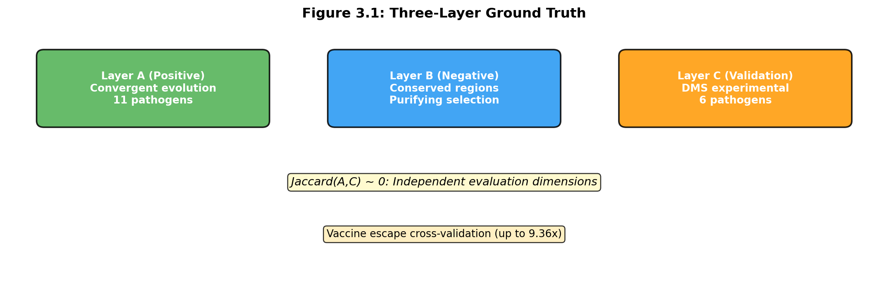


| Layer | 생물학적 의미 | 벤치마크 역할 |
|-------|-------------|-------------|
| **A** | 수렴 진화 위치 (양성 선택) | 양성 기준 — MCC 계산에 사용 |
| **B** | 정화 선택 하의 보존 영역 | 위험 감시 — Constrained FPR |
| **C** | DMS 실험에서 기능 영향 확인 | 교차 검증 — Layer A와 독립 |

[테이블: Table 3.2 — 3-layer ground truth position counts per pathogen]

| 바이러스 | Layer A | Layer B | Layer C |
|---------|---------|---------|---------|
| SARS-CoV-2 | 25 | 154 | 252 |
| H3N2 | 25 | 10 | 102 |
| Norovirus | 15 | 229 | --- |
| HIV-1 | 23 | 23 | 100 |
| Dengue | 24 | 24 | --- |
| RSV | 20 | 18 | 101 |
| Influenza B | 17 | 10 | --- |
| MERS | 9 | 110 | --- |
| HCV | 54 | 0 | --- |

DMS Layer C 가용 병원체: SARS-CoV-2, H3N2, HIV-1, RSV, **Rabies**, **EV-A71** (총 6개)

세 층은 거의 겹치지 않음 (Jaccard 유사도 0.006) → 독립적 정보 제공

#### 3.1.3 DMS-based Benchmark (DMS 기반 벤치마크)

6개 병원체에서 DMS 데이터 가용:
- SARS-CoV-2 (Dadonaite 2024, spike entry)
- H3N2 (Lee 2018, HA preferences)
- HIV-1 (Haddox 2018, Env growth)
- RSV (Bloom lab 2026, F entry)
- Rabies (Aditham 2025, G entry)
- EV-A71 (Bakhache 2025, VP1 replication)


### 3.2 Benchmark Framework Design (벤치마크 프레임워크 설계)

#### 3.2.1 MutBench Framework Architecture

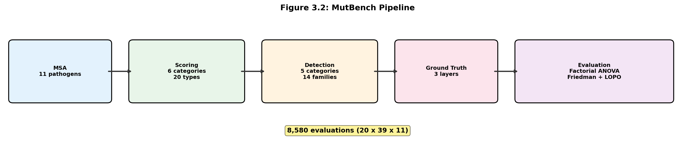


```
MSA 서열 (11개 병원체)
    ↓
점수화 유형 (6 카테고리, 20가지)
    ↓
탐지 알고리즘 (14 패밀리, 39 변형)
    ↓
3층 GT 대비 평가 (MCC + Constrained FPR + DMS F1)
    ↓
통계 분석 (ANOVA, Friedman, LOPO)
```


#### 3.2.2 Five MutClust Variants

| 변형 | 설명 |
|------|------|
| MutClust-Orig | 원래 CCM + DBSCAN |
| MutClust-Fixed | 고정 파라미터 DBSCAN |
| MutClust-HDBSCAN | CCM + HDBSCAN |
| MutClust-Hybrid | CCM 시드 + HDBSCAN 경계 (최적 균형) |
| MutClust-Ensemble | 다중 방법 앙상블 |

#### 3.2.3 Combined Evaluation Metric (Hotspot-score)

Stage 1에서 사용:

```
hotspot-score = (recall + precision + stability) / 3
```

Stage 2에서는 **MCC**를 핵심 지표로 사용 (stability는 cross-pathogen 비교에서 제외)

### 3.3 Scoring and Detection Methods (점수화 및 탐지 방법)

#### 3.3.1 Scoring Types (20가지, 6개 카테고리)

[테이블: Table 3.4 — Twenty scoring types used in Stage 2 (6 categories)]

| 카테고리 | 유형 | 정보 원천 | 설명 |
|---------|------|----------|------|
| **빈도 기반 (3)** | freq | MSA 변이 빈도 | 위치별 변이 빈도 |
| | rare_freq | MSA 희귀 변이 | 5% 미만 변이 비율 |
| | freq_with_indel | MSA+indel | 삽입/결실 포함 빈도 |
| **MSA 파생 (3)** | entropy | Shannon 엔트로피 | 아미노산 다양성 |
| | entropy_with_indel | 갭 포함 엔트로피 | 갭 문자 포함 |
| | homoplasy | 계통수 | 독립적 수렴 변이 횟수 |
| **계통발생 (4)** | dN/dS proxy | 코돈 정렬 | Nei-Gojobori 비율 |
| | FUBAR prob | HyPhy FUBAR | 양성 선택 사후 확률 |
| | FUBAR pos_sel | HyPhy FUBAR | 양성 선택 속도 |
| | FUBAR Bayes factor | HyPhy FUBAR | 양성 선택 베이즈 팩터 |
| **구조 기반 (3)** | pLDDT inverse | AlphaFold2 | 낮은 신뢰도 = 유연 영역 |
| | SASA | 3D 구조 | 표면 노출도 |
| | Grantham distance | 물리화학 | 치환의 화학적 차이 |
| **AI 기반 (5)** | ESM-2 LLR | PLM | 변이 예측 log-likelihood ratio |
| | Tranception | PLM | 자기회귀 변이 효과 |
| | semantic change | ESM-2 임베딩 | 임베딩 공간 코사인 거리 |
| | stability | 열역학 | 안정성 변화 예측 |
| | stability_structural | 구조 인식 | 구조 기반 안정성 |
| **복합 (2)** | EVEscape composite | 다중 결합 | 진화+구조+면역 가중 결합 |
| | EqualWeight | 전체 평균 | 모든 유형의 동등 가중 평균 |

**핵심 변화 (v1 → v2)**: 9가지 H-score 변형 → 20가지로 확장. 빈도/엔트로피 외에 계통발생(FUBAR), 구조(pLDDT, SASA), AI(ESM-2, Tranception, semantic change, stability), 복합(EVEscape) 유형 추가.

#### 3.3.2 Detection Method Families (14개 탐지 알고리즘 패밀리)

[테이블: Table 3.5 — Detection method families]
[테이블: Table 3.6 — 14 families (39 variants) variants]

핵심 9개 알고리즘:

1. **FreqThresh** (빈도 임계값) — 상위 k% 판정. 기준선
2. **AdaptiveKnee** — 자동 꺾임점 탐지
3. **Wavelet** (웨이블릿) — 다중 스케일 이상 신호 탐지. **평균 성능 1위**
4. **CUSUM** — 누적합 변화점. RSV에서 강점
5. **SlidingTest** — 슬라이딩 윈도우 z-검정. HIV-1에서 강점
6. **LocalContrast** — 국소-전체 대비
7. **ScoreDBSCAN** — 밀도 기반 클러스터링. SARS-CoV-2에서 강점
8. **KDE** — 커널 밀도 추정. 바이러스마다 성능 극단적 차이
9. **MutClust-Orig** — 레거시 기준

### 3.4 Evaluation and Statistical Design (평가 및 통계 설계)

#### 3.4.1 Evaluation Metrics

- **MCC** (Matthews Correlation Coefficient): 핵심 지표. -1~+1, 4가지 결과(TP/TN/FP/FN) 모두 활용. 극심한 불균형(양성 1~16%)에서 F1보다 공정
- **Constrained FPR**: Layer B 위치를 핫스팟이라 잘못 판정하는 비율
- **DMS F1**: Layer C DMS 데이터 대비 F1

#### 3.4.2 Statistical Analysis Design

- **3-way ANOVA**: scoring(20) x detection(14) x pathogen(11), omega-squared로 분산 분해
- **Friedman 검정**: 비모수. 상위 20개 조합의 순위 일관성 검정
- **LOPO**: Leave-One-Pathogen-Out. 10개 학습 → 1개 테스트, 11번 반복
- **BCa bootstrap CI**: MCC의 신뢰 구간


\newpage

## Chapter 4. Experimental Results (실험 결과)

### 4.1 Single-Pathogen Benchmark: SARS-CoV-2 (Stage 1)

#### 4.1.1 Variant Comparison on Synthetic Data

합성 데이터에서 MutClust 5가지 변형 비교:

[테이블: Table 4.1 — Hotspot-scores for MutClust variants]

MutClust-Hybrid가 F1=0.785로 최고 균형 (precision 0.968, recall 0.659).

**주의**: 실제 GISAID 데이터에서는 F1이 0.123으로 대폭 하락하였다. 합성 실험은 방법 간 차이 구분 능력을 검증하는 것이 목적.

#### 4.1.2 Multi-Ground Truth Evaluation

[테이블: Table 4.2 — Multi-GT evaluation results]


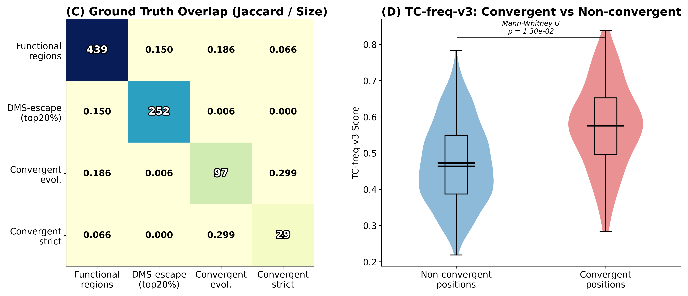


**핵심 발견**: 정답 기준에 따라 최적 방법이 달라짐. GT 간 Jaccard 0.006 — 세 GT가 독립적.

DMS 검증:

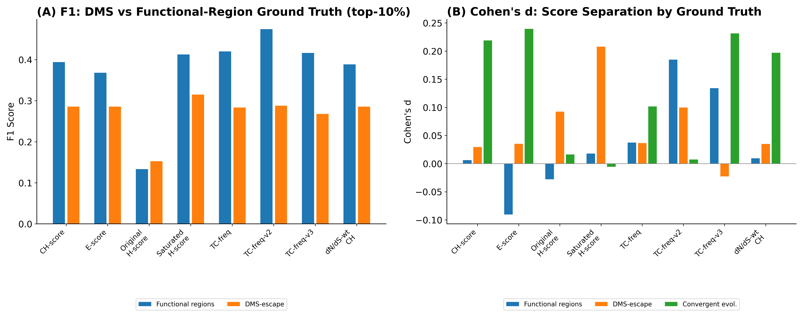


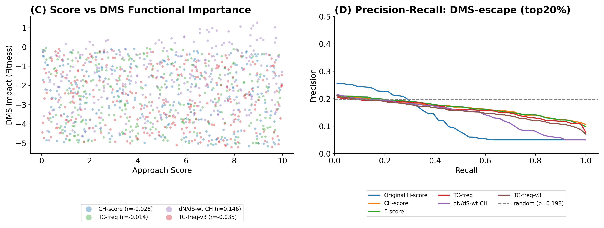


#### 4.1.3 Real GISAID H-score Benchmark

[테이블: Table 4.3 — Real GISAID benchmark results]

합성 → 실제 데이터 성능 격차가 크지만 enrichment ratio는 6.9~8.0배로 생물학적 타당성 유지.

#### 4.1.4 Comparison with External Methods

MutClust variants vs 범용 방법(OPTICS, KDE 등) 비교. 도메인 특화 방법이 우수.


### 4.2 Robustness and Sensitivity Validation (견고성 검증)

> **이 섹션의 목적**: Stage 2로 확장하기 전에, Stage 1 결과가 파라미터나 통계적 변동의 산물이 아닌지 확인합니다.

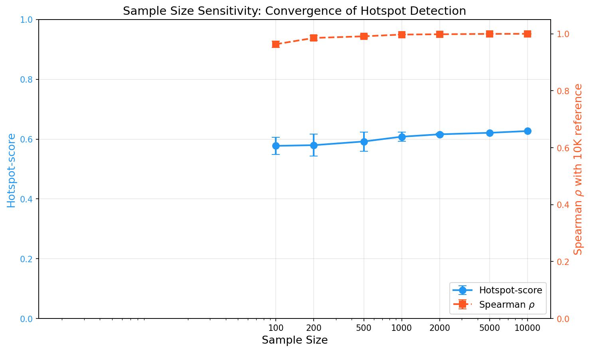

약 1,000개 서열부터 안정화. 본 벤치마크의 서열 수(662~5,325)는 수렴점 이상.

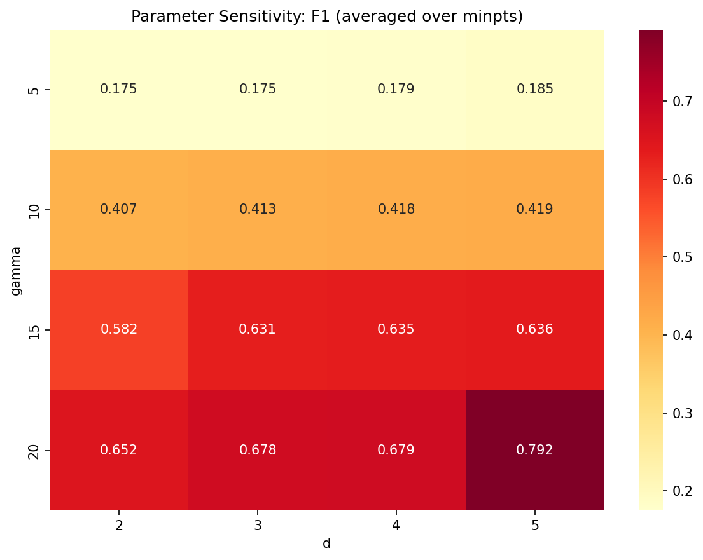

MutClust-Hybrid가 171가지 가중치 조합 중 71.9%에서 1위 유지.

### 4.3 Cross-Pathogen and Structural Validation

> **이 섹션의 목적**: SARS-CoV-2에서 확인된 프레임워크를 다른 바이러스에 적용해보고, Stage 2 대규모 벤치마크의 필요성을 확인합니다.

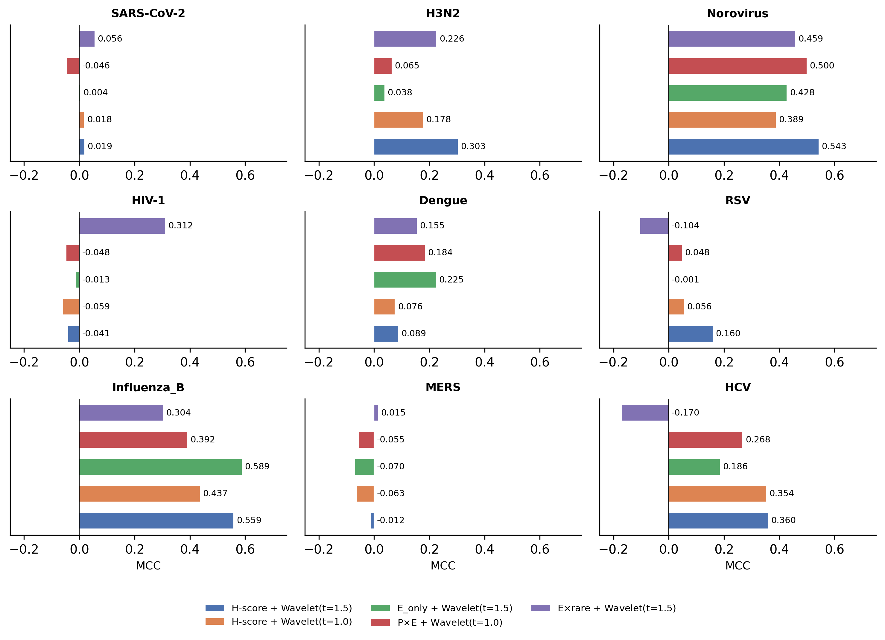

Stage 1 최적(MutClust-Hybrid)이 다른 바이러스에서는 순위 하락 → **"범용 방법은 존재하지 않는다"는 첫 번째 직접 증거**.

3D 구조 분석: 선형 서열 핫스팟이 공간적으로도 클러스터링됨 (**5.92배** spatial contact enrichment, z=13.34).

계통 비독립성: H-score는 founder effect를 양성선택과 혼동 (D614G: H-score 2위 vs homoplasy 1,134위, ρ=−0.876). → **빈도 기반 scoring의 근본적 한계 확인, 다양한 정보 유형 필요**

### 4.4 Cross-Pathogen Large-Scale Benchmark (대규모 벤치마크, Stage 2)

**핵심**: 20 scoring x 14 families (39 variants) x 11 pathogens = **8,580회** 평가

#### 4.4.1 Benchmark Scale and Data

총 8,580회 평가. 11개 바이러스에 대해 780가지 scoring-detection 조합 각각의 MCC를 계산.

#### 4.4.2 Per-Pathogen Best Method Analysis

[테이블: Table 4.5 — Best scoring-detection combination for each of the 11 pathogens (by MCC)]

| 바이러스 | 최적 점수화 | 카테고리 | 최적 탐지 | MCC |
|---------|-----------|---------|----------|-----|
| HCV | freq | 빈도 기반 | SlidingTest(p=0.01) | **0.660** |
| H3N2 | FUBAR Bayes factor | 계통발생 | Wavelet(t=1.5) | **0.534** |
| Norovirus | homoplasy | MSA 파생 | Bayes(prior=0.15) | **0.510** |
| Flu-B | freq | 빈도 기반 | KDE(p=85) | **0.392** |
| HIV-1 | entropy | MSA 파생 | Wavelet(t=2.0) | **0.275** |
| Dengue | entropy_with_indel | MSA 파생 | KDE(p=85) | **0.274** |
| EV-A71 | semantic change | AI 기반 | MutClust-Orig | **0.260** |
| Rabies | stability | AI 기반 | SWAN(w=20,k=2.0) | **0.248** |
| SARS-CoV-2 | Tranception | AI 기반 | KDE(p=85) | **0.211** |
| RSV | ESM-2 LLR | AI 기반 | Wavelet(t=2.0) | **0.196** |
| MERS | freq | 빈도 기반 | KDE(p=85) | **0.196** |

**11/11 고유 최적 조합**. 9개의 서로 다른 점수화 유형이 최적으로 나타남. 6개 카테고리 전체에 걸쳐 분포.

**각 병원체별 생물학적 근거:**
- **H3N2 (FUBAR)**: 수십 년 계통수에서 양성선택 신호가 강함. dN/dS 기반 방법에 최적
- **Norovirus (homoplasy)**: GII.4 에포크 진화 → 수렴 변이가 AUC 0.944로 거의 완벽한 예측
- **SARS-CoV-2 (Tranception)**: 2019년 이후 얕은 계통 → PLM이 넓은 코로나바이러스 진화 맥락 보상
- **RSV (ESM-2)**: 제한된 계통 다양성 → PLM이 대안 신호
- **EV-A71 (semantic change)**: VP1 항원 표면 기능 변화 포착
- **Rabies (stability)**: G 단백질 pH 의존 구조 전환 제약
- **HCV (freq)**: 과변이 영역(HVR1/HVR2) quasispecies 포화로 빈도가 직접 신호
- **HIV-1 (entropy)**: 높은 quasispecies 다양성, 엔트로피가 변이 분포 포착
- **Dengue (entropy_with_indel)**: 4가지 혈청형 간 변이 + indel이 E 단백질 에피토프에서 중요
- **MERS (freq)**: 희소 샘플링(<500 서열), 복잡한 방법은 통계적 힘 부족
- **Influenza B (freq)**: Victoria/Yamagata 이중 계통 구조 → 빈도가 이중 분포 직접 반영

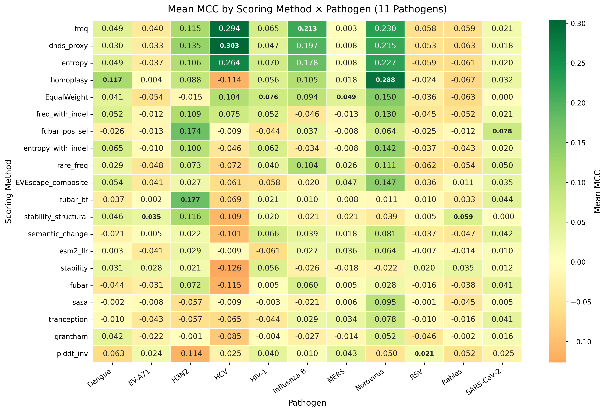


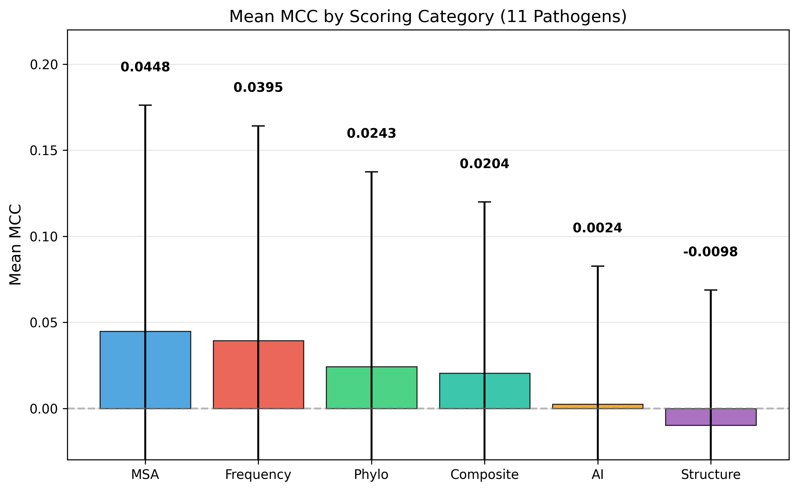


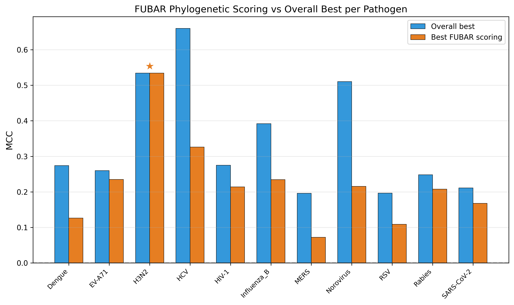


#### 4.4.3 Statistical Analysis

**3-way ANOVA 분산 분해:**

[테이블: Table 4.6 — ANOVA variance decomposition]

| 요인 | 설명 | omega-squared |
|------|------|--------------|
| scoring x pathogen | **정보 유형 x 바이러스 상호작용** | **0.296** (최대) |
| pathogen | 바이러스 주효과 | 0.128 |
| family x pathogen | 알고리즘 x 바이러스 상호작용 | 0.065 |
| scoring | 정보 유형 주효과 | 0.013 |
| family | 알고리즘 주효과 | 0.002 |

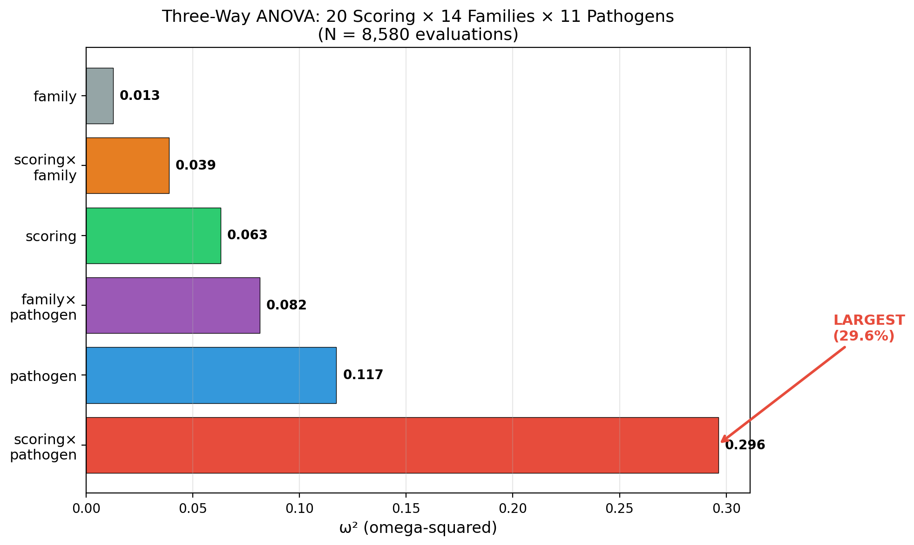


**핵심 해석**: **어떤 정보를 어떤 바이러스에 쓰느냐**(scoring × pathogen, 29.6%)가 성능의 핵심 결정 요인이며, 최적 정보 유형이 바이러스마다 근본적으로 상이합니다.

**Friedman 검정:**

chi-squared = 7.69, **p = 0.990** (비유의)

Kendall W = 0.037 (거의 0 — 순위 합의 없음)

해석: 상위 20개 조합 중 어떤 하나도 모든 바이러스에서 일관되게 우위를 점하지 못하였다. (참고: 이전 9-scoring 분석에서는 χ²=42.44, p=0.0015로 유의하였으나, 20가지 scoring으로 확장 후 순위 변동이 더 심화되어 비유의로 전환되었다.)

**LOPO 교차 검증:**

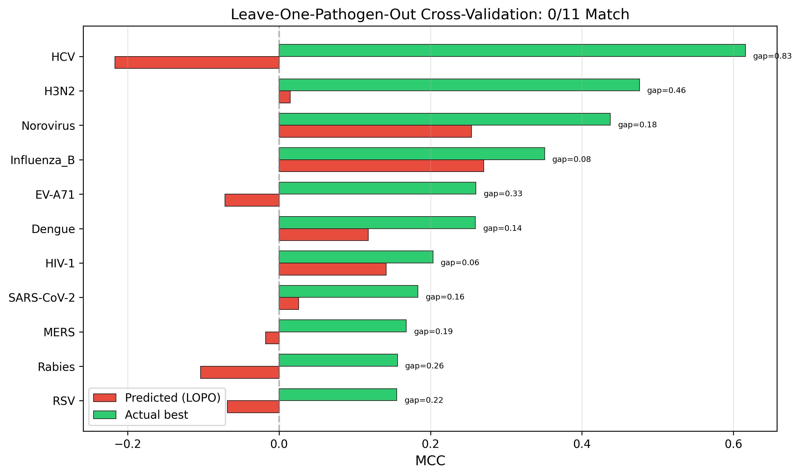


**0/11 일치**. 평균 일반화 MCC = 0.022, oracle과의 gap = 0.320.

#### 4.4.4 Supplementary Analyses

Precision@k 분석, DMS 임계값 민감도 분석, **Layer A vs Layer C 최적 비교**:

[테이블: Table 4.8 — Best scoring type under Layer A vs Layer C for 6 DMS pathogens]

| 바이러스 | Layer A 최적 | MCC_A | Layer C 최적 | MCC_C |
|---------|------------|-------|------------|-------|
| SARS-CoV-2 | Tranception | 0.211 | pLDDT inv | 0.186 |
| H3N2 | FUBAR BF | 0.534 | semantic change | 0.245 |
| HIV-1 | entropy | 0.275 | FUBAR | 0.139 |
| RSV | ESM-2 LLR | 0.196 | EVEscape | 0.180 |
| Rabies | stability | 0.248 | homoplasy | 0.182 |
| EV-A71 | semantic change | 0.260 | pLDDT inv | 0.322 |

6개 중 5개에서 Layer A와 Layer C의 최적이 다름 → 독립적 평가 차원 확인.

#### 4.4.5 Summary of Key Findings

4가지 독립 증거:

1. **Interaction dominance**: scoring x pathogen omega-squared = 0.296 (최대)
2. **Unique best**: 11/11 고유 최적 조합, 9개 서로 다른 scoring 유형
3. **Generalization failure**: LOPO 0/11, gap = 0.320
4. **No universal best**: Friedman p = 0.990


### 4.5 Information-Type Analysis (정보 유형 분석)

#### 4.5.1 Per-Feature Discriminative Power

[테이블: Table 4.9 — Per-feature AUC for 10 features x 9 pathogens]

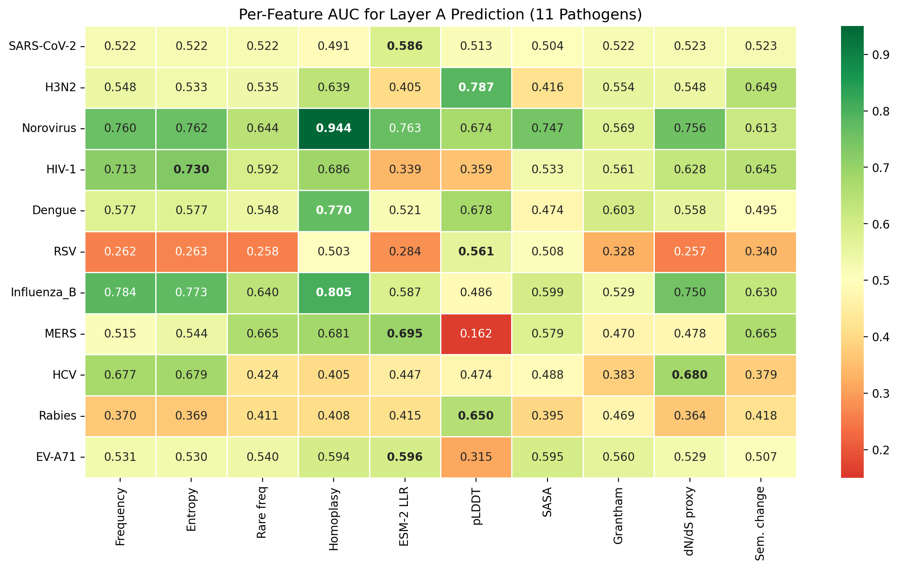


| 바이러스 | 가장 효과적인 정보 | AUC |
|---------|------------------|-----|
| Norovirus | homoplasy | **0.944** |
| Flu-B | homoplasy | **0.805** |
| H3N2 | pLDDT | **0.787** |
| Dengue | homoplasy | **0.770** |
| HIV-1 | entropy | **0.730** |
| MERS | ESM-2 LLR | **0.695** |
| HCV | dN/dS proxy | **0.680** |
| SARS-CoV-2 | ESM-2 LLR | **0.586** |
| RSV | pLDDT | **0.561** |

#### 4.5.2 Feature Importance by Pathogen

Random Forest로 10가지 feature 결합 시 cross-validation AUC:

- Norovirus: **0.899** (최고)
- MERS: 0.537 → **0.875** (가장 큰 개선)
- H3N2: **0.791**
- HIV-1: **0.802**
- RSV: **0.737** (단일 feature로는 거의 불가능했던 예측이 가능)

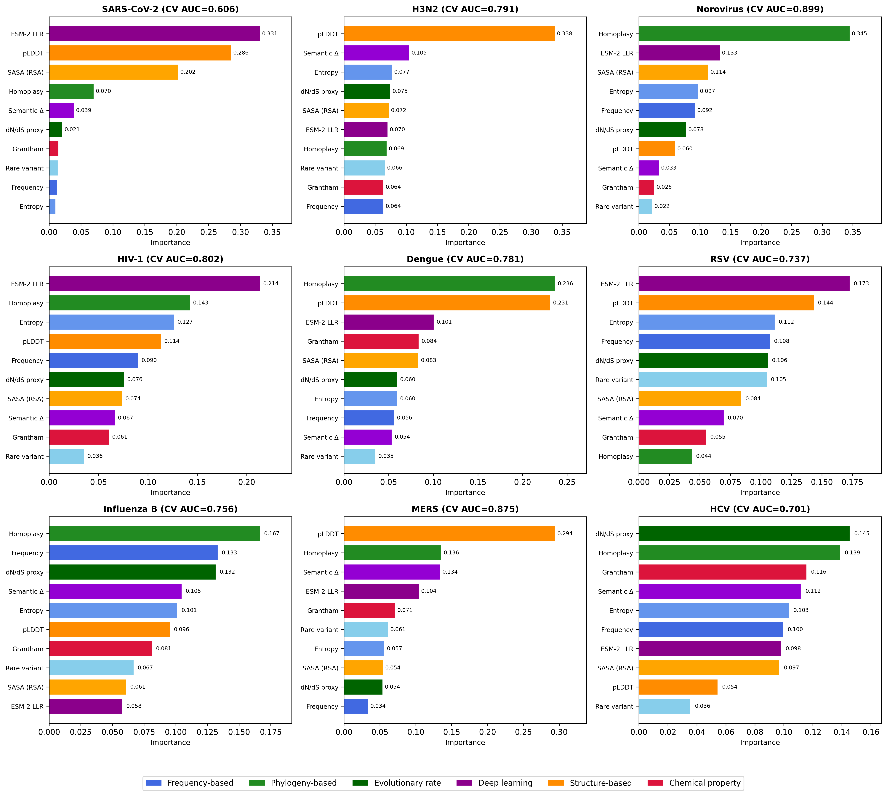


#### 4.5.3 Feature Correlation Structure

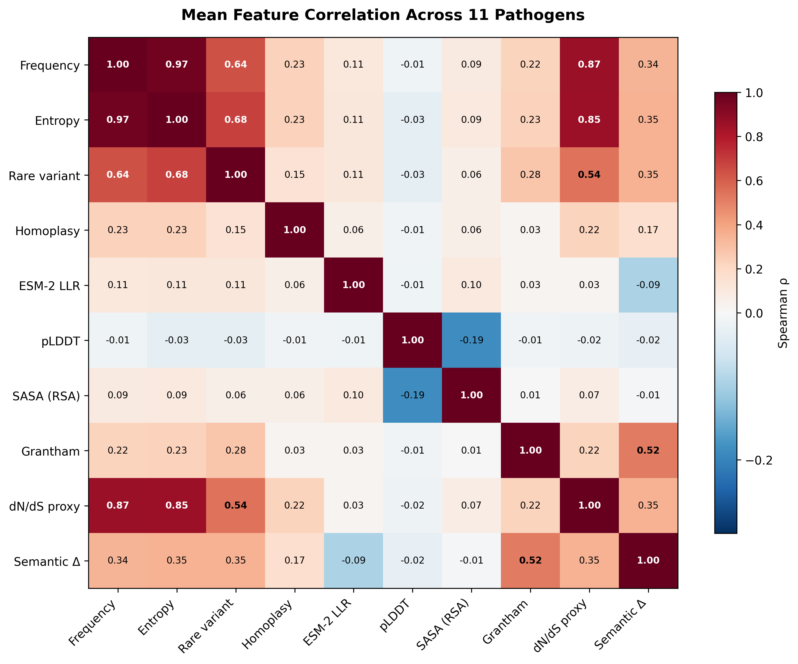


빈도-엔트로피 상관 0.97 (사실상 동일). homoplasy는 다른 feature와 상관 0.23 이하 (독립적 정보).

#### 4.5.4 Feature Ablation Analysis

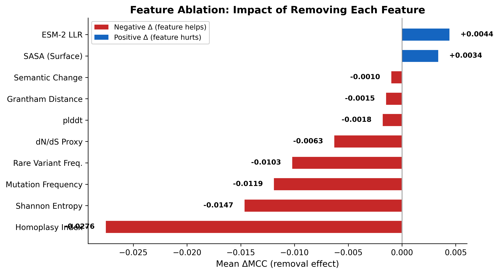


[테이블: Table 4.10 — Feature ablation results]

- **homoplasy** 제거 시 최대 성능 하락 (-0.028) → 가장 중요
- 빈도 + homoplasy 등 **4개 feature만으로 전체 10개의 98% 성능** 달성
- ESM-2, SASA는 전체 평균에서는 잡음(noise)으로 작용하나 특정 바이러스에서는 최고 성능을 보임

#### 4.5.5 Ground Truth Heterogeneity

[테이블: Table 4.11 — GT heterogeneity analysis]

11개 바이러스의 Layer A 위치가 대부분 "면역 회피" 유형 (80~100%). 같은 유형임에도 최적 정보가 상이하게 분화됨 → omega-squared = 0.296은 GT 차이가 아닌 **고유한 생물학적 차이**에 기인한 것으로 판단된다.

#### 4.5.6 Practical Validation: Search Space Reduction (실용적 검증)

**Vaccine escape enrichment (20 scoring x 39 detectors, 2,340 evaluations):**

[테이블: Table 4.12 — Best vaccine escape enrichment per pathogen]

| 바이러스 | 최적 scoring | 카테고리 | Detection | Enrichment | p값 |
|---------|------------|---------|-----------|-----------|-----|
| **H3N2** | FUBAR BF | 계통발생 | Wavelet(t=2.0) | **9.36배** | <0.0001 |
| **HIV-1** | freq | 빈도 기반 | Wavelet(t=1.5) | **7.19배** | <0.0001 |
| **SARS-CoV-2** | FUBAR pos.sel. | 계통발생 | FreqThresh(p=85) | **7.63배** | 0.026 |

**다중 정보 통합 (EqualWeight):**

| 바이러스 | Enrichment | p값 |
|---------|-----------|-----|
| H3N2 | **4.01배** | **0.0023** |
| HIV-1 | **4.17배** | **0.0037** |
| SARS-CoV-2 | 2.67배 | 0.171 (비유의) |

**Layer A ↔ vaccine escape 교차 검증:**

Layer A 벤치마크에서 최적으로 식별된 scoring 유형 = vaccine escape에서도 최고 enrichment:
- H3N2: Layer A 최적 = FUBAR BF (MCC 0.534) → escape 최적도 = FUBAR BF (9.36배)
- HIV-1: Layer A 최적 = freq → escape 최적도 = freq (7.19배)

이 일치는 두 평가가 근본적으로 다른 것을 측정하기 때문에 의미가 큽니다. **Layer A 기반 벤치마크가 실제 공중보건 관련 위치를 정확히 반영**함을 독립적으로 입증.

**탐색 범위 축소 효과:**

| 접근 | 탐색 범위 | 핫스팟 농축 |
|------|----------|-----------|
| 무정보 | 500 전부 | 1.0배 |
| 빈도만 | 상위 50 | 1.7배 |
| **EqualWeight (10-feature)** | **상위 50** | **4.01배** |
| **최적 조합 (oracle)** | **상위 20-80** | **7-9배** |

#### 4.5.7 Adaptive Weighting: Current Limits

3가지 적응적 가중치 전략 모두 EqualWeight보다 성능 낮음:
- kNN-weighted: MCC 0.020
- Top-3 AUC: MCC 0.049
- Correlation-aware: MCC 0.043
- **EqualWeight: MCC 0.083**

원인: 12개 참조 바이러스로는 13차원 프로파일 공간이 심각하게 부족 (차원-표본 비 약 1.1).

단, Oracle MCC = 0.160으로 EqualWeight의 약 2배 → 20~30개 이상 병원체 확보 시 적응적 개선 가능.


\newpage

## Chapter 5. Discussion (논의)

### 5.1 Methodological Validity of MutBench (방법론 타당성)

#### 5.1.1 Bootstrap Confidence Intervals

BCa bootstrap CI로 MCC 추정의 불확실성 정량화.

#### 5.1.2 Performance Gap Between Synthetic and Real Data

합성 F1=0.785 → 실제 F1=0.123. 격차 원인: 실제 H-score 분포의 희소성. 단, enrichment 6.9~8.0배로 생물학적 신호 보존.

#### 5.1.3 Independence of Ground Truth and Detection Methods

3층 GT 구성이 특정 탐지 방법에 유리하게 편향되지 않음을 확인. 3D 구조 분석으로 5.92배 공간 접촉 enrichment 확인.

### 5.2 Limitations of H-score-Based Detection (H-score 한계)

#### 5.2.1 Fixed-Reference Scoring

H-score는 founder mutation에 가장 높은 점수 부여 (시뮬레이션에서 100% 경우). 독립 발생 횟수와 rho = -0.876 (강한 음의 상관).

#### 5.2.2 Complementary Evaluation Perspectives

Region-overlap MCC: Exact 0.289 → +/-5: 0.638 → +/-10: **0.712**. H3N2는 +/-10에서 MCC 0.964.

[테이블: Table 5.2 — Region-overlap MCC per pathogen]

#### 5.2.3 Homoplasy-Based Scoring as an Alternative

HIV-1에서 AUC=0.71 (우수), HCV에서 AUC=0.39 (실패 — parsimony 포화).

### 5.3 Cross-Pathogen Generalization (교차 병원체 일반화)

#### 5.3.1 Implications

LOPO 0/11의 실용적 함의: 새 바이러스에 대해 기존 최적을 직접 적용 불가. 병원체별 벤치마크가 필수.

#### 5.3.2 Upper Bound of Detection Performance

MCC 0.083이 상대적으로 낮은 수치로 보일 수 있는 이유:

| 비교 대상 | 과제 | 성능 | 양성 비율 |
|----------|------|------|----------|
| 암 드라이버 유전자 | position-level | MCC 0.1~0.3 | 1~5% |
| 전사인자 결합 부위 | position-level | F1 0.3~0.5 | 1~3% |
| **MutBench** | **position-level** | **MCC 0.083** | **2~5%** |

영역 수준에서는 MCC 0.712 (양호).

### 5.4 Practical Implications (실용적 함의)

#### 5.4.1 Vaccine Escape Position Validation (Stage 1 단일 scoring)

[테이블: Table 5.3 — Vaccine escape validation (Stage 1)]

SARS-CoV-2에서 최고 방법이 34개 중 25개 탐지 (recall 73.5%, 4.9배 enrichment).

#### 5.4.2 Cross-Validation via Vaccine Escape Enrichment

**v98의 핵심 추가 검증**: 3개 병원체, 2,340회 evaluation에서 Layer A 최적 = escape 최적이라는 교차 검증 달성. 이것은 DMS 데이터 없는 5개 바이러스에서 Layer A의 타당성을 뒷받침하는 독립 증거.

#### 5.4.3 Practical Application Workflow for New Pathogens

새로운 바이러스에 MutBench 적용하는 4단계 워크플로우:

1. **서열 수집**: 200개 이상, MAFFT로 MSA 구축 (~5분)
2. **Feature 계산**: freq/entropy (초), homoplasy (2~5분), ESM-2 (3~5분, GPU), 구조 (AlphaFold2)
3. **Scoring 카테고리 선택**: 아래 추천표 참고
4. **탐지 및 평가**: KDE 또는 Wavelet 기본값 적용 (~30초)

전체 소요시간: **15~20분** (GPU 탑재 워크스테이션)

[테이블: Table 5.4 — Recommended scoring categories by virus family]

| 바이러스 패밀리 | 추천 Scoring | 근거 |
|---------------|-------------|------|
| Orthomyxoviridae (인플루엔자) | Phylogenetic (FUBAR) | 강한 다양화 선택 신호 |
| Coronaviridae (코로나) | AI-based (PLM) | 얕은 계통; PLM이 넓은 맥락 포착 |
| Caliciviridae (노로) | MSA-derived (homoplasy) | epoch 진화에서 수렴 패턴 |
| Retroviridae (HIV) | MSA-derived (entropy) | 높은 다양성; 대립유전자 변이 포착 |
| Flaviviridae (HCV, 뎅기) | Frequency-based | 초변이 영역이 신호 지배 |
| Pneumoviridae (RSV) | AI-based (ESM-2) | 제한된 계통발생 신호 |

#### 5.4.4 Phylogenetic Non-Independence

H-score가 founder effect 보정 불가. Homoplasy 기반 보정이 부분적 대안 (H-score vs homoplasy: rho = -0.107, p = 1.36e-4).

#### 5.4.5 ESM-2 Training Data Overlap

ESM-2가 SARS-CoV-2/MERS에서 높은 성능을 보이는 것이 학습 데이터 겹침 때문일 가능성. 단, Norovirus/HIV에서 낮은 성능은 이것이 범용적으로 적용 가능하지 않음을 확인하였다.

#### 5.4.6 Ground Truth Heterogeneity Across Pathogens

Layer A 선정 기준이 병원체마다 다름 (SARS-CoV-2: 수렴 진화, HCV: 초변이 영역 등). 논문에서 한계로 명시.


\newpage

## Chapter 6. Conclusion (결론)

### 6.1 Summary of Research Contributions (기여 요약)

**기여 1: MutBench 벤치마크 프레임워크**

바이러스 핫스팟 탐지 분야 최초의 체계적 비교 기준.
- 11개 바이러스, 20가지 점수화 유형 (6개 카테고리), 14개 탐지 방법 패밀리 (5개 카테고리, 39개 파라미터 변형), 3층 정답 기준
- **8,580회** 대규모 평가

**기여 2: 정보 유형 x 병원체 상호작용이 핵심이라는 발견**

4가지 독립 통계 증거:
- ANOVA: scoring × pathogen **ω² = 0.296** (최대 분산원). 최적 정보 유형이 바이러스마다 상이함을 정량적으로 입증
- 11/11 고유 최적 조합 (9개 서로 다른 scoring 유형)
- Friedman: **chi-squared = 7.69, p = 0.990** (일관된 최고 조합 없음)
- LOPO: **0/11** 일치 (일반화 불가)

**기여 3: 다중 정보 통합 분석 및 vaccine escape 교차 검증**

- 10가지 정보 유형의 병원체별 판별력 분석
- 최적 조합으로 **최대 9.36배** enrichment (H3N2, p<0.0001)
- EqualWeight 통합: H3N2 **4.01배** (p=0.0023), HIV-1 **4.17배** (p=0.0037)
- Layer A 최적 = vaccine escape 최적이라는 **독립적 교차 검증** 달성

### 6.2 Limitations (한계)

[테이블: Table 6.1 — Summary of limitations]

| 한계 | 설명 | 경감 요인 |
|------|------|----------|
| GT 불완전 | DMS 데이터 6/11 병원체만 | Layer A만으로 MCC 평가 가능 |
| RNA 바이러스만 | DNA 바이러스(HPV, HBV) 미포함 | 변이 메커니즘이 다르므로 별도 검증 필요 |
| Founder effect | H-score 파이프라인 내 직접 보정 미통합 | Homoplasy + FUBAR scoring으로 보완 |
| dN/dS proxy | 단백질 수준 proxy, 빈도와 r=0.87 | FUBAR는 codon alignment 직접 사용 |
| 적응적 가중치 | 12개 병원체로 학습 부족 | Oracle MCC 0.160 → 확장 시 개선 가능 |

### 6.3 Future Research Directions (향후 연구)

[테이블: Table 6.2 — Future research roadmap]

| 방향 | 내용 |
|------|------|
| 병원체 확장 | 20~30개 이상으로 확장하여 적응적 가중치 학습 가능하게 |
| DNA 바이러스 | HPV, HBV 등 DNA 바이러스로 벤치마크 확장 |
| 시계열 통합 | 시간에 따른 핫스팟 변화 추적 |
| 구조 통합 | AlphaFold2 예측 구조를 3D 핫스팟 탐지에 활용 |
| 실시간 감시 | MutBench를 Nextstrain과 통합하여 실시간 핫스팟 모니터링 |

### 6.4 Concluding Remarks (맺음말)

바이러스마다 최적의 핫스팟 탐지를 위한 정보 유형이 다릅니다. MutBench가 11개 바이러스, 20가지 점수화 유형, 8,580회 평가로 이를 입증했으며, **최적 정보 유형이 바이러스마다 근본적으로 상이**하고 다중 정보 통합이 실험 탐색 범위를 최대 9.36배 축소할 수 있음을 확인하였습니다.

10가지 정보의 통합 분석은 최대 9.36배의 탐색 범위 축소를 달성하며, Layer A 벤치마크 순위와 vaccine escape enrichment의 일치를 통해 독립적으로 검증되었습니다.

앞으로는 바이러스 특성에 맞는 정보 유형을 선택·통합하는 접근이 필요하며, 병원체 참조 데이터베이스의 확장이 적응적 방법 선택의 핵심 과제입니다.


\newpage

## 부록: v1 → v2 주요 변경 사항 요약

| 항목 | v1 (구) | v2 (신) |
|------|---------|---------|
| 바이러스 수 | 9개 | **11개** (Rabies, EV-A71 추가) |
| 점수화 공식 | 9가지 (H-score 변형) | **20가지** (6개 카테고리) |
| 총 평가 횟수 | 3,159회 | **8,580회** |
| ANOVA 최대 분산원 | family x pathogen, omega-squared=0.285 | **scoring x pathogen, omega-squared=0.296** |
| ANOVA 핵심 해석 | "탐지 알고리즘 x 바이러스 궁합이 핵심" | **"정보 유형 x 바이러스 궁합이 핵심"** |
| Friedman 검정 | chi-squared=42.44, p=0.0015 (유의) | **chi-squared=7.69, p=0.990 (비유의)** |
| LOPO | 0/9 | **0/11** |
| DMS 가용 병원체 | 4개 (SARS-CoV-2, H3N2, HIV-1, RSV) | **6개** (+Rabies, EV-A71) |
| Vaccine escape enrichment | H3N2 4.0배 (단일) | **최대 9.36배** (3개 병원체) |
| Vaccine escape 교차 검증 | 없음 | **추가** (Layer A 최적 = escape 최적) |
| 논문 구조 | 7장 | **6장** (Ch5 → Ch4 통합) |
| EVE scoring | 포함 | **제거** |
| Dengue DMS | 포함 | **제거** (잘못된 단백질 매핑) |
